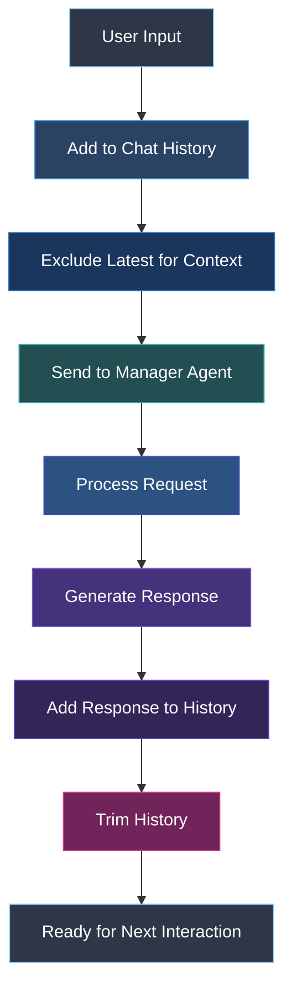

# Chat History Management

This document details how the Multi-Agent system manages chat history to maintain context across interactions.

## Overview

Chat history management is crucial for the Multi-Agent system to:
1. Maintain context between user interactions
2. Allow agents to understand the conversation flow
3. Provide continuity for multi-turn conversations
4. Enable accurate classification of follow-up questions
5. Provide data for response validation and improvement

## Implementation



## Chat History Structure

The chat history is implemented as a list of `ChatMessage` objects from the llama_index library:

```python
from llama_index.core.llms import ChatMessage

class AgentService:
    def __init__(self):
        # ...
        # Chat history to provide context
        self.chat_history: List[ChatMessage] = []
```

Each `ChatMessage` object contains:
- `role`: The role of the message sender ("user", "assistant", or "system")
- `content`: The actual text content of the message

## Key Components

### 1. Central Storage

The primary storage for chat history is in the `AgentService` class:

```python
# Adding messages to history
self.chat_history.append(ChatMessage(role="user", content=user_input))
self.chat_history.append(ChatMessage(role="assistant", content=response))
```

### 2. History Formatting

The `ManagerAgent` formats history for LLM consumption:

```python
def _format_chat_history(self, chat_history: List[ChatMessage]) -> str:
    """Format recent chat history for context"""
    if not chat_history:
        return "No recent chat history"
    
    # Take last messages for context
    recent_msgs = chat_history[-6:] if len(chat_history) > 6 else chat_history
    formatted = []
    for msg in recent_msgs:
        formatted.append(f"{msg.role}: {msg.content}")
    return "\n".join(formatted)
```

This converts the history into a human-readable format for the LLM.

### 3. Context Window Management

To prevent the history from growing too large and exceeding token limits, the system implements a sliding window approach:

```python
# Trim chat history to last 10 messages to prevent context overflow
self.chat_history = self.chat_history[-10:]
```

This ensures the system maintains relevant recent context while staying within token limits.

## History Handling Flow

### Adding User Input

```python
# First add the user message to history
logger.info(f"User input: {user_input}")
self.chat_history.append(ChatMessage(role="user", content=user_input))
```

### Passing History to Agent (Excluding Latest)

```python
# Get streaming response from planning agent
async for chunk in self.manager.astream_chat(
    query=user_input,
    chat_history=self.chat_history[:-1],  # Exclude the user message we just added
    verbose=verbose
):
    # ... chunk processing ...
```

The latest user message is excluded from history since it's passed as the query parameter.

### Adding Agent Response

```python
# After streaming is complete, update chat history with the full response
self.chat_history.append(ChatMessage(role="assistant", content=full_response))
logger.info(f"Final response: {full_response}")
```

### Error Response Handling

```python
# Add error message to chat history
error_msg = "I'm sorry, I encountered an error processing your request."
self.chat_history.append(ChatMessage(role="assistant", content=error_msg))
```

Even error messages are added to maintain continuity.

## History Usage in Agent Decision-Making

### Classification

The manager agent uses history to determine if a query is a follow-up:

```
Important: The user input may be a follow-up response to a previous interaction.
The conversation history, including the name of the previously selected agent, is provided.
If the user's input appears to be a continuation of the previous conversation
(e.g., 'yes', 'ok', 'I want to know more', '1'), select the same agent as before.
```

### Response Validation

History is used when validating responses for contextual relevance:

```python
validation_prompt = VALIDATION_PROMPT.format(
    user_query=user_query,
    agent_name=agent_name,
    agent_response=agent_response,
    chat_history=self._format_chat_history(chat_history)
)
```

## History Reset Functionality

The system includes an API endpoint to reset the conversation:

```python
@agent_router.post("/reset", response_model=ResetResponse)
async def reset_chat_endpoint():
    try:
        agent_chat.reset_chat()
        return ResetResponse(
            status="success", 
            message="Chat history has been successfully reset"
        )
    except Exception as e:
        raise HTTPException(status_code=500, detail=str(e))
```

The reset implementation:

```python
def reset_chat(self):
    """Reset the chat history"""
    self.chat_history = []
```

## Cross-Agent Context Sharing

All specialized agents access the same chat history through the manager agent, ensuring consistent context across different agent types.

## Benefits of History Management

- **Continuity**: Enables coherent multi-turn conversations
- **Context Awareness**: Agents can reference previous parts of the conversation
- **Agent Selection**: Helps route follow-up questions to the appropriate specialized agent
- **Response Quality**: Provides context for generating more relevant responses
- **Token Efficiency**: Sliding window approach balances context with token usage

## Future Improvements

Potential enhancements to history management could include:
1. Semantic summarization of older history
2. Selective history pruning based on relevance
3. Long-term memory storage for persistent context
4. User-specific history management for multi-user deployments 