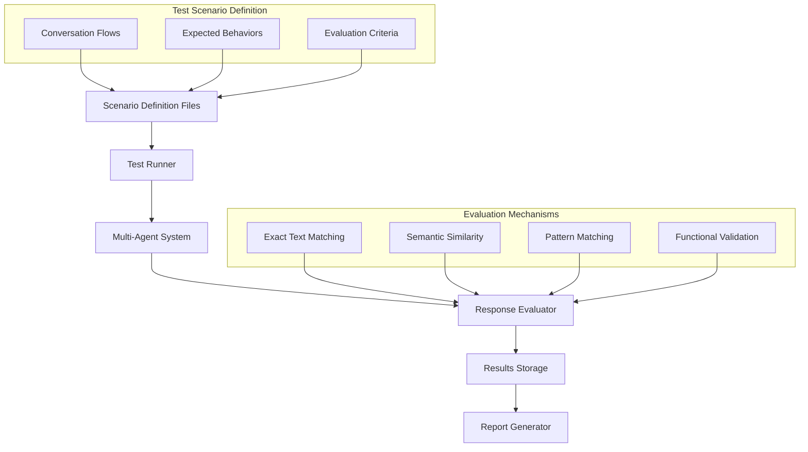
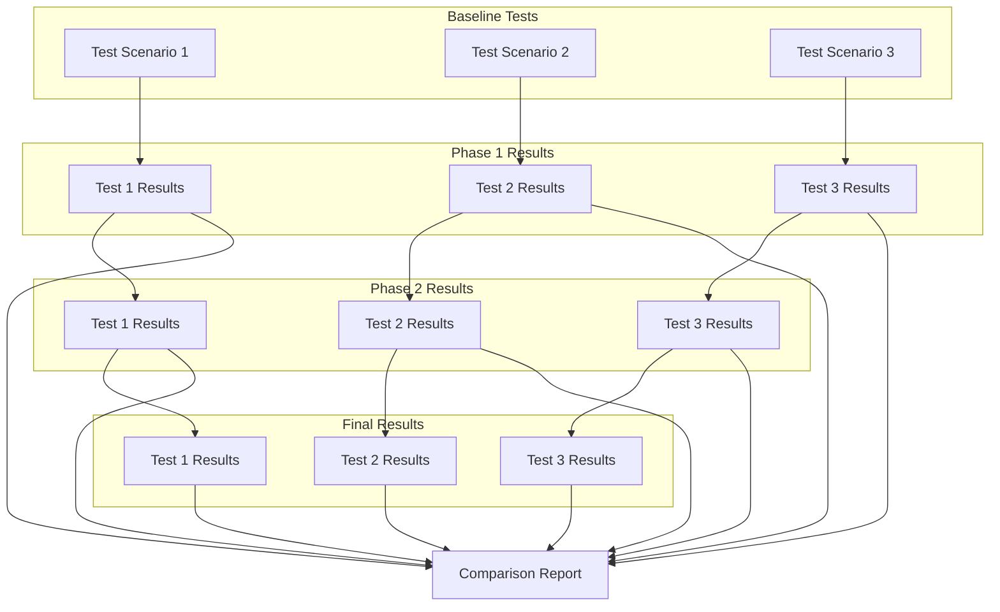

# Conversation-Based Testing Framework

This document outlines the conversation-based testing framework for the multi-agent system migration. The framework is designed to simulate real user interactions and evaluate the system's responses, providing a reliable way to verify functionality through each migration phase.

## Table of Contents

1. [Overview](#overview)
2. [Framework Architecture](#framework-architecture)
3. [Scenario Definition Format](#scenario-definition-format)
4. [Test Runner Implementation](#test-runner-implementation)
5. [Response Evaluation](#response-evaluation)
6. [Cross-Phase Comparison](#cross-phase-comparison)
7. [Test Scenario Categories](#test-scenario-categories)
8. [Implementation Plan](#implementation-plan)

## Overview

Instead of traditional unit tests, this framework simulates real user conversations and evaluates responses based on expected characteristics rather than exact matches. This approach is better suited for testing LLM-based systems where exact output matching is impractical.

Key benefits of this approach:

1. **Realistic Testing**: Tests actual conversation flows that users will experience
2. **Flexible Evaluation**: Uses multiple strategies to validate responses
3. **Phase Comparison**: Tracks system performance across migration phases
4. **Regression Detection**: Identifies when previously working functionality breaks
5. **Behavior Verification**: Tests that the system behaves as expected, not just produces certain text

## Framework Architecture



## Scenario Definition Format

Test scenarios are defined in YAML files that specify:
1. Conversation sequence (user inputs and expected agent responses)
2. Evaluation criteria for each response
3. System configuration for the test

### Example Scenario Definition

```yaml
name: "Basic Planning Capability Test"
description: "Tests the planning agent's ability to create and execute plans"
configuration:
  agent_mode: "standard"  # or "smart_proxy"
  max_steps: 3
conversations:
  - id: "simple_planning_task"
    description: "A simple task requiring planning"
    turns:
      - role: "user"
        content: "I need to analyze the sales data from Q1 and create a report."
        
      - role: "assistant"
        expect:
          - type: "semantic_similarity"
            content: "I'll help you analyze the sales data and create a report."
            threshold: 0.8
          - type: "contains_pattern"
            pattern: ".*plan.*steps.*"
          - type: "function_call"
            name: "has_valid_plan_structure"
            
      - role: "user"
        content: "Yes, please proceed with your plan."
        
      - role: "assistant"
        expect:
          - type: "contains_all_keywords"
            keywords: ["analysis", "report", "data"]
          - type: "functional_validation"
            name: "executed_planned_steps"
            args:
              min_steps_executed: 2
```

## Test Runner Implementation

The test runner will:
1. Load scenario definitions
2. Initialize the agent system with the specified configuration
3. Execute conversations turn by turn
4. Collect and evaluate responses
5. Generate detailed reports on test results

### Pseudocode Implementation

```python
class ConversationTestRunner:
    def __init__(self, scenario_dir, agent_system):
        self.scenarios = self.load_scenarios(scenario_dir)
        self.agent_system = agent_system
        self.evaluator = ResponseEvaluator()
        
    def load_scenarios(self, scenario_dir):
        # Load all YAML scenario files
        pass
        
    def run_all_tests(self):
        results = {}
        for scenario in self.scenarios:
            results[scenario.id] = self.run_scenario(scenario)
        return results
        
    def run_scenario(self, scenario):
        # Configure agent system
        self.agent_system.configure(scenario.configuration)
        
        results = []
        # For each conversation in the scenario
        for conversation in scenario.conversations:
            conv_result = self.run_conversation(conversation)
            results.append(conv_result)
            
        return results
        
    def run_conversation(self, conversation):
        # Execute each turn and evaluate responses
        pass
```

## Response Evaluation

The response evaluator will use multiple evaluation strategies to validate system outputs:

### 1. Exact Text Matching

For cases where specific text must be present:

```python
def exact_match(response, expected_text):
    return expected_text in response
```

### 2. Semantic Similarity

Using embeddings to check if responses are semantically similar to expected content:

```python
def semantic_similarity(response, expected_text, threshold=0.8):
    response_embedding = get_embedding(response)
    expected_embedding = get_embedding(expected_text)
    similarity = cosine_similarity(response_embedding, expected_embedding)
    return similarity >= threshold
```

### 3. Pattern Matching

Using regex to verify response patterns:

```python
def pattern_match(response, pattern):
    import re
    return bool(re.search(pattern, response))
```

### 4. Functional Validation

Custom functions to validate specific behaviors:

```python
def validate_plan_structure(response):
    # Check if response contains a well-structured plan
    has_steps = "steps" in response.lower() or "step" in response.lower()
    has_numbering = bool(re.search(r'(step |^\d+\.)', response, re.MULTILINE))
    has_actions = bool(re.search(r'(will|should|need to|going to)', response))
    return has_steps and (has_numbering or has_actions)
```

## Cross-Phase Comparison

The framework will track performance across migration phases:



## Test Scenario Categories

We will develop test scenarios in the following categories:

### 1. Core Functionality Tests

Basic capabilities that should work consistently across all phases:

- Basic agent interactions
- Tool usage
- Error handling
- Configuration validation

### 2. Agent-Specific Tests

Tests tailored to each agent type:

- Manager agent classification
- Planning agent workflows
- Reflection agent quality
- Fallback agent behavior

### 3. Cross-Phase Regression Tests

Ensure existing functionality works as phases progress:

- Verify backward compatibility
- Check performance characteristics
- Test integrated functionality

### 4. Edge Case and Resilience Tests

Test system behavior under challenging conditions:

- Complex or ambiguous queries
- Error recovery
- Rate limiting and retry behavior
- Malformed inputs

## Implementation Plan

### 1. Framework Development (2 weeks)

- Implement test runner class
- Create evaluation mechanisms
- Develop reporting tools
- Build scenario parser

### 2. Scenario Creation (3 weeks)

- Develop baseline test scenarios
- Create phase-specific test cases
- Add edge case scenarios
- Develop performance benchmarks

### 3. Integration with CI/CD (1 week)

- Add automated test runs to CI pipeline
- Create test result visualization
- Implement regression detection
- Add performance trending

### 4. Execution Strategy

- Run full test suite before beginning each phase
- Run incremental tests during development
- Run complete regression tests after each phase
- Generate cross-phase comparison reports

## Example Scenarios

### Basic Classification Test

```yaml
name: "Manager Agent Classification Test"
description: "Tests the manager agent's ability to classify requests to appropriate sub-agents"
conversations:
  - id: "planning_classification"
    turns:
      - role: "user"
        content: "I need to organize a marketing campaign for our new product launch"
        
      - role: "assistant"
        expect:
          - type: "function_call"
            name: "check_classification"
            args:
              expected_agent: "planning"
              min_confidence: 0.7
```

### Multi-turn Conversation Test

```yaml
name: "Multi-turn Planning Test"
description: "Tests the planning agent's ability to maintain context across turns"
conversations:
  - id: "context_retention"
    turns:
      - role: "user"
        content: "I need to analyze the customer survey data from March."
        
      - role: "assistant"
        expect:
          - type: "function_call"
            name: "plan_created"
      
      - role: "user"
        content: "Can you also include a comparison with February?"
        
      - role: "assistant"
        expect:
          - type: "contains_all_keywords"
            keywords: ["February", "March", "comparison"]
          - type: "function_call"
            name: "plan_updated"
            args:
              should_contain_original: true
``` 