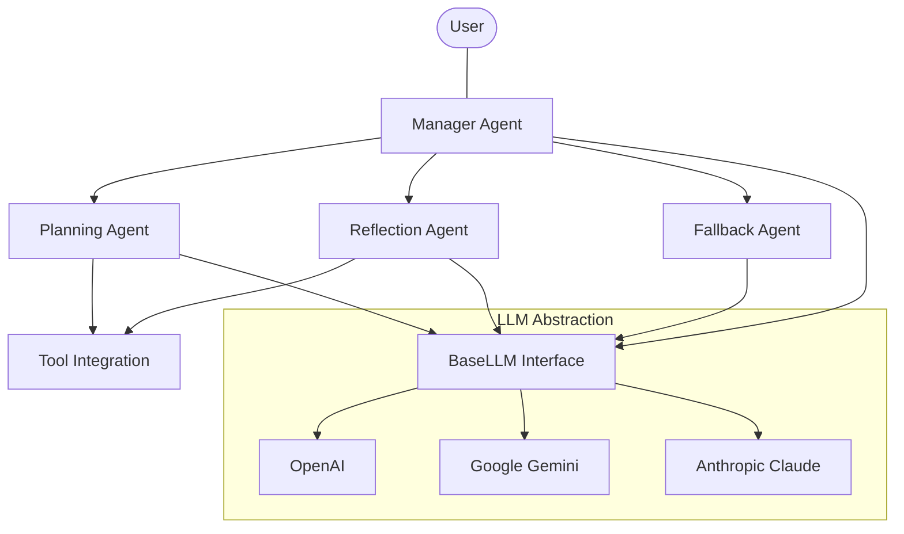
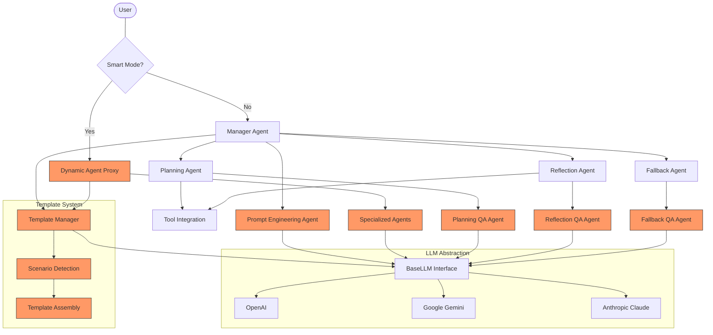
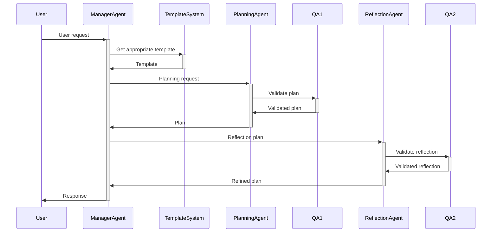

# Multi-Agent System Migration - Architecture Documentation

## Document Information
**Document ID:** ARCH-001  
**Version:** 1.0  
**Date:** 2023-07-01  
**Author:** Multi-Agent Migration Team  
**Status:** Draft  

## Revision History

| Version | Date | Author | Description of Changes |
|---------|------|--------|------------------------|
| 1.0 | 2023-07-01 | Multi-Agent Migration Team | Initial version |

## 1. Introduction

### 1.1 Purpose
This document describes the architecture of the Multi-Agent System, covering both the current implementation and the target architecture after migration. It serves as a guide for developers implementing the system.

### 1.2 Scope
The document covers the high-level architecture, component design, interfaces, data flows, and technology stack for the entire multi-agent system.

### 1.3 Definitions, Acronyms, and Abbreviations
- **LLM**: Large Language Model
- **API**: Application Programming Interface
- **UI**: User Interface
- **QA**: Quality Assurance

### 1.4 References
- [Requirements Document](requirements_document.md)
- [Reference System Architecture](/.reference/docs/architecture-diagrams.md)

## 2. Architectural Goals and Constraints

### 2.1 Key Requirements Influencing the Architecture
- Support for multiple LLM providers
- Dynamic agent creation and routing
- Quality assurance for agent outputs
- Workflow-based processing of requests
- Configuration flexibility and validation

### 2.2 Technical Constraints
- Python-based implementation
- Support for existing environment variable configuration
- Maintenance of current external API
- Compatibility with existing infrastructure

### 2.3 Business Constraints
- Phased migration approach
- Backward compatibility requirements
- Performance requirements
- Security and compliance requirements

## 3. Current System Architecture

### 3.1 Overall Architecture

### 3.2 Current Component Description

#### 3.2.1 Manager Agent
[Description of the Manager Agent component and its responsibilities]

#### 3.2.2 Planning Agent
[Description of the Planning Agent component and its responsibilities]

#### 3.2.3 Reflection Agent
[Description of the Reflection Agent component and its responsibilities]

#### 3.2.4 Fallback Agent
[Description of the Fallback Agent component and its responsibilities]

#### 3.2.5 LLM Abstraction
[Description of the LLM abstraction layer and provider integrations]

#### 3.2.6 Tool Integration
[Description of the tool integration framework]

### 3.3 Current Interfaces and Data Flows

[Description of key interfaces between components and data flows]

### 3.4 Current Deployment Architecture

[Description of the current deployment architecture]

## 4. Target System Architecture

### 4.1 Overall Architecture

### 4.2 Target Component Description

#### 4.2.1 Manager Agent
[Description of the enhanced Manager Agent component]

#### 4.2.2 Dynamic Agent Proxy
[Description of the new Dynamic Agent Proxy component]

#### 4.2.3 Specialized Agents
[Description of the Specialized Agents framework]

#### 4.2.4 Prompt Engineering Agent
[Description of the new Prompt Engineering Agent]

#### 4.2.5 QA Agents
[Description of the QA layer and its components]

#### 4.2.6 Template System
[Description of the Template System components]

#### 4.2.7 Planning, Reflection, and Fallback Agents
[Description of enhancements to existing agents]

#### 4.2.8 LLM Abstraction
[Description of enhancements to the LLM abstraction layer]

#### 4.2.9 Tool Integration
[Description of enhancements to the tool integration framework]

### 4.3 Target Interfaces and Data Flows

#### 4.3.1 External Interfaces
[Description of external interfaces and APIs]

#### 4.3.2 Internal Interfaces
[Description of key interfaces between components]

#### 4.3.3 Data Flow Diagrams

### 4.4 Target Deployment Architecture

[Description of the target deployment architecture]

## 5. Component Design

### 5.1 Configuration System

#### 5.1.1 Purpose and Responsibilities
[Description of the component's purpose and key responsibilities]

#### 5.1.2 Design Details
[Detailed design of the configuration system]

#### 5.1.3 Interfaces
[Description of the component's interfaces]

#### 5.1.4 Data Models
[Description of the component's data models]

### 5.2 Prompt Template System

#### 5.2.1 Purpose and Responsibilities
[Description of the component's purpose and key responsibilities]

#### 5.2.2 Design Details
[Detailed design of the prompt template system]

#### 5.2.3 Interfaces
[Description of the component's interfaces]

#### 5.2.4 Data Models
[Description of the component's data models]

### 5.3 Smart Agent Proxy

#### 5.3.1 Purpose and Responsibilities
[Description of the component's purpose and key responsibilities]

#### 5.3.2 Design Details
[Detailed design of the smart agent proxy]

#### 5.3.3 Interfaces
[Description of the component's interfaces]

#### 5.3.4 Data Models
[Description of the component's data models]

### 5.4 QA Layer

#### 5.4.1 Purpose and Responsibilities
[Description of the component's purpose and key responsibilities]

#### 5.4.2 Design Details
[Detailed design of the QA layer]

#### 5.4.3 Interfaces
[Description of the component's interfaces]

#### 5.4.4 Data Models
[Description of the component's data models]

### 5.5 Workflow Stages

#### 5.5.1 Purpose and Responsibilities
[Description of the component's purpose and key responsibilities]

#### 5.5.2 Design Details
[Detailed design of the workflow stages]

#### 5.5.3 Interfaces
[Description of the component's interfaces]

#### 5.5.4 Data Models
[Description of the component's data models]

### 5.6 Testing Framework

#### 5.6.1 Purpose and Responsibilities
[Description of the component's purpose and key responsibilities]

#### 5.6.2 Design Details
[Detailed design of the testing framework]

#### 5.6.3 Interfaces
[Description of the component's interfaces]

#### 5.6.4 Data Models
[Description of the component's data models]

## 6. Data Model

### 6.1 Entity Relationship Diagram

[Entity Relationship Diagram of the system's data model]

### 6.2 Data Descriptions

#### 6.2.1 Configuration Data
[Description of configuration data structures]

#### 6.2.2 Prompt Templates
[Description of prompt template data structures]

#### 6.2.3 Conversation Data
[Description of conversation data structures]

#### 6.2.4 Agent Metadata
[Description of agent metadata structures]

#### 6.2.5 Testing Scenario Data
[Description of testing scenario data structures]

## 7. Technology Stack

### 7.1 Programming Languages
- Python 3.10+

### 7.2 Frameworks and Libraries
- [List of key frameworks and libraries]

### 7.3 Infrastructure and Deployment
- [Description of infrastructure and deployment technologies]

### 7.4 External Services
- [List of external services and dependencies]

## 8. Quality Attributes

### 8.1 Performance
[Description of performance considerations and optimizations]

### 8.2 Security
[Description of security considerations and measures]

### 8.3 Scalability
[Description of scalability considerations and approaches]

### 8.4 Maintainability
[Description of maintainability considerations and practices]

### 8.5 Testability
[Description of testability considerations and approaches]

## 9. Migration Considerations

### 9.1 Phased Migration Approach
[Description of the phased migration approach]

### 9.2 Backward Compatibility
[Description of backward compatibility considerations]

### 9.3 Data Migration
[Description of data migration considerations]

### 9.4 Rollback Procedures
[Description of rollback procedures for each phase]

## 10. Open Issues and Decision Points

### 10.1 Architectural Decisions
[List of key architectural decisions and their rationale]

### 10.2 Open Issues
[List of open architectural issues and plans to address them]

### 10.3 Risks and Mitigations
[List of architectural risks and mitigation strategies]

## 11. Appendices

### Appendix A: Detailed Component Interfaces
[Detailed documentation of component interfaces]

### Appendix B: Architectural Decision Records
[Records of key architectural decisions]

### Appendix C: Reference Architecture Mapping
[Mapping between reference architecture and the target architecture] 