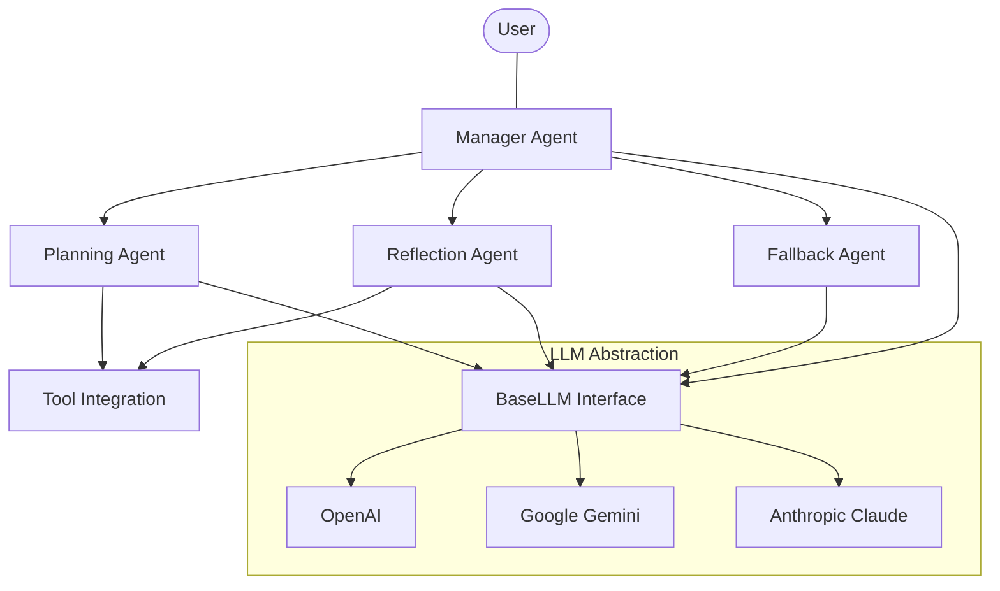
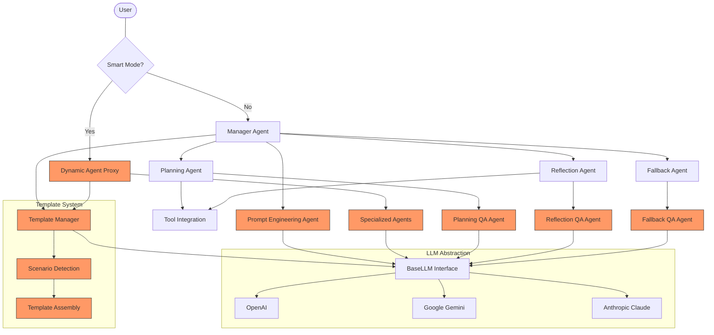
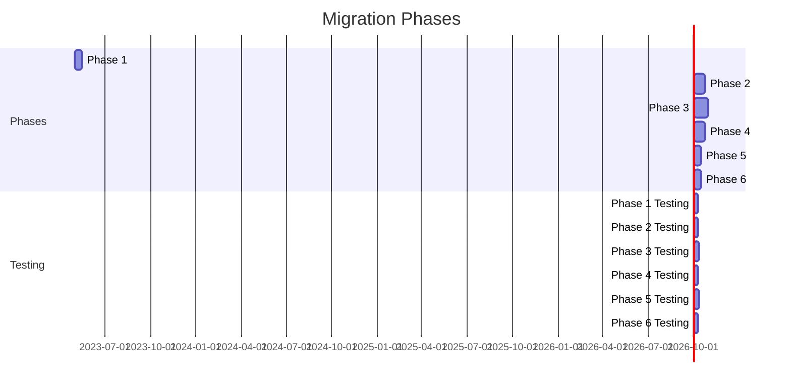
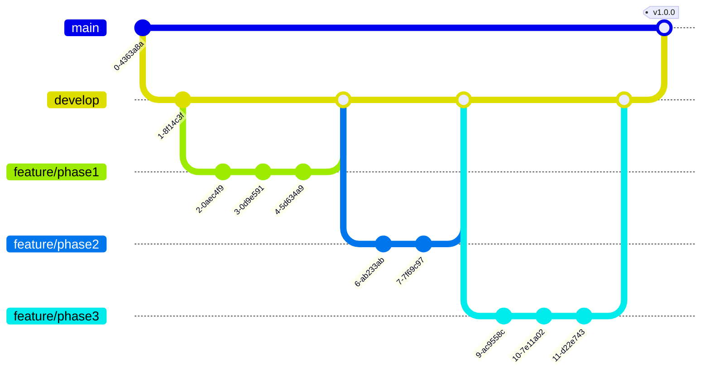

# Migration Overview & Architecture

## Overview

The current multi-agent system already has a solid foundation with modular agent types, LLM provider abstraction, and basic orchestration capabilities. This migration plan focuses on integrating advanced features from the reference implementation while maintaining cross-provider compatibility and existing functionality.

## Current System Architecture

## Target Architecture After Migration

## Migration Phases Summary

## Documentation and Requirements Strategy

Before implementing each phase, we will develop comprehensive documentation to ensure clear understanding of requirements, design decisions, and implementation details. This strategy addresses the current documentation gaps in the project.

### Documentation Structure

```mermaid
flowchart TD
    ProjectDocs[Project Documentation] --> RequirementsDocs[Requirements Documents]
    ProjectDocs --> DesignDocs[Design Documents]
    ProjectDocs --> APIReference[API Reference]
    ProjectDocs --> UserGuides[User Guides]
    ProjectDocs --> DevGuides[Developer Guides]
    
    RequirementsDocs --> FunctionalReqs[Functional Requirements]
    RequirementsDocs --> NonFunctionalReqs[Non-Functional Requirements]
    RequirementsDocs --> ReqsMatrix[Requirements Traceability Matrix]
    
    DesignDocs --> ArchitectureDiagrams[Architecture Diagrams]
    DesignDocs --> ComponentSpecs[Component Specifications]
    DesignDocs --> SequenceDiagrams[Sequence Diagrams]
    DesignDocs --> DataModels[Data Models]
    
    APIReference --> Endpoints[API Endpoints]
    APIReference --> DataSchemas[Data Schemas]
    APIReference --> ErrorCodes[Error Codes]
    
    UserGuides --> Installation[Installation Guide]
    UserGuides --> Configuration[Configuration Guide]
    UserGuides --> Usage[Usage Scenarios]
    
    DevGuides --> SetupGuide[Development Setup]
    DevGuides --> ContributionGuide[Contribution Guidelines]
    DevGuides --> TestingGuide[Testing Guide]
```

### Documentation Implementation Plan

1. **Pre-Migration Documentation**
   - Create a comprehensive system architecture document
   - Document the current capabilities and limitations
   - Create a glossary of terms and concepts

2. **Per-Phase Documentation**
   - Detailed requirements specification for each phase
   - Design documents with architecture diagrams
   - API specifications and data models
   - Implementation guidelines for developers

3. **Post-Implementation Documentation**
   - User guides for new features
   - Developer documentation for extending the system
   - Maintenance and troubleshooting guides

### Requirements Management Process

1. **Requirements Gathering**
   - Analyze reference implementation features
   - Document functional requirements
   - Define non-functional requirements (performance, security, etc.)
   - Prioritize requirements based on business value

2. **Requirements Documentation**
   - Create formal requirements documents
   - Develop requirements traceability matrix
   - Define acceptance criteria for each requirement

## Version Control Strategy

We will follow [Git Workflow Guidelines](../git_workflow.md) with some specific adaptations for this migration project:

### Branch Structure

### Branching Guidelines

1. **Main Branches**
   - `main` - Production-ready code
   - `develop` - Integration branch for features

2. **Feature Branches**
   - Create a feature branch for each phase or major component
   - Follow naming convention: `feature/phase<n>-<component-name>`
   - Create smaller branches for individual features when needed

3. **Release Branches**
   - Create a release branch after completing each phase
   - Name format: `release/v<major>.<minor>.<patch>`
   - Merge to main and tag after testing

### Commit Guidelines

1. **Commit Messages**
   - Follow conventional commit format: `<type>(<scope>): <description>`
   - Reference issue numbers when applicable
   - Provide detailed descriptions for significant changes

2. **Code Reviews**
   - All changes require code review
   - Use pull requests for all merges to develop
   - Require at least one approval before merging 