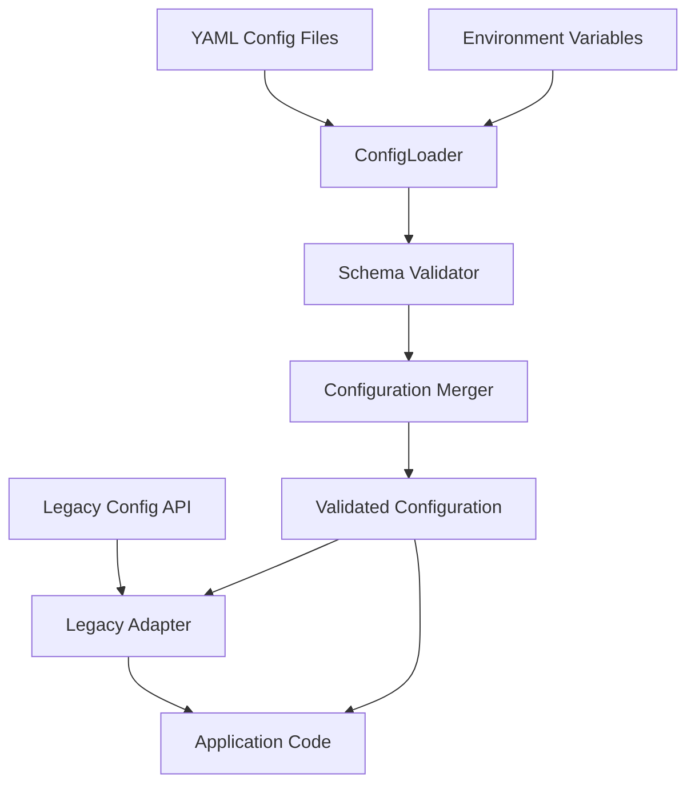

# Phase 1 Technical Design: Data Migration

## Overview

This document outlines the technical design for Phase 1 of the multi-agent system migration, focusing on enhancing the configuration system to use YAML-based configuration with environment variable overrides, validation, and backward compatibility.

## Current Implementation

The current system uses a combination of hardcoded defaults and environment variable overrides implemented in the `Config` class (`src/config.py`). Configuration is organized into several Pydantic models:

- `LLMEndpointConfig`: Configuration for LLM API endpoints
- `LLMConfig`: Configuration for LLM providers
- `AgentConfig`: Agent-specific settings
- `APIConfig`: API server settings
- `UIConfig`: UI settings
- `LoggingConfig`: Logging configuration

The main limitations of the current system are:
1. No support for file-based configuration
2. Limited validation for configuration values
3. No hierarchical configuration capability
4. No centralized schema definition

## Proposed Architecture

### High-Level Design



### Component Design

#### 1. ConfigLoader

Responsible for loading configuration from multiple sources:
- YAML files in predefined locations
- Environment variables
- Default values

**Key Methods:**
- `load_from_yaml(path)`: Load configuration from a YAML file
- `load_from_env()`: Load configuration from environment variables
- `load_defaults()`: Load default configuration values
- `load_config()`: Orchestrate loading from all sources in proper precedence

**Implementation Details:**
- Use PyYAML for YAML parsing
- Implement a consistent naming scheme for environment variables
- Support multiple YAML files with cascading precedence

#### 2. SchemaValidator

Validates configuration against a defined schema:
- Required vs. optional fields
- Type validation
- Range/constraint validation
- Format validation

**Key Methods:**
- `validate_config(config, schema)`: Validate a configuration against a schema
- `get_schema()`: Get the current configuration schema
- `generate_schema_docs()`: Generate documentation from the schema

**Implementation Details:**
- Use JSON Schema for validation
- Generate helpful error messages for validation failures
- Support custom validation rules

#### 3. ConfigMerger

Merges configuration from multiple sources with correct precedence:
1. Environment variables (highest priority)
2. User configuration files
3. System configuration files
4. Default values (lowest priority)

**Key Methods:**
- `merge_configs(base, override)`: Merge two configurations with override taking precedence
- `apply_env_overrides(config)`: Apply environment variable overrides to a configuration

**Implementation Details:**
- Deep merge support for nested configurations
- Array handling (replace vs. append)
- Special handling for "unset" values

#### 4. LegacyAdapter

Provides backward compatibility with the existing configuration API:
- Maps new configuration structure to old API
- Ensures no breaking changes to existing code

**Key Methods:**
- `adapt_to_legacy(config)`: Convert new configuration to legacy format
- `adapt_from_legacy(legacy_config)`: Convert legacy configuration to new format

**Implementation Details:**
- Implement the same interface as the current Config class
- Map new configuration paths to legacy properties

### YAML Configuration Structure

```yaml
# Example config.yaml structure
llm:
  default_provider: openai
  providers:
    openai:
      api_key: ${OPENAI_API_KEY}  # Environment variable reference
      model_id: gpt-3.5-turbo
      temperature: 0.7
      max_tokens: 2048
      endpoint:
        api_base: ${OPENAI_API_BASE}
        organization_id: ${OPENAI_ORGANIZATION_ID}
        api_version: ${OPENAI_API_VERSION}
    
    gemini:
      api_key: ${GOOGLE_API_KEY}
      model_id: models/gemini-1.5-flash
      temperature: 0.8
      max_tokens: 2048
      endpoint:
        api_base: ${GEMINI_API_BASE}
        api_version: ${GEMINI_API_VERSION}
    
    claude:
      api_key: ${ANTHROPIC_API_KEY}
      model_id: claude-3-haiku-20240307
      temperature: 0.7
      max_tokens: 4000
      endpoint:
        api_base: ${ANTHROPIC_API_BASE}
        api_version: ${ANTHROPIC_API_VERSION}

agent:
  save_chat: true
  verbose_logging: false
  max_retries: 3
  timeout_seconds: 60

api:
  host: 0.0.0.0
  port: 8000
  debug: false
  reload: true

ui:
  port: 8501
  address: 0.0.0.0
  theme: light

logging:
  level: INFO
  format: "%(asctime)s | %(levelname)-8s - [%(relpathname)s %(funcName)s(%(lineno)d)] - %(message)s"
  log_to_file: true
  log_dir: logs
```

### Schema Definition

The configuration schema will be defined using JSON Schema:

```json
{
  "$schema": "http://json-schema.org/draft-07/schema#",
  "type": "object",
  "properties": {
    "llm": {
      "type": "object",
      "properties": {
        "default_provider": {
          "type": "string",
          "enum": ["openai", "gemini", "claude"]
        },
        "providers": {
          "type": "object",
          "properties": {
            "openai": {"$ref": "#/$defs/llm_provider"},
            "gemini": {"$ref": "#/$defs/llm_provider"},
            "claude": {"$ref": "#/$defs/llm_provider"}
          }
        }
      },
      "required": ["default_provider", "providers"]
    },
    "agent": {"$ref": "#/$defs/agent_config"},
    "api": {"$ref": "#/$defs/api_config"},
    "ui": {"$ref": "#/$defs/ui_config"},
    "logging": {"$ref": "#/$defs/logging_config"}
  },
  "$defs": {
    "llm_provider": {
      "type": "object",
      "properties": {
        "api_key": {"type": "string"},
        "model_id": {"type": "string"},
        "temperature": {"type": "number", "minimum": 0, "maximum": 1},
        "max_tokens": {"type": "integer", "minimum": 1},
        "endpoint": {
          "type": "object",
          "properties": {
            "api_base": {"type": "string"},
            "api_version": {"type": "string"},
            "organization_id": {"type": "string"}
          }
        }
      },
      "required": ["api_key", "model_id"]
    },
    "agent_config": {
      "type": "object",
      "properties": {
        "save_chat": {"type": "boolean"},
        "verbose_logging": {"type": "boolean"},
        "max_retries": {"type": "integer", "minimum": 0},
        "timeout_seconds": {"type": "integer", "minimum": 1}
      }
    },
    "api_config": {
      "type": "object",
      "properties": {
        "host": {"type": "string"},
        "port": {"type": "integer", "minimum": 1, "maximum": 65535},
        "debug": {"type": "boolean"},
        "reload": {"type": "boolean"}
      }
    },
    "ui_config": {
      "type": "object",
      "properties": {
        "port": {"type": "integer", "minimum": 1, "maximum": 65535},
        "address": {"type": "string"},
        "theme": {"type": "string", "enum": ["light", "dark"]}
      }
    },
    "logging_config": {
      "type": "object",
      "properties": {
        "level": {"type": "string", "enum": ["DEBUG", "INFO", "WARNING", "ERROR", "CRITICAL"]},
        "format": {"type": "string"},
        "log_to_file": {"type": "boolean"},
        "log_dir": {"type": "string"}
      }
    }
  }
}
```

## Implementation Plan

### Phase 1.1: Basic YAML Configuration

1. Create a new `config_loader.py` file with the `ConfigLoader` class
2. Implement YAML file loading capability
3. Add environment variable substitution
4. Create a sample YAML configuration file

### Phase 1.2: Schema Validation

1. Create a `schema_validator.py` file with the `SchemaValidator` class
2. Define the JSON Schema for configuration
3. Implement validation logic
4. Add helpful error messages for validation failures

### Phase 1.3: Configuration Merging

1. Create a `config_merger.py` file with the `ConfigMerger` class
2. Implement deep merging logic
3. Add special handling for arrays and nested objects
4. Implement environment variable override capability

### Phase 1.4: Legacy Adapter

1. Create a `legacy_adapter.py` file with the `LegacyAdapter` class
2. Map new configuration structure to legacy API
3. Ensure backward compatibility with existing code

### Phase 1.5: Integration and Testing

1. Integrate all components
2. Write comprehensive unit tests
3. Write integration tests
4. Create documentation

## Migration Path

To ensure a smooth transition from the current configuration system to the new YAML-based system:

1. The new system will load configuration from both YAML and environment variables
2. The `LegacyAdapter` will provide backward compatibility with the current API
3. Documentation will be provided for migrating to the new API
4. Examples will be provided for common configuration scenarios

## Risks and Mitigations

| Risk | Impact | Mitigation |
|------|--------|------------|
| Breaking backward compatibility | High | Thorough testing of `LegacyAdapter`, comprehensive regression tests |
| Performance degradation | Medium | Benchmark new system against current implementation, optimize loading process |
| Configuration errors harder to debug | Medium | Detailed error messages, validation before application startup |
| Environment variable handling complexity | Medium | Clear documentation, consistent naming conventions |

## Conclusion

This design provides a flexible, robust configuration system that will serve as a foundation for the multi-agent system migration. The YAML-based approach with environment variable overrides and validation will provide a more maintainable and user-friendly configuration experience while ensuring backward compatibility. 