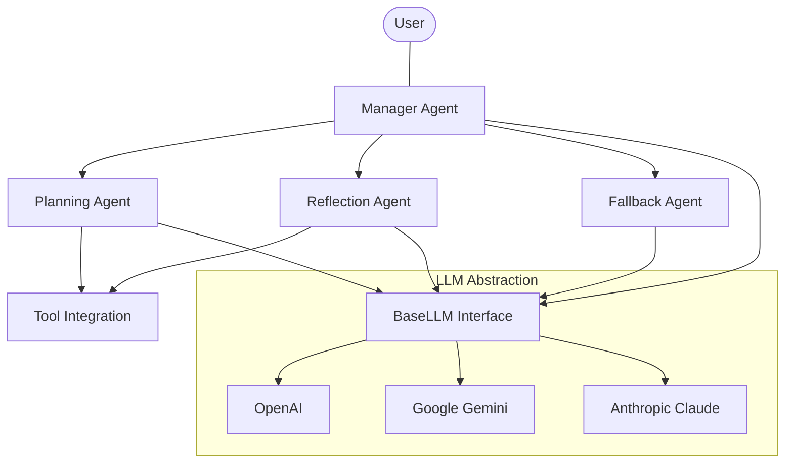
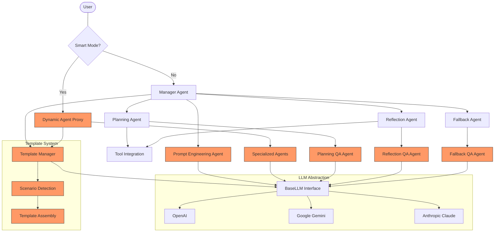
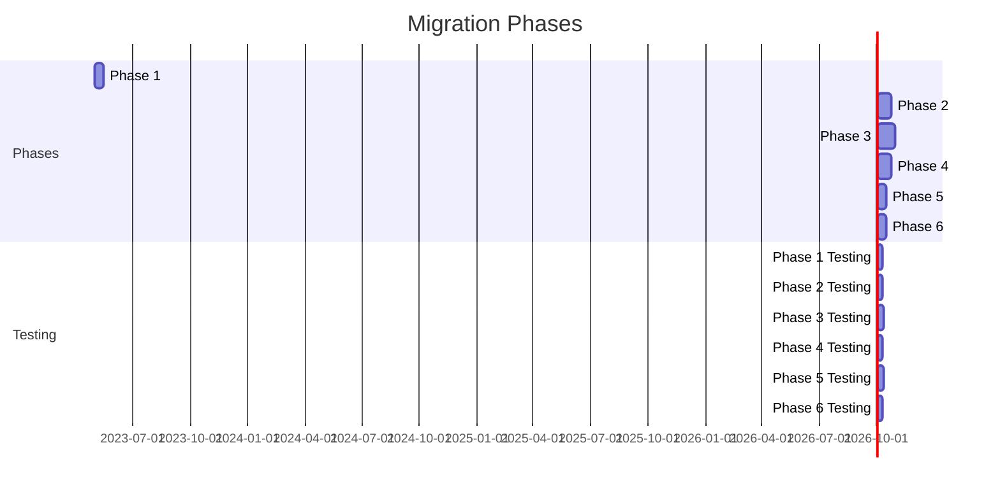
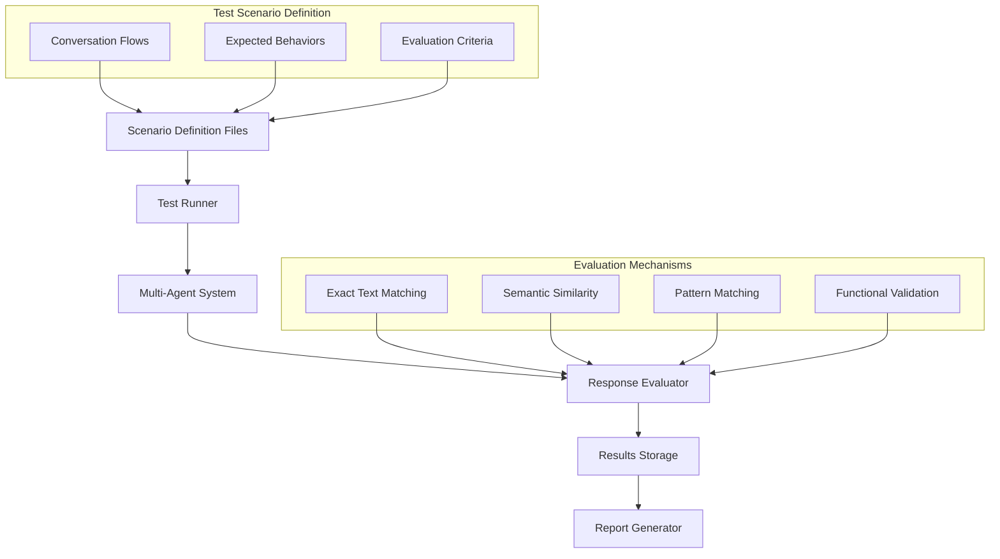
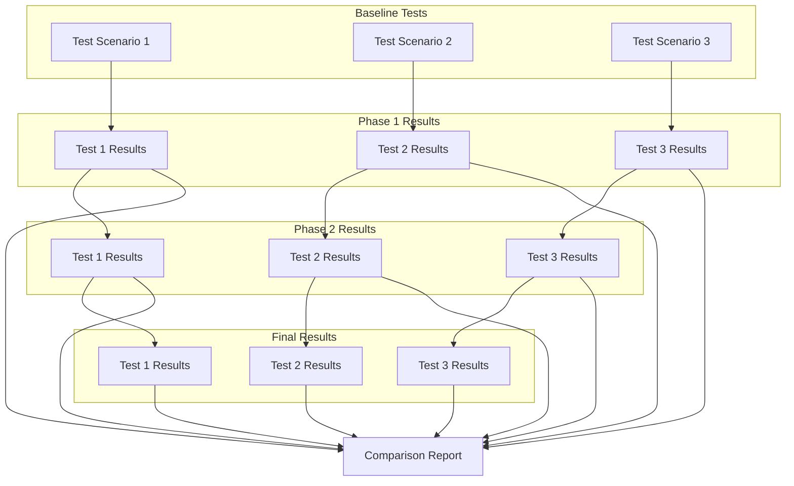
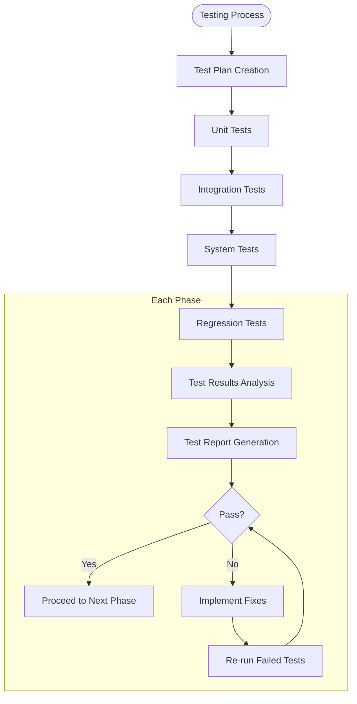
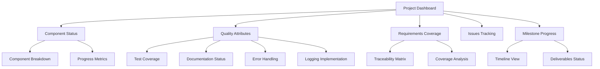

# Multi-Agent System Migration Plan

This document outlines a phased approach for enhancing our current multi-agent system by integrating key features from the reference implementation. Each phase includes specific implementation tasks, testing requirements, and success criteria.

## Table of Contents

1. [Overview](#overview)
2. [Migration Phases Summary](#migration-phases-summary)
3. [Documentation and Requirements Strategy](#documentation-and-requirements-strategy)
4. [Version Control Strategy](#version-control-strategy)
5. [Master Checklist](#master-checklist)
6. [Phase 1: Configuration System Enhancement](#phase-1-configuration-system-enhancement)
7. [Phase 2: Prompt Template System Implementation](#phase-2-prompt-template-system-implementation)
8. [Phase 3: Smart Agent Proxy Integration](#phase-3-smart-agent-proxy-integration)
9. [Phase 4: QA Layer Implementation](#phase-4-qa-layer-implementation)
10. [Phase 5: Workflow Stages Implementation](#phase-5-workflow-stages-implementation)
11. [Phase 6: Testing Framework Implementation](#phase-6-testing-framework-implementation)
12. [Testing Strategy](#testing-strategy)
13. [Conversation-Based Testing Framework](#conversation-based-testing-framework)
14. [Rollback Procedures](#rollback-procedures)
15. [Timeline and Resources](#timeline-and-resources)
16. [Progress Tracking](#progress-tracking)

## Overview

The current multi-agent system already has a solid foundation with modular agent types, LLM provider abstraction, and basic orchestration capabilities. This migration plan focuses on integrating advanced features from the reference implementation while maintaining cross-provider compatibility and existing functionality.

### Current System Architecture



### Target Architecture After Migration



## Migration Phases Summary



## Documentation and Requirements Strategy

Before implementing each phase, we will develop comprehensive documentation to ensure clear understanding of requirements, design decisions, and implementation details. This strategy addresses the current documentation gaps in the project.

### Documentation Structure

```mermaid
flowchart TD
    ProjectDocs[Project Documentation] --> RequirementsDocs[Requirements Documents]
    ProjectDocs --> DesignDocs[Design Documents]
    ProjectDocs --> APIReference[API Reference]
    ProjectDocs --> UserGuides[User Guides]
    ProjectDocs --> DevGuides[Developer Guides]
    
    RequirementsDocs --> FunctionalReqs[Functional Requirements]
    RequirementsDocs --> NonFunctionalReqs[Non-Functional Requirements]
    RequirementsDocs --> ReqsMatrix[Requirements Traceability Matrix]
    
    DesignDocs --> ArchitectureDiagrams[Architecture Diagrams]
    DesignDocs --> ComponentSpecs[Component Specifications]
    DesignDocs --> SequenceDiagrams[Sequence Diagrams]
    DesignDocs --> DataModels[Data Models]
    
    APIReference --> Endpoints[API Endpoints]
    APIReference --> DataSchemas[Data Schemas]
    APIReference --> ErrorCodes[Error Codes]
    
    UserGuides --> Installation[Installation Guide]
    UserGuides --> Configuration[Configuration Guide]
    UserGuides --> Usage[Usage Scenarios]
    
    DevGuides --> SetupGuide[Development Setup]
    DevGuides --> ContributionGuide[Contribution Guidelines]
    DevGuides --> TestingGuide[Testing Guide]
```



### Documentation Implementation Plan

1. **Pre-Migration Documentation**
   - Create a comprehensive system architecture document
   - Document the current capabilities and limitations
   - Create a glossary of terms and concepts

2. **Per-Phase Documentation**
   - Detailed requirements specification for each phase
   - Design documents with architecture diagrams
   - API specifications and data models
   - Implementation guidelines for developers

3. **Post-Implementation Documentation**
   - User guides for new features
   - Developer documentation for extending the system
   - Maintenance and troubleshooting guides

### Requirements Management Process

1. **Requirements Gathering**
   - Analyze reference implementation features
   - Document functional requirements
   - Define non-functional requirements (performance, security, etc.)
   - Prioritize requirements based on business value

2. **Requirements Documentation**
   - Create formal requirements documents
   - Develop requirements traceability matrix
   - Define acceptance criteria for each requirement

3. **Requirements Validation**
   - Review requirements with stakeholders
   - Validate technical feasibility
   - Ensure alignment with project goals

### Documentation Standards

- All documentation will use Markdown format for version control
- Architecture and sequence diagrams will use Mermaid notation
- Code documentation will follow Python docstring standards
- API documentation will use OpenAPI/Swagger format

## Version Control Strategy

To maintain code quality and facilitate collaboration, we follow a structured Git workflow. See the [Git Workflow Guidelines](git_workflow.md) document for detailed guidelines on:

- Branch strategy and naming conventions
- Commit message format and best practices
- Code review process
- Release tagging and versioning
- Git hooks for quality assurance

All team members must follow these version control practices throughout the migration project to ensure a clean, traceable history and simplified collaboration.

## Master Checklist

This checklist applies to each phase of the migration process. Phase-specific checklists are provided in their respective sections.

### Pre-Implementation Checklist

- [ ] **Requirements Documentation**
  - [ ] Functional requirements documented
  - [ ] Non-functional requirements documented
  - [ ] Dependencies and constraints identified
  - [ ] Acceptance criteria defined

- [ ] **Design Documentation**
  - [ ] Architecture design reviewed and approved
  - [ ] Data model design completed
  - [ ] API specifications documented
  - [ ] Integration points identified

- [ ] **Resource Allocation**
  - [ ] Development team assigned
  - [ ] Testing resources allocated
  - [ ] Infrastructure needs addressed
  - [ ] Schedule confirmed with stakeholders

- [ ] **Version Control Setup**
  - [ ] Feature branch created following Git workflow guidelines
  - [ ] Required Git hooks installed for quality checks
  - [ ] Team briefed on commit message standards for this phase

### Implementation Checklist

- [ ] **Development Process**
  - [ ] Code developed according to style guidelines
  - [ ] Unit tests written for new functionality
  - [ ] Integration tests implemented
  - [ ] Regular code commits with descriptive messages following Git workflow
  - [ ] Frequent integration with main branch to reduce merge conflicts
  - [ ] **Git Commit Strategy**
    - [ ] Atomic commits focused on single logical changes
    - [ ] Meaningful commit messages following project conventions
    - [ ] Regular commits at logical implementation milestones
    - [ ] Code committed after passing local tests

- [ ] **Code Quality Assurance**
  - [ ] Code review conducted by at least one peer
  - [ ] All tests passing
  - [ ] Static code analysis completed
  - [ ] Code coverage meets minimum threshold
  - [ ] Commits follow appropriate format per Git workflow guidelines

### Pre-Migration Tasks

- [ ] **Initial Documentation**
  - [ ] Create comprehensive system architecture document
  - [ ] Document current capabilities and limitations
  - [ ] Create glossary of terms and concepts
  - [ ] Establish documentation standards and templates
  - [ ] **Commit documentation to Git repository**

- [ ] **Development Environment Setup**
  - [ ] Prepare development environments
  - [ ] Configure version control with feature branching
  - [ ] Set up CI/CD pipelines
  - [ ] Establish test environments
  - [ ] **Commit environment configuration to Git repository**

- [ ] **Testing Framework**
  - [ ] Implement conversation-based testing framework
  - [ ] Develop baseline test scenarios
  - [ ] Create testing utilities and evaluation metrics
  - [ ] Set up test results tracking
  - [ ] **Commit testing framework to Git repository**

- [ ] **Progress Tracking**
  - [ ] Initialize progress tracking system
  - [ ] Create baseline component status reports
  - [ ] Set up automated metrics collection
  - [ ] Establish regular reporting schedule
  - [ ] **Commit tracking templates to Git repository**

### Phase 1 Tasks - Configuration System

- [ ] **Requirements and Design**
  - [ ] Complete [Phase 1 Requirements Checklist](#phase-1-checklist)
  - [ ] Design YAML schema and validation rules
  - [ ] Create configuration class diagrams
  - [ ] **Commit requirements and design documents to Git repository**

- [ ] **Implementation**
  - [ ] Develop YAML configuration parser
  - [ ] Enhance configuration system
  - [ ] Create default configuration files
  - [ ] Update dependent components
  - [ ] **Commit code changes to Git repository (incremental commits with clear messages)**

- [ ] **Testing**
  - [ ] Run conversation-based test scripts
  - [ ] Verify backward compatibility
  - [ ] Test environment-specific configurations
  - [ ] Validate error handling
  - [ ] **Commit test scripts and results to Git repository**

- [ ] **Documentation**
  - [ ] Update configuration documentation
  - [ ] Create migration guide for existing users
  - [ ] Update developer guides
  - [ ] **Commit documentation updates to Git repository**

### Phase 2 Tasks - Prompt Template System

- [ ] **Requirements and Design**
  - [ ] Complete [Phase 2 Requirements Checklist](#phase-2-checklist)
  - [ ] Design template schema
  - [ ] Create template assembly flow diagrams
  - [ ] **Commit requirements and design documents to Git repository**

- [ ] **Implementation**
  - [ ] Create template manager
  - [ ] Implement template assembly engine
  - [ ] Create scenario detector
  - [ ] Integrate with agent system
  - [ ] **Commit code changes to Git repository (incremental commits with clear messages)**

- [ ] **Testing**
  - [ ] Test template loading from all supported sources
  - [ ] Test variable substitution with different data types
  - [ ] Test conditional logic in templates
  - [ ] Test nested template inclusion
  - [ ] Test error handling and validation
  - [ ] Test rendering performance with large datasets
  - [ ] **Commit all test scripts and results**

- [ ] **Documentation**
  - [ ] Create template authoring guide
  - [ ] Document template schema
  - [ ] Update developer documentation
  - [ ] **Commit documentation updates to Git repository**

#### Git Commit Guidelines for Phase 2
- [ ] Create feature branch named `feature/phase2-prompt-templates`
- [ ] Follow commit message format: `[Phase2] <component>: <brief description>`
- [ ] Commit requirements and design documents before implementation begins
- [ ] Make atomic commits focused on single logical changes
- [ ] Commit working code at logical implementation milestones
- [ ] Write detailed commit messages explaining the "why" behind changes
- [ ] Ensure commits are linked to project tracking system (reference IDs in commits)
- [ ] Create a pull request with detailed summary of all changes

### Phase 3 Tasks - Smart Agent Proxy

- [ ] **Requirements and Design**
  - [ ] Complete [Phase 3 Requirements Checklist](#phase-3-checklist)
  - [ ] Design prompt analysis algorithm
  - [ ] Create agent evolution diagrams
  - [ ] **Commit requirements and design documents to Git repository**

- [ ] **Implementation**
  - [ ] Implement Dynamic Agent Proxy
  - [ ] Create specialized agent
  - [ ] Develop prompt analysis engine
  - [ ] Implement agent evolution system
  - [ ] Add runtime mode switching
  - [ ] **Commit code changes to Git repository (incremental commits with clear messages)**

- [ ] **Testing**
  - [ ] Run conversation-based test scripts
  - [ ] Test prompt analysis accuracy
  - [ ] Validate agent design creation
  - [ ] Test multi-turn conversation evolution
  - [ ] **Commit test scripts and results to Git repository**

- [ ] **Documentation**
  - [ ] Document Smart Proxy mode
  - [ ] Create agent design schema
  - [ ] Update developer documentation
  - [ ] **Commit documentation updates to Git repository**

#### Git Commit Guidelines for Phase 3
- [ ] Create feature branch named `feature/phase3-agent-proxy`
- [ ] Follow commit message format: `[Phase3] <component>: <brief description>`
- [ ] Commit requirements and design documents before implementation begins
- [ ] Make atomic commits focused on single logical changes
- [ ] Commit working code at logical implementation milestones
- [ ] Write detailed commit messages explaining the "why" behind changes
- [ ] Ensure commits are linked to project tracking system (reference IDs in commits)

### Phase 4 Tasks - QA Layer

- [ ] **Requirements and Design**
  - [ ] Complete [Phase 4 Requirements Checklist](#phase-4-checklist)
  - [ ] Design review-revision workflow
  - [ ] Define quality criteria
  - [ ] **Commit requirements and design documents to Git repository**

- [ ] **Implementation**
  - [ ] Create base QA agent
  - [ ] Implement specialized QA agents
  - [ ] Develop quality criteria definitions
  - [ ] Implement review-revision workflow
  - [ ] Integrate with existing agents
  - [ ] **Commit code changes to Git repository (incremental commits with clear messages)**

- [ ] **Testing**
  - [ ] Run conversation-based test scripts
  - [ ] Test QA accuracy
  - [ ] Validate revision improvements
  - [ ] Benchmark quality improvements
  - [ ] **Commit test scripts and results to Git repository**

- [ ] **Documentation**
  - [ ] Document QA process
  - [ ] Create quality criteria guide
  - [ ] Update developer documentation
  - [ ] **Commit documentation updates to Git repository**

- [ ] Set up notifications for failed tests
- [ ] Document the testing process and scenarios

#### Git Commit Guidelines for Phase 4
- [ ] Create feature branch named `feature/phase4-qa-layer`
- [ ] Follow commit message format: `[Phase4] <component>: <brief description>`
- [ ] Commit requirements and design documents before implementation begins
- [ ] Make atomic commits focused on single logical changes
- [ ] Commit working code at logical implementation milestones
- [ ] Write detailed commit messages explaining the "why" behind changes
- [ ] Ensure commits are linked to project tracking system (reference IDs in commits)
- [ ] Create a pull request with detailed summary of all changes

<a id="phase-4-checklist"></a>
### Phase 4 Checklist

#### Requirements
- [ ] Define quality criteria dimensions
- [ ] Document review workflow requirements
- [ ] Define feedback generation requirements
- [ ] Identify revision strategy requirements
- [ ] Document integration requirements

#### Design
- [ ] Design QA agent class hierarchy
- [ ] Create quality assessment algorithm
- [ ] Design review-revision workflow
- [ ] Design feedback generation approach
- [ ] Create integration mechanism

#### Development
- [ ] Implement base QA agent
- [ ] Create specialized QA agents
- [ ] Develop quality criteria definitions
- [ ] Implement review-revision workflow
- [ ] Integrate with existing agents

#### Testing
- [ ] Test quality assessment accuracy
- [ ] Test feedback generation
- [ ] Test revision process
- [ ] Measure quality improvements
- [ ] Validate end-to-end flow

### Phase 5 Tasks - Workflow Stages

- [ ] **Requirements and Design**
  - [ ] Complete [Phase 5 Requirements Checklist](#phase-5-checklist)
  - [ ] Design stage transition rules
  - [ ] Create workflow diagrams
  - [ ] **Commit requirements and design documents to Git repository**

- [ ] **Implementation**
  - [ ] Implement workflow stage tracking
  - [ ] Add stage-specific guidance
  - [ ] Create stage transition logic
  - [ ] Integrate with template system
  - [ ] Add user-facing indicators
  - [ ] **Commit code changes to Git repository (incremental commits with clear messages)**

- [ ] **Testing**
  - [ ] Run conversation-based test scripts
  - [ ] Test stage transitions
  - [ ] Test stage-specific outputs
  - [ ] Validate user experience
  - [ ] Test complex multi-stage workflows
  - [ ] **Commit test scripts and results to Git repository**

- [ ] **Documentation**
  - [ ] Document workflow stages
  - [ ] Create workflow authoring guide
  - [ ] Update user and developer documentation
  - [ ] **Commit documentation updates to Git repository**

### Post-Migration Tasks

- [ ] **Final Integration Testing**
  - [ ] Run full test suite across all features
  - [ ] Conduct load and performance testing
  - [ ] Validate cross-feature interactions
  - [ ] **Commit final test results to Git repository**

- [ ] **Documentation Finalization**
  - [ ] Complete all pending documentation
  - [ ] Review and update existing documentation
  - [ ] Create comprehensive user guides
  - [ ] **Commit final documentation to Git repository**

- [ ] **Knowledge Transfer**
  - [ ] Conduct training sessions
  - [ ] Create tutorial materials
  - [ ] Document lessons learned
  - [ ] **Commit training materials to Git repository**

- [ ] **Release Activities**
  - [ ] Create release notes
  - [ ] Plan deployment strategy
  - [ ] Establish monitoring protocols
  - [ ] **Create Git release tag for stable version**

## Phase-Specific Checklists

<a id="phase-1-checklist"></a>
### Phase 1: Configuration System Checklist

#### Requirements
- [ ] Document all current configuration parameters
- [ ] Define YAML schema requirements
- [ ] Identify environment variables to support
- [ ] Define validation rules for configuration values
- [ ] Document backward compatibility requirements
- [ ] **Commit requirements documentation to Git repository**

#### Design
- [ ] Create configuration class diagram
- [ ] Design YAML file structure
- [ ] Define configuration merging strategy
- [ ] Design validation implementation
- [ ] Create error handling approach
- [ ] **Commit design documentation to Git repository**

#### Development
- [ ] Implement YAML parser
  - [ ] **Commit initial YAML parser code**
- [ ] Create configuration loader with fallbacks
  - [ ] **Commit configuration loader code**
- [ ] Implement validation logic
  - [ ] **Commit validation implementation**
- [ ] Create configuration documentation
  - [ ] **Commit documentation updates**
- [ ] Update all dependent components
  - [ ] **Commit dependency updates**

#### Testing
- [ ] Test default configuration loading
- [ ] Test environment variable overrides
- [ ] Test configuration merging from multiple sources
- [ ] Test validation error handling
- [ ] Verify backward compatibility
- [ ] **Commit all test scripts and results**

#### Git Commit Guidelines for Phase 1
- [ ] Create feature branch named `feature/phase1-config-system`
- [ ] Follow commit message format: `[Phase1] <component>: <brief description>`
- [ ] Commit requirements and design documents before implementation begins
- [ ] Make atomic commits focused on single logical changes
- [ ] Commit working code at logical implementation milestones
- [ ] Write detailed commit messages explaining the "why" behind changes
- [ ] Ensure commits are linked to project tracking system (reference IDs in commits)
- [ ] Create a pull request with detailed summary of all changes

<a id="phase-2-checklist"></a>
### Phase 2: Prompt Template System Checklist

#### Requirements
- [ ] Define template schema requirements
- [ ] Identify all template contexts (scenarios, entities, stages)
- [ ] Define variable substitution requirements
- [ ] Document template assembly rules
- [ ] Define template caching strategy

#### Design
- [ ] Design template file structure
- [ ] Create template assembly algorithm
- [ ] Design scenario detection approach
- [ ] Create template context model
- [ ] Design caching mechanism

#### Development
- [ ] Implement template manager
- [ ] Create template parser
- [ ] Implement template assembly engine
- [ ] Develop scenario detector
- [ ] Create template usage documentation

#### Testing
- [ ] Test template loading from all supported sources
- [ ] Test variable substitution with different data types
- [ ] Test conditional logic in templates
- [ ] Test nested template inclusion
- [ ] Test error handling and validation
- [ ] Test rendering performance with large datasets
- [ ] **Commit all test scripts and results**

#### Git Commit Guidelines for Phase 2
- [ ] Create feature branch named `feature/phase2-prompt-templates`
- [ ] Follow commit message format: `[Phase2] <component>: <brief description>`
- [ ] Commit requirements and design documents before implementation begins
- [ ] Make atomic commits focused on single logical changes
- [ ] Commit working code at logical implementation milestones
- [ ] Write detailed commit messages explaining the "why" behind changes
- [ ] Ensure commits are linked to project tracking system (reference IDs in commits)
- [ ] Create a pull request with detailed summary of all changes

<a id="phase-3-checklist"></a>
### Phase 3: Smart Agent Proxy Checklist

#### Requirements
- [ ] Define prompt analysis requirements
- [ ] Document agent design schema
- [ ] Define evolution rules for conversations
- [ ] Identify agent performance metrics
- [ ] Document mode switching requirements

#### Design
- [ ] Design prompt analysis algorithm
- [ ] Create agent design structure
- [ ] Design evolution algorithm
- [ ] Design performance tracking approach
- [ ] Create mode switching mechanism

#### Development
- [ ] Implement Dynamic Agent Proxy
- [ ] Create specialized agent class
- [ ] Develop prompt analysis engine
- [ ] Implement agent evolution system
- [ ] Add runtime mode switching

#### Testing
- [ ] Test prompt analysis accuracy
- [ ] Test agent design creation
- [ ] Test evolution over multi-turn conversations
- [ ] Test performance tracking
- [ ] Verify mode switching

#### Git Commit Guidelines for Phase 3
- [ ] Create feature branch named `feature/phase3-agent-proxy`
- [ ] Follow commit message format: `[Phase3] <component>: <brief description>`
- [ ] Commit requirements and design documents before implementation begins
- [ ] Make atomic commits focused on single logical changes
- [ ] Commit working code at logical implementation milestones
- [ ] Write detailed commit messages explaining the "why" behind changes
- [ ] Ensure commits are linked to project tracking system (reference IDs in commits)

<a id="phase-5-checklist"></a>
### Phase 5 Checklist

#### Requirements
- [ ] Define workflow stages and transitions
- [ ] Document stage-specific guidance requirements
- [ ] Define stage detection requirements
- [ ] Identify user-facing indicators
- [ ] Document template integration requirements

#### Design
- [ ] Design stage tracking mechanism
- [ ] Create stage transition rules
- [ ] Design stage-specific guidance integration
- [ ] Design user-facing indicators
- [ ] Create template integration approach

#### Development
- [ ] Implement workflow stage tracking
- [ ] Add stage-specific guidance
- [ ] Create stage transition logic
- [ ] Integrate with template system
- [ ] Add user-facing indicators

#### Testing
- [ ] Test stage tracking accuracy
- [ ] Test stage transitions
- [ ] Test stage-specific outputs
- [ ] Validate user experience
- [ ] Test complex multi-stage workflows
- [ ] Test performance tracking
- [ ] Verify mode switching

#### Git Commit Guidelines for Phase 5
- [ ] Create feature branch named `feature/phase5-workflow-stages`
- [ ] Follow commit message format: `[Phase5] <component>: <brief description>`
- [ ] Commit requirements and design documents before implementation begins
- [ ] Make atomic commits focused on single logical changes
- [ ] Commit working code at logical implementation milestones
- [ ] Write detailed commit messages explaining the "why" behind changes
- [ ] Ensure commits are linked to project tracking system (reference IDs in commits)
- [ ] Create a pull request with detailed summary of all changes

## Conversation-Based Testing Framework

Instead of traditional unit tests, we will implement a conversation-based testing framework that simulates real user interactions and evaluates responses based on expected characteristics rather than exact matches.

### Framework Architecture



### Scenario Definition Format

Test scenarios will be defined in YAML files that specify:
1. Conversation sequence (user inputs and expected agent responses)
2. Evaluation criteria for each response
3. System configuration for the test

Example scenario definition:

```yaml
name: "Basic Planning Capability Test"
description: "Tests the planning agent's ability to create and execute plans"
configuration:
  agent_mode: "standard"  # or "smart_proxy"
  max_steps: 3
conversations:
  - id: "simple_planning_task"
    description: "A simple task requiring planning"
    turns:
      - role: "user"
        content: "I need to analyze the sales data from Q1 and create a report."
        
      - role: "assistant"
        expect:
          - type: "semantic_similarity"
            content: "I'll help you analyze the sales data and create a report."
            threshold: 0.8
          - type: "contains_pattern"
            pattern: ".*plan.*steps.*"
          - type: "function_call"
            name: "has_valid_plan_structure"
            
      - role: "user"
        content: "Yes, please proceed with your plan."
        
      - role: "assistant"
        expect:
          - type: "contains_all_keywords"
            keywords: ["analysis", "report", "data"]
          - type: "functional_validation"
            name: "executed_planned_steps"
            args:
              min_steps_executed: 2
```

### Test Runner Implementation

The test runner will:
1. Load scenario definitions
2. Initialize the agent system with the specified configuration
3. Execute conversations turn by turn
4. Collect and evaluate responses
5. Generate detailed reports on test results

```python
# Pseudocode for test runner
class ConversationTestRunner:
    def __init__(self, scenario_dir, agent_system):
        self.scenarios = self.load_scenarios(scenario_dir)
        self.agent_system = agent_system
        self.evaluator = ResponseEvaluator()
        
    def load_scenarios(self, scenario_dir):
        # Load all YAML scenario files
        pass
        
    def run_all_tests(self):
        results = {}
        for scenario in self.scenarios:
            results[scenario.id] = self.run_scenario(scenario)
        return results
        
    def run_scenario(self, scenario):
        # Configure agent system
        self.agent_system.configure(scenario.configuration)
        
        results = []
        # For each conversation in the scenario
        for conversation in scenario.conversations:
            conv_result = self.run_conversation(conversation)
            results.append(conv_result)
            
        return results
        
    def run_conversation(self, conversation):
        # Execute each turn and evaluate responses
        pass
```

### Response Evaluation

The response evaluator will use multiple evaluation strategies:

1. **Exact Text Matching**: For cases where specific text must be present
2. **Semantic Similarity**: Using embeddings to check if responses are semantically similar to expected content
3. **Pattern Matching**: Using regex to verify response patterns
4. **Functional Validation**: Custom functions to validate specific behaviors (e.g., did the agent create a valid plan?)

### Cross-Phase Comparison

The framework will track performance across migration phases:



### Test Scenario Categories

We will develop test scenarios in the following categories:

1. **Core Functionality Tests**
   - Basic agent interactions
   - Tool usage
   - Error handling
   - Configuration validation

2. **Agent-Specific Tests**
   - Manager agent classification
   - Planning agent workflows
   - Reflection agent quality
   - Fallback agent behavior

3. **Cross-Phase Regression Tests**
   - Ensure basic functionality continues to work
   - Verify backward compatibility
   - Check performance characteristics

4. **Edge Case and Resilience Tests**
   - Complex or ambiguous queries
   - Error recovery
   - Rate limiting and retry behavior
   - Malformed inputs

### Implementation Plan

1. **Framework Development**
   - Implement test runner
   - Create evaluation mechanisms
   - Develop reporting tools
   - Build scenario parser

2. **Scenario Creation**
   - Develop baseline test scenarios
   - Create phase-specific test cases
   - Add edge case scenarios
   - Develop performance benchmarks

3. **Integration with CI/CD**
   - Add automated test runs to CI pipeline
   - Create test result visualization
   - Implement regression detection
   - Add performance trending

## Testing Strategy

### Test Categories

1. **Unit Tests**
   - Test individual components in isolation
   - Verify behavior under normal and error conditions
   - Test configuration, templates, and core mechanisms

2. **Integration Tests**
   - Test agent interactions
   - Verify template assembly with different scenarios
   - Test QA workflow and agent evolution

3. **System Tests**
   - End-to-end conversation tests
   - Test multi-turn interactions
   - Verify performance metrics

4. **Regression Tests**
   - Verify all existing functionality continues to work
   - Test backward compatibility
   - Ensure no degradation in response quality



### Test Automation

- Create automated test scripts for all test categories
- Implement CI/CD pipeline integration
- Create test data generators for conversation testing
- Implement metrics collection for quality assessment

#### Git Commit Guidelines for Phase 6
- [ ] Create feature branch named `feature/phase6-testing-framework`
- [ ] Follow commit message format: `[Phase6] <component>: <brief description>`
- [ ] Commit requirements and design documents before implementation begins
- [ ] Make atomic commits focused on single logical changes
- [ ] Commit working code at logical implementation milestones
- [ ] Write detailed commit messages explaining the "why" behind changes
- [ ] Ensure commits are linked to project tracking system (reference IDs in commits)
- [ ] Create a pull request with detailed summary of all changes

## Rollback Procedures

For each phase, implement the following rollback strategy:

1. **Version Control**
   - Create feature branches for each phase
   - Implement clean separation of concerns
   - Tag stable versions before and after each phase

2. **Compatibility Layers**
   - Create adapters for backward compatibility
   - Implement feature flags for new functionality
   - Allow runtime disabling of new features

3. **Rollback Scripts**
   - Create scripts to revert configuration changes
   - Implement database migrations with rollback support
   - Document manual rollback procedures

4. **Monitoring**
   - Implement health checks for new components
   - Add performance monitoring
   - Create alerts for abnormal behavior

## Timeline and Resources

### Estimated Timeline

- **Phase 1:** 2-3 weeks
- **Phase 2:** 3-4 weeks
- **Phase 3:** 4-5 weeks
- **Phase 4:** 3-4 weeks
- **Phase 5:** 2-3 weeks

Total estimated duration: 14-19 weeks

### Resource Requirements

- **Development:** 2-3 developers familiar with LLMs and Python
- **Testing:** 1-2 QA engineers
- **Infrastructure:** Cloud infrastructure for testing and development
- **LLM API Access:** OpenAI API keys (and optionally other providers)

### Dependencies and Risks

- **API Limitations:** OpenAI Responses API may have limitations or changes
- **Performance Impact:** New features may impact response times
- **Complexity Management:** Ensuring the system remains maintainable
- **Testing Thoroughness:** Comprehensive testing is critical

### Mitigation Strategies

- Regular architecture reviews
- Performance benchmarking at each phase
- Thorough documentation
- Incremental implementation with testing checkpoints

## Progress Tracking

We will implement a comprehensive progress tracking system to monitor the status of each phase, component, and cross-cutting concern. This provides visibility into the project's status and ensures quality attributes are consistently addressed.

### Progress Dashboard

We will create a central progress dashboard with the following structure:



### Progress Tracking Template

For each major component, we will maintain a tracking table with the following format:

| Component | Complete | In Progress | Not Started | Total | % Done | Documentation | Error Handling | Testing | Logging |
|-----------|----------|-------------|------------|-------|--------|---------------|----------------|---------|---------|
| Component 1 | # | # | # | # | % | ✅/⬜ | ✅/⬜ | ✅/⬜ | ✅/⬜ |
| Component 2 | # | # | # | # | % | ✅/⬜ | ✅/⬜ | ✅/⬜ | ✅/⬜ |
| ... | ... | ... | ... | ... | ... | ... | ... | ... | ... |
| **Total** | **#** | **#** | **#** | **#** | **%** | **#/#** | **#/#** | **#/#** | **#/#** |

### Implementation of Tracking System

1. **Setup Phase (Before Migration Begins)**
   - Create initial documentation framework
   - Set up progress tracking templates
   - Establish baseline metrics

2. **Per-Phase Tracking**
   - Update component status after each milestone
   - Track quality attributes across all components
   - Generate weekly progress reports

3. **Continuous Improvement**
   - Review tracking effectiveness monthly
   - Adjust metrics and tracking approach as needed
   - Incorporate feedback from stakeholders

### Integration with Development Workflow

- Link GitHub/GitLab issues to requirements
- Automate tracking updates based on commits and PRs
- Generate progress reports from version control data

This comprehensive approach to documentation and progress tracking will ensure that all team members have clear visibility into project status, requirements, and implementation details, addressing the current documentation gaps in the project. 

## Phase 1: Data Migration

### Phase 1 Checklist

- [ ] **Planning**
  - [ ] Data assessment completed
  - [ ] Migration strategy approved
  - [ ] Rollback plan developed
  - [ ] Feature branch created with prefix `data-migration/` per Git workflow

- [ ] **Development**
  - [ ] Data mapping completed
  - [ ] Migration scripts developed
  - [ ] Data validation rules implemented
  - [ ] Daily commits with standardized messages (per Git workflow)
  - [ ] Pull requests created for code review

- [ ] **Testing**
  - [ ] Testing environment prepared
  - [ ] Data migration tested with sample data
  - [ ] Performance testing completed
  - [ ] Issues logged in tracking system
  - [ ] Code review feedback addressed and committed

- [ ] **Implementation**
  - [ ] Migration schedule confirmed
  - [ ] Stakeholders notified
  - [ ] Production environment prepared
  - [ ] Final code merged following Git workflow approval process
  - [ ] Release tagged according to versioning standards

## Phase 2: Application Services

### Phase 2 Checklist

- [ ] **Planning**
  - [ ] Service architecture finalized
  - [ ] Dependencies identified
  - [ ] Implementation plan approved
  - [ ] Feature branches created with prefix `app-services/` per Git workflow

- [ ] **Development**
  - [ ] Service interfaces developed
  - [ ] Authentication implemented
  - [ ] API endpoints created
  - [ ] Documentation updated
  - [ ] Regular commits following Git workflow standards
  - [ ] Automated tests integrated with CI pipeline

- [ ] **Testing**
  - [ ] Service integration tested
  - [ ] Load testing completed
  - [ ] Security testing completed
  - [ ] API documentation verified
  - [ ] All pull requests reviewed according to team standards

- [ ] **Implementation**
  - [ ] Deployment plan finalized
  - [ ] Services deployed to staging
  - [ ] Final testing completed
  - [ ] Code merged to main branch after approval
  - [ ] Release tagged and deployed

## Phase 3: User Interface

### Phase 3 Checklist

- [ ] **Planning**
  - [ ] UI/UX design approved
  - [ ] Component architecture defined
  - [ ] Implementation priorities set
  - [ ] Feature branches created with prefix `ui/` per Git workflow

- [ ] **Development**
  - [ ] Core components developed
  - [ ] API integration completed
  - [ ] UI state management implemented
  - [ ] Responsive design implemented
  - [ ] Commits organized by component or feature with detailed messages
  - [ ] Changes pushed daily to remote repository

- [ ] **Testing**
  - [ ] Unit tests for components
  - [ ] Integration testing completed
  - [ ] Cross-browser testing completed
  - [ ] Accessibility testing completed
  - [ ] All pull requests include test coverage reports

- [ ] **Implementation**
  - [ ] User acceptance testing completed
  - [ ] Final adjustments made
  - [ ] Production deployment prepared
  - [ ] Code merged following team review process
  - [ ] Release tagged with UI version number 

## Conversation-Based Testing Framework

Instead of traditional unit tests, we will implement a conversation-based testing framework that simulates real user interactions and evaluates responses based on expected characteristics rather than exact matches.

### Framework Architecture


### Scenario Definition Format

Test scenarios will be defined in YAML files that specify:
1. Conversation sequence (user inputs and expected agent responses)
2. Evaluation criteria for each response
3. System configuration for the test

Example scenario definition:

```yaml
name: "Basic Planning Capability Test"
description: "Tests the planning agent's ability to create and execute plans"
configuration:
  agent_mode: "standard"  # or "smart_proxy"
  max_steps: 3
conversations:
  - id: "simple_planning_task"
    description: "A simple task requiring planning"
    turns:
      - role: "user"
        content: "I need to analyze the sales data from Q1 and create a report."
        
      - role: "assistant"
        expect:
          - type: "semantic_similarity"
            content: "I'll help you analyze the sales data and create a report."
            threshold: 0.8
          - type: "contains_pattern"
            pattern: ".*plan.*steps.*"
          - type: "function_call"
            name: "has_valid_plan_structure"
            
      - role: "user"
        content: "Yes, please proceed with your plan."
        
      - role: "assistant"
        expect:
          - type: "contains_all_keywords"
            keywords: ["analysis", "report", "data"]
          - type: "functional_validation"
            name: "executed_planned_steps"
            args:
              min_steps_executed: 2
```

### Test Runner Implementation

The test runner will:
1. Load scenario definitions
2. Initialize the agent system with the specified configuration
3. Execute conversations turn by turn
4. Collect and evaluate responses
5. Generate detailed reports on test results

```python
# Pseudocode for test runner
class ConversationTestRunner:
    def __init__(self, scenario_dir, agent_system):
        self.scenarios = self.load_scenarios(scenario_dir)
        self.agent_system = agent_system
        self.evaluator = ResponseEvaluator()
        
    def load_scenarios(self, scenario_dir):
        # Load all YAML scenario files
        pass
        
    def run_all_tests(self):
        results = {}
        for scenario in self.scenarios:
            results[scenario.id] = self.run_scenario(scenario)
        return results
        
    def run_scenario(self, scenario):
        # Configure agent system
        self.agent_system.configure(scenario.configuration)
        
        results = []
        # For each conversation in the scenario
        for conversation in scenario.conversations:
            conv_result = self.run_conversation(conversation)
            results.append(conv_result)
            
        return results
        
    def run_conversation(self, conversation):
        # Execute each turn and evaluate responses
        pass
```

### Response Evaluation

The response evaluator will use multiple evaluation strategies:

1. **Exact Text Matching**: For cases where specific text must be present
2. **Semantic Similarity**: Using embeddings to check if responses are semantically similar to expected content
3. **Pattern Matching**: Using regex to verify response patterns
4. **Functional Validation**: Custom functions to validate specific behaviors (e.g., did the agent create a valid plan?)

### Cross-Phase Comparison

The framework will track performance across migration phases:


### Test Scenario Categories

We will develop test scenarios in the following categories:

1. **Core Functionality Tests**
   - Basic agent interactions
   - Tool usage
   - Error handling
   - Configuration validation

2. **Agent-Specific Tests**
   - Manager agent classification
   - Planning agent workflows
   - Reflection agent quality
   - Fallback agent behavior

3. **Cross-Phase Regression Tests**
   - Ensure basic functionality continues to work
   - Verify backward compatibility
   - Check performance characteristics

4. **Edge Case and Resilience Tests**
   - Complex or ambiguous queries
   - Error recovery
   - Rate limiting and retry behavior
   - Malformed inputs

### Implementation Plan

1. **Framework Development**
   - Implement test runner
   - Create evaluation mechanisms
   - Develop reporting tools
   - Build scenario parser

2. **Scenario Creation**
   - Develop baseline test scenarios
   - Create phase-specific test cases
   - Add edge case scenarios
   - Develop performance benchmarks

3. **Integration with CI/CD**
   - Add automated test runs to CI pipeline
   - Create test result visualization
   - Implement regression detection
   - Add performance trending

## Testing Strategy

### Test Categories

1. **Unit Tests**
   - Test individual components in isolation
   - Verify behavior under normal and error conditions
   - Test configuration, templates, and core mechanisms

2. **Integration Tests**
   - Test agent interactions
   - Verify template assembly with different scenarios
   - Test QA workflow and agent evolution

3. **System Tests**
   - End-to-end conversation tests
   - Test multi-turn interactions
   - Verify performance metrics

4. **Regression Tests**
   - Verify all existing functionality continues to work
   - Test backward compatibility
   - Ensure no degradation in response quality


### Test Automation

- Create automated test scripts for all test categories
- Implement CI/CD pipeline integration
- Create test data generators for conversation testing
- Implement metrics collection for quality assessment

#### Git Commit Guidelines for Phase 6
- [ ] Create feature branch named `feature/phase6-testing-framework`
- [ ] Follow commit message format: `[Phase6] <component>: <brief description>`
- [ ] Commit requirements and design documents before implementation begins
- [ ] Make atomic commits focused on single logical changes
- [ ] Commit working code at logical implementation milestones
- [ ] Write detailed commit messages explaining the "why" behind changes
- [ ] Ensure commits are linked to project tracking system (reference IDs in commits)
- [ ] Create a pull request with detailed summary of all changes

## Rollback Procedures

For each phase, implement the following rollback strategy:

1. **Version Control**
   - Create feature branches for each phase
   - Implement clean separation of concerns
   - Tag stable versions before and after each phase

2. **Compatibility Layers**
   - Create adapters for backward compatibility
   - Implement feature flags for new functionality
   - Allow runtime disabling of new features

3. **Rollback Scripts**
   - Create scripts to revert configuration changes
   - Implement database migrations with rollback support
   - Document manual rollback procedures

4. **Monitoring**
   - Implement health checks for new components
   - Add performance monitoring
   - Create alerts for abnormal behavior

## Timeline and Resources

### Estimated Timeline

- **Phase 1:** 2-3 weeks
- **Phase 2:** 3-4 weeks
- **Phase 3:** 4-5 weeks
- **Phase 4:** 3-4 weeks
- **Phase 5:** 2-3 weeks

Total estimated duration: 14-19 weeks

### Resource Requirements

- **Development:** 2-3 developers familiar with LLMs and Python
- **Testing:** 1-2 QA engineers
- **Infrastructure:** Cloud infrastructure for testing and development
- **LLM API Access:** OpenAI API keys (and optionally other providers)

### Dependencies and Risks

- **API Limitations:** OpenAI Responses API may have limitations or changes
- **Performance Impact:** New features may impact response times
- **Complexity Management:** Ensuring the system remains maintainable
- **Testing Thoroughness:** Comprehensive testing is critical

### Mitigation Strategies

- Regular architecture reviews
- Performance benchmarking at each phase
- Thorough documentation
- Incremental implementation with testing checkpoints

## Progress Tracking

We will implement a comprehensive progress tracking system to monitor the status of each phase, component, and cross-cutting concern. This provides visibility into the project's status and ensures quality attributes are consistently addressed.

### Progress Dashboard

We will create a central progress dashboard with the following structure:


### Progress Tracking Template

For each major component, we will maintain a tracking table with the following format:

| Component | Complete | In Progress | Not Started | Total | % Done | Documentation | Error Handling | Testing | Logging |
|-----------|----------|-------------|------------|-------|--------|---------------|----------------|---------|---------|
| Component 1 | # | # | # | # | % | ✅/⬜ | ✅/⬜ | ✅/⬜ | ✅/⬜ |
| Component 2 | # | # | # | # | % | ✅/⬜ | ✅/⬜ | ✅/⬜ | ✅/⬜ |
| ... | ... | ... | ... | ... | ... | ... | ... | ... | ... |
| **Total** | **#** | **#** | **#** | **#** | **%** | **#/#** | **#/#** | **#/#** | **#/#** |

### Implementation of Tracking System

1. **Setup Phase (Before Migration Begins)**
   - Create initial documentation framework
   - Set up progress tracking templates
   - Establish baseline metrics

2. **Per-Phase Tracking**
   - Update component status after each milestone
   - Track quality attributes across all components
   - Generate weekly progress reports

3. **Continuous Improvement**
   - Review tracking effectiveness monthly
   - Adjust metrics and tracking approach as needed
   - Incorporate feedback from stakeholders

### Integration with Development Workflow

- Link GitHub/GitLab issues to requirements
- Automate tracking updates based on commits and PRs
- Generate progress reports from version control data

This comprehensive approach to documentation and progress tracking will ensure that all team members have clear visibility into project status, requirements, and implementation details, addressing the current documentation gaps in the project. 

## Phase 1: Data Migration

### Phase 1 Checklist

- [ ] **Planning**
  - [ ] Data assessment completed
  - [ ] Migration strategy approved
  - [ ] Rollback plan developed
  - [ ] Feature branch created with prefix `data-migration/` per Git workflow

- [ ] **Development**
  - [ ] Data mapping completed
  - [ ] Migration scripts developed
  - [ ] Data validation rules implemented
  - [ ] Daily commits with standardized messages (per Git workflow)
  - [ ] Pull requests created for code review

- [ ] **Testing**
  - [ ] Testing environment prepared
  - [ ] Data migration tested with sample data
  - [ ] Performance testing completed
  - [ ] Issues logged in tracking system
  - [ ] Code review feedback addressed and committed

- [ ] **Implementation**
  - [ ] Migration schedule confirmed
  - [ ] Stakeholders notified
  - [ ] Production environment prepared
  - [ ] Final code merged following Git workflow approval process
  - [ ] Release tagged according to versioning standards

## Phase 2: Application Services

### Phase 2 Checklist

- [ ] **Planning**
  - [ ] Service architecture finalized
  - [ ] Dependencies identified
  - [ ] Implementation plan approved
  - [ ] Feature branches created with prefix `app-services/` per Git workflow

- [ ] **Development**
  - [ ] Service interfaces developed
  - [ ] Authentication implemented
  - [ ] API endpoints created
  - [ ] Documentation updated
  - [ ] Regular commits following Git workflow standards
  - [ ] Automated tests integrated with CI pipeline

- [ ] **Testing**
  - [ ] Service integration tested
  - [ ] Load testing completed
  - [ ] Security testing completed
  - [ ] API documentation verified
  - [ ] All pull requests reviewed according to team standards

- [ ] **Implementation**
  - [ ] Deployment plan finalized
  - [ ] Services deployed to staging
  - [ ] Final testing completed
  - [ ] Code merged to main branch after approval
  - [ ] Release tagged and deployed

## Phase 3: User Interface

### Phase 3 Checklist

- [ ] **Planning**
  - [ ] UI/UX design approved
  - [ ] Component architecture defined
  - [ ] Implementation priorities set
  - [ ] Feature branches created with prefix `ui/` per Git workflow

- [ ] **Development**
  - [ ] Core components developed
  - [ ] API integration completed
  - [ ] UI state management implemented
  - [ ] Responsive design implemented
  - [ ] Commits organized by component or feature with detailed messages
  - [ ] Changes pushed daily to remote repository

- [ ] **Testing**
  - [ ] Unit tests for components
  - [ ] Integration testing completed
  - [ ] Cross-browser testing completed
  - [ ] Accessibility testing completed
  - [ ] All pull requests include test coverage reports

- [ ] **Implementation**
  - [ ] User acceptance testing completed
  - [ ] Final adjustments made
  - [ ] Production deployment prepared
  - [ ] Code merged following team review process
  - [ ] Release tagged with UI version number 

## Conversation-Based Testing Framework

Instead of traditional unit tests, we will implement a conversation-based testing framework that simulates real user interactions and evaluates responses based on expected characteristics rather than exact matches.

### Framework Architecture


### Scenario Definition Format

Test scenarios will be defined in YAML files that specify:
1. Conversation sequence (user inputs and expected agent responses)
2. Evaluation criteria for each response
3. System configuration for the test

Example scenario definition:

```yaml
name: "Basic Planning Capability Test"
description: "Tests the planning agent's ability to create and execute plans"
configuration:
  agent_mode: "standard"  # or "smart_proxy"
  max_steps: 3
conversations:
  - id: "simple_planning_task"
    description: "A simple task requiring planning"
    turns:
      - role: "user"
        content: "I need to analyze the sales data from Q1 and create a report."
        
      - role: "assistant"
        expect:
          - type: "semantic_similarity"
            content: "I'll help you analyze the sales data and create a report."
            threshold: 0.8
          - type: "contains_pattern"
            pattern: ".*plan.*steps.*"
          - type: "function_call"
            name: "has_valid_plan_structure"
            
      - role: "user"
        content: "Yes, please proceed with your plan."
        
      - role: "assistant"
        expect:
          - type: "contains_all_keywords"
            keywords: ["analysis", "report", "data"]
          - type: "functional_validation"
            name: "executed_planned_steps"
            args:
              min_steps_executed: 2
```

### Test Runner Implementation

The test runner will:
1. Load scenario definitions
2. Initialize the agent system with the specified configuration
3. Execute conversations turn by turn
4. Collect and evaluate responses
5. Generate detailed reports on test results

```python
# Pseudocode for test runner
class ConversationTestRunner:
    def __init__(self, scenario_dir, agent_system):
        self.scenarios = self.load_scenarios(scenario_dir)
        self.agent_system = agent_system
        self.evaluator = ResponseEvaluator()
        
    def load_scenarios(self, scenario_dir):
        # Load all YAML scenario files
        pass
        
    def run_all_tests(self):
        results = {}
        for scenario in self.scenarios:
            results[scenario.id] = self.run_scenario(scenario)
        return results
        
    def run_scenario(self, scenario):
        # Configure agent system
        self.agent_system.configure(scenario.configuration)
        
        results = []
        # For each conversation in the scenario
        for conversation in scenario.conversations:
            conv_result = self.run_conversation(conversation)
            results.append(conv_result)
            
        return results
        
    def run_conversation(self, conversation):
        # Execute each turn and evaluate responses
        pass
```

### Response Evaluation

The response evaluator will use multiple evaluation strategies:

1. **Exact Text Matching**: For cases where specific text must be present
2. **Semantic Similarity**: Using embeddings to check if responses are semantically similar to expected content
3. **Pattern Matching**: Using regex to verify response patterns
4. **Functional Validation**: Custom functions to validate specific behaviors (e.g., did the agent create a valid plan?)

### Cross-Phase Comparison

The framework will track performance across migration phases:


### Test Scenario Categories

We will develop test scenarios in the following categories:

1. **Core Functionality Tests**
   - Basic agent interactions
   - Tool usage
   - Error handling
   - Configuration validation

2. **Agent-Specific Tests**
   - Manager agent classification
   - Planning agent workflows
   - Reflection agent quality
   - Fallback agent behavior

3. **Cross-Phase Regression Tests**
   - Ensure basic functionality continues to work
   - Verify backward compatibility
   - Check performance characteristics

4. **Edge Case and Resilience Tests**
   - Complex or ambiguous queries
   - Error recovery
   - Rate limiting and retry behavior
   - Malformed inputs

### Implementation Plan

1. **Framework Development**
   - Implement test runner
   - Create evaluation mechanisms
   - Develop reporting tools
   - Build scenario parser

2. **Scenario Creation**
   - Develop baseline test scenarios
   - Create phase-specific test cases
   - Add edge case scenarios
   - Develop performance benchmarks

3. **Integration with CI/CD**
   - Add automated test runs to CI pipeline
   - Create test result visualization
   - Implement regression detection
   - Add performance trending

## Testing Strategy

### Test Categories

1. **Unit Tests**
   - Test individual components in isolation
   - Verify behavior under normal and error conditions
   - Test configuration, templates, and core mechanisms

2. **Integration Tests**
   - Test agent interactions
   - Verify template assembly with different scenarios
   - Test QA workflow and agent evolution

3. **System Tests**
   - End-to-end conversation tests
   - Test multi-turn interactions
   - Verify performance metrics

4. **Regression Tests**
   - Verify all existing functionality continues to work
   - Test backward compatibility
   - Ensure no degradation in response quality


### Test Automation

- Create automated test scripts for all test categories
- Implement CI/CD pipeline integration
- Create test data generators for conversation testing
- Implement metrics collection for quality assessment

#### Git Commit Guidelines for Phase 6
- [ ] Create feature branch named `feature/phase6-testing-framework`
- [ ] Follow commit message format: `[Phase6] <component>: <brief description>`
- [ ] Commit requirements and design documents before implementation begins
- [ ] Make atomic commits focused on single logical changes
- [ ] Commit working code at logical implementation milestones
- [ ] Write detailed commit messages explaining the "why" behind changes
## Rollback Procedures

For each phase, implement the following rollback strategy:

1. **Version Control**
   - Create feature branches for each phase
   - Implement clean separation of concerns
   - Tag stable versions before and after each phase

2. **Compatibility Layers**
   - Create adapters for backward compatibility
   - Implement feature flags for new functionality
   - Allow runtime disabling of new features

3. **Rollback Scripts**
   - Create scripts to revert configuration changes
   - Implement database migrations with rollback support
   - Document manual rollback procedures

4. **Monitoring**
   - Implement health checks for new components
   - Add performance monitoring
   - Create alerts for abnormal behavior

## Timeline and Resources

### Estimated Timeline

- **Phase 1:** 2-3 weeks
- **Phase 2:** 3-4 weeks
- **Phase 3:** 4-5 weeks
- **Phase 4:** 3-4 weeks
- **Phase 5:** 2-3 weeks

Total estimated duration: 14-19 weeks

### Resource Requirements

- **Development:** 2-3 developers familiar with LLMs and Python
- **Testing:** 1-2 QA engineers
- **Infrastructure:** Cloud infrastructure for testing and development
- **LLM API Access:** OpenAI API keys (and optionally other providers)

### Dependencies and Risks

- **API Limitations:** OpenAI Responses API may have limitations or changes
- **Performance Impact:** New features may impact response times
- **Complexity Management:** Ensuring the system remains maintainable
- **Testing Thoroughness:** Comprehensive testing is critical

### Mitigation Strategies

- Regular architecture reviews
- Performance benchmarking at each phase
- Thorough documentation
- Incremental implementation with testing checkpoints

## Progress Tracking

We will implement a comprehensive progress tracking system to monitor the status of each phase, component, and cross-cutting concern. This provides visibility into the project's status and ensures quality attributes are consistently addressed.

### Progress Dashboard

We will create a central progress dashboard with the following structure:


### Progress Tracking Template

For each major component, we will maintain a tracking table with the following format:

| Component | Complete | In Progress | Not Started | Total | % Done | Documentation | Error Handling | Testing | Logging |
|-----------|----------|-------------|------------|-------|--------|---------------|----------------|---------|---------|
| Component 1 | # | # | # | # | % | ✅/⬜ | ✅/⬜ | ✅/⬜ | ✅/⬜ |
| Component 2 | # | # | # | # | % | ✅/⬜ | ✅/⬜ | ✅/⬜ | ✅/⬜ |
| ... | ... | ... | ... | ... | ... | ... | ... | ... | ... |
| **Total** | **#** | **#** | **#** | **#** | **%** | **#/#** | **#/#** | **#/#** | **#/#** |

### Implementation of Tracking System

1. **Setup Phase (Before Migration Begins)**
   - Create initial documentation framework
   - Set up progress tracking templates
   - Establish baseline metrics

2. **Per-Phase Tracking**
   - Update component status after each milestone
   - Track quality attributes across all components
   - Generate weekly progress reports

3. **Continuous Improvement**
   - Review tracking effectiveness monthly
   - Adjust metrics and tracking approach as needed
   - Incorporate feedback from stakeholders

### Integration with Development Workflow

- Link GitHub/GitLab issues to requirements
- Automate tracking updates based on commits and PRs
- Generate progress reports from version control data

This comprehensive approach to documentation and progress tracking will ensure that all team members have clear visibility into project status, requirements, and implementation details, addressing the current documentation gaps in the project. 

## Phase 1: Data Migration

### Phase 1 Checklist

- [ ] **Planning**
  - [ ] Data assessment completed
  - [ ] Migration strategy approved
  - [ ] Rollback plan developed
  - [ ] Feature branch created with prefix `data-migration/` per Git workflow

- [ ] **Development**
  - [ ] Data mapping completed
  - [ ] Migration scripts developed
  - [ ] Data validation rules implemented
  - [ ] Daily commits with standardized messages (per Git workflow)
  - [ ] Pull requests created for code review

- [ ] **Testing**
  - [ ] Testing environment prepared
  - [ ] Data migration tested with sample data
  - [ ] Performance testing completed
  - [ ] Issues logged in tracking system
  - [ ] Code review feedback addressed and committed

- [ ] **Implementation**
  - [ ] Migration schedule confirmed
  - [ ] Stakeholders notified
  - [ ] Production environment prepared
  - [ ] Final code merged following Git workflow approval process
  - [ ] Release tagged according to versioning standards

## Phase 2: Application Services

### Phase 2 Checklist

- [ ] **Planning**
  - [ ] Service architecture finalized
  - [ ] Dependencies identified
  - [ ] Implementation plan approved
  - [ ] Feature branches created with prefix `app-services/` per Git workflow

- [ ] **Development**
  - [ ] Service interfaces developed
  - [ ] Authentication implemented
  - [ ] API endpoints created
  - [ ] Documentation updated
  - [ ] Regular commits following Git workflow standards
  - [ ] Automated tests integrated with CI pipeline

- [ ] **Testing**
  - [ ] Service integration tested
  - [ ] Load testing completed
  - [ ] Security testing completed
  - [ ] API documentation verified
  - [ ] All pull requests reviewed according to team standards

- [ ] **Implementation**
  - [ ] Deployment plan finalized
  - [ ] Services deployed to staging
  - [ ] Final testing completed
  - [ ] Code merged to main branch after approval
  - [ ] Release tagged and deployed

## Phase 3: User Interface

### Phase 3 Checklist

- [ ] **Planning**
  - [ ] UI/UX design approved
  - [ ] Component architecture defined
  - [ ] Implementation priorities set
  - [ ] Feature branches created with prefix `ui/` per Git workflow

- [ ] **Development**
  - [ ] Core components developed
  - [ ] API integration completed
  - [ ] UI state management implemented
  - [ ] Responsive design implemented
  - [ ] Commits organized by component or feature with detailed messages
  - [ ] Changes pushed daily to remote repository

- [ ] **Testing**
  - [ ] Unit tests for components
  - [ ] Integration testing completed
  - [ ] Cross-browser testing completed
  - [ ] Accessibility testing completed
  - [ ] All pull requests include test coverage reports

- [ ] **Implementation**
  - [ ] User acceptance testing completed
  - [ ] Final adjustments made
  - [ ] Production deployment prepared
  - [ ] Code merged following team review process
  - [ ] Release tagged with UI version number 

## Conversation-Based Testing Framework

Instead of traditional unit tests, we will implement a conversation-based testing framework that simulates real user interactions and evaluates responses based on expected characteristics rather than exact matches.

### Framework Architecture


### Scenario Definition Format

Test scenarios will be defined in YAML files that specify:
1. Conversation sequence (user inputs and expected agent responses)
2. Evaluation criteria for each response
3. System configuration for the test

Example scenario definition:

```yaml
name: "Basic Planning Capability Test"
description: "Tests the planning agent's ability to create and execute plans"
configuration:
  agent_mode: "standard"  # or "smart_proxy"
  max_steps: 3
conversations:
  - id: "simple_planning_task"
    description: "A simple task requiring planning"
    turns:
      - role: "user"
        content: "I need to analyze the sales data from Q1 and create a report."
        
      - role: "assistant"
        expect:
          - type: "semantic_similarity"
            content: "I'll help you analyze the sales data and create a report."
            threshold: 0.8
          - type: "contains_pattern"
            pattern: ".*plan.*steps.*"
          - type: "function_call"
            name: "has_valid_plan_structure"
            
      - role: "user"
        content: "Yes, please proceed with your plan."
        
      - role: "assistant"
        expect:
          - type: "contains_all_keywords"
            keywords: ["analysis", "report", "data"]
          - type: "functional_validation"
            name: "executed_planned_steps"
            args:
              min_steps_executed: 2
```

### Test Runner Implementation

The test runner will:
1. Load scenario definitions
2. Initialize the agent system with the specified configuration
3. Execute conversations turn by turn
4. Collect and evaluate responses
5. Generate detailed reports on test results

```python
# Pseudocode for test runner
class ConversationTestRunner:
    def __init__(self, scenario_dir, agent_system):
        self.scenarios = self.load_scenarios(scenario_dir)
        self.agent_system = agent_system
        self.evaluator = ResponseEvaluator()
        
    def load_scenarios(self, scenario_dir):
        # Load all YAML scenario files
        pass
        
    def run_all_tests(self):
        results = {}
        for scenario in self.scenarios:
            results[scenario.id] = self.run_scenario(scenario)
        return results
        
    def run_scenario(self, scenario):
        # Configure agent system
        self.agent_system.configure(scenario.configuration)
        
        results = []
        # For each conversation in the scenario
        for conversation in scenario.conversations:
            conv_result = self.run_conversation(conversation)
            results.append(conv_result)
            
        return results
        
    def run_conversation(self, conversation):
        # Execute each turn and evaluate responses
        pass
```

### Response Evaluation

The response evaluator will use multiple evaluation strategies:

1. **Exact Text Matching**: For cases where specific text must be present
2. **Semantic Similarity**: Using embeddings to check if responses are semantically similar to expected content
3. **Pattern Matching**: Using regex to verify response patterns
4. **Functional Validation**: Custom functions to validate specific behaviors (e.g., did the agent create a valid plan?)

### Cross-Phase Comparison

The framework will track performance across migration phases:


### Test Scenario Categories

We will develop test scenarios in the following categories:

1. **Core Functionality Tests**
   - Basic agent interactions
   - Tool usage
   - Error handling
   - Configuration validation

2. **Agent-Specific Tests**
   - Manager agent classification
   - Planning agent workflows
   - Reflection agent quality
   - Fallback agent behavior

3. **Cross-Phase Regression Tests**
   - Ensure basic functionality continues to work
   - Verify backward compatibility
   - Check performance characteristics

4. **Edge Case and Resilience Tests**
   - Complex or ambiguous queries
   - Error recovery
   - Rate limiting and retry behavior
   - Malformed inputs

### Implementation Plan

1. **Framework Development**
   - Implement test runner
   - Create evaluation mechanisms
   - Develop reporting tools
   - Build scenario parser

2. **Scenario Creation**
   - Develop baseline test scenarios
   - Create phase-specific test cases
   - Add edge case scenarios
   - Develop performance benchmarks

3. **Integration with CI/CD**
   - Add automated test runs to CI pipeline
   - Create test result visualization
   - Implement regression detection
   - Add performance trending

## Testing Strategy

### Test Categories

1. **Unit Tests**
   - Test individual components in isolation
   - Verify behavior under normal and error conditions
   - Test configuration, templates, and core mechanisms

2. **Integration Tests**
   - Test agent interactions
   - Verify template assembly with different scenarios
   - Test QA workflow and agent evolution

3. **System Tests**
   - End-to-end conversation tests
   - Test multi-turn interactions
   - Verify performance metrics

4. **Regression Tests**
   - Verify all existing functionality continues to work
   - Test backward compatibility
   - Ensure no degradation in response quality


### Test Automation

- Create automated test scripts for all test categories
- Implement CI/CD pipeline integration
- Create test data generators for conversation testing
- Implement metrics collection for quality assessment

## Rollback Procedures

For each phase, implement the following rollback strategy:

1. **Version Control**
   - Create feature branches for each phase
   - Implement clean separation of concerns
   - Tag stable versions before and after each phase

2. **Compatibility Layers**
   - Create adapters for backward compatibility
   - Implement feature flags for new functionality
   - Allow runtime disabling of new features

3. **Rollback Scripts**
   - Create scripts to revert configuration changes
   - Implement database migrations with rollback support
   - Document manual rollback procedures

4. **Monitoring**
   - Implement health checks for new components
   - Add performance monitoring
   - Create alerts for abnormal behavior

## Timeline and Resources

### Estimated Timeline

- **Phase 1:** 2-3 weeks
- **Phase 2:** 3-4 weeks
- **Phase 3:** 4-5 weeks
- **Phase 4:** 3-4 weeks
- **Phase 5:** 2-3 weeks

Total estimated duration: 14-19 weeks

### Resource Requirements

- **Development:** 2-3 developers familiar with LLMs and Python
- **Testing:** 1-2 QA engineers
- **Infrastructure:** Cloud infrastructure for testing and development
- **LLM API Access:** OpenAI API keys (and optionally other providers)

### Dependencies and Risks

- **API Limitations:** OpenAI Responses API may have limitations or changes
- **Performance Impact:** New features may impact response times
- **Complexity Management:** Ensuring the system remains maintainable
- **Testing Thoroughness:** Comprehensive testing is critical

### Mitigation Strategies

- Regular architecture reviews
- Performance benchmarking at each phase
- Thorough documentation
- Incremental implementation with testing checkpoints

## Progress Tracking

We will implement a comprehensive progress tracking system to monitor the status of each phase, component, and cross-cutting concern. This provides visibility into the project's status and ensures quality attributes are consistently addressed.

### Progress Dashboard

We will create a central progress dashboard with the following structure:


### Progress Tracking Template

For each major component, we will maintain a tracking table with the following format:

| Component | Complete | In Progress | Not Started | Total | % Done | Documentation | Error Handling | Testing | Logging |
|-----------|----------|-------------|------------|-------|--------|---------------|----------------|---------|---------|
| Component 1 | # | # | # | # | % | ✅/⬜ | ✅/⬜ | ✅/⬜ | ✅/⬜ |
| Component 2 | # | # | # | # | % | ✅/⬜ | ✅/⬜ | ✅/⬜ | ✅/⬜ |
| ... | ... | ... | ... | ... | ... | ... | ... | ... | ... |
| **Total** | **#** | **#** | **#** | **#** | **%** | **#/#** | **#/#** | **#/#** | **#/#** |

### Implementation of Tracking System

1. **Setup Phase (Before Migration Begins)**
   - Create initial documentation framework
   - Set up progress tracking templates
   - Establish baseline metrics

2. **Per-Phase Tracking**
   - Update component status after each milestone
   - Track quality attributes across all components
   - Generate weekly progress reports

3. **Continuous Improvement**
   - Review tracking effectiveness monthly
   - Adjust metrics and tracking approach as needed
   - Incorporate feedback from stakeholders

### Integration with Development Workflow

- Link GitHub/GitLab issues to requirements
- Automate tracking updates based on commits and PRs
- Generate progress reports from version control data

This comprehensive approach to documentation and progress tracking will ensure that all team members have clear visibility into project status, requirements, and implementation details, addressing the current documentation gaps in the project. 

## Phase 1: Data Migration

### Phase 1 Checklist

- [ ] **Planning**
  - [ ] Data assessment completed
  - [ ] Migration strategy approved
  - [ ] Rollback plan developed
  - [ ] Feature branch created with prefix `data-migration/` per Git workflow

- [ ] **Development**
  - [ ] Data mapping completed
  - [ ] Migration scripts developed
  - [ ] Data validation rules implemented
  - [ ] Daily commits with standardized messages (per Git workflow)
  - [ ] Pull requests created for code review

- [ ] **Testing**
  - [ ] Testing environment prepared
  - [ ] Data migration tested with sample data
  - [ ] Performance testing completed
  - [ ] Issues logged in tracking system
  - [ ] Code review feedback addressed and committed

- [ ] **Implementation**
  - [ ] Migration schedule confirmed
  - [ ] Stakeholders notified
  - [ ] Production environment prepared
  - [ ] Final code merged following Git workflow approval process
  - [ ] Release tagged according to versioning standards

## Phase 2: Application Services

### Phase 2 Checklist

- [ ] **Planning**
  - [ ] Service architecture finalized
  - [ ] Dependencies identified
  - [ ] Implementation plan approved
  - [ ] Feature branches created with prefix `app-services/` per Git workflow

- [ ] **Development**
  - [ ] Service interfaces developed
  - [ ] Authentication implemented
  - [ ] API endpoints created
  - [ ] Documentation updated
  - [ ] Regular commits following Git workflow standards
  - [ ] Automated tests integrated with CI pipeline

- [ ] **Testing**
  - [ ] Service integration tested
  - [ ] Load testing completed
  - [ ] Security testing completed
  - [ ] API documentation verified
  - [ ] All pull requests reviewed according to team standards

- [ ] **Implementation**
  - [ ] Deployment plan finalized
  - [ ] Services deployed to staging
  - [ ] Final testing completed
  - [ ] Code merged to main branch after approval
  - [ ] Release tagged and deployed

## Phase 3: User Interface

### Phase 3 Checklist

- [ ] **Planning**
  - [ ] UI/UX design approved
  - [ ] Component architecture defined
  - [ ] Implementation priorities set
  - [ ] Feature branches created with prefix `ui/` per Git workflow

- [ ] **Development**
  - [ ] Core components developed
  - [ ] API integration completed
  - [ ] UI state management implemented
  - [ ] Responsive design implemented
  - [ ] Commits organized by component or feature with detailed messages
  - [ ] Changes pushed daily to remote repository

- [ ] **Testing**
  - [ ] Unit tests for components
  - [ ] Integration testing completed
  - [ ] Cross-browser testing completed
  - [ ] Accessibility testing completed
  - [ ] All pull requests include test coverage reports

- [ ] **Implementation**
  - [ ] User acceptance testing completed
  - [ ] Final adjustments made
  - [ ] Production deployment prepared
  - [ ] Code merged following team review process
  - [ ] Release tagged with UI version number 

## Conversation-Based Testing Framework

Instead of traditional unit tests, we will implement a conversation-based testing framework that simulates real user interactions and evaluates responses based on expected characteristics rather than exact matches.

### Framework Architecture

```mermaid
flowchart TD
    ScenarioFiles[Scenario Definition Files] --> TestRunner[Test Runner]
    TestRunner --> AgentSystem[Multi-Agent System]
    AgentSystem --> ResponseEvaluator[Response Evaluator]
    ResponseEvaluator --> ResultsStorage[Results Storage]
    ResultsStorage --> ReportGenerator[Report Generator]
    
    subgraph "Test Scenario Definition"
        Conversations[Conversation Flows]
        ExpectedBehaviors[Expected Behaviors]
        Assertions[Evaluation Criteria]
    end
    
    Conversations --> ScenarioFiles
    ExpectedBehaviors --> ScenarioFiles
    Assertions --> ScenarioFiles
    
    subgraph "Evaluation Mechanisms"
        ExactMatch[Exact Text Matching]
        SemanticSimilarity[Semantic Similarity]
        PatternMatching[Pattern Matching]
        FunctionalChecks[Functional Validation]
    end
    
    ExactMatch --> ResponseEvaluator
    SemanticSimilarity --> ResponseEvaluator
    PatternMatching --> ResponseEvaluator
    FunctionalChecks --> ResponseEvaluator
```

### Scenario Definition Format

Test scenarios will be defined in YAML files that specify:
1. Conversation sequence (user inputs and expected agent responses)
2. Evaluation criteria for each response
3. System configuration for the test

Example scenario definition:

```yaml
name: "Basic Planning Capability Test"
description: "Tests the planning agent's ability to create and execute plans"
configuration:
  agent_mode: "standard"  # or "smart_proxy"
  max_steps: 3
conversations:
  - id: "simple_planning_task"
    description: "A simple task requiring planning"
    turns:
      - role: "user"
        content: "I need to analyze the sales data from Q1 and create a report."
        
      - role: "assistant"
        expect:
          - type: "semantic_similarity"
            content: "I'll help you analyze the sales data and create a report."
            threshold: 0.8
          - type: "contains_pattern"
            pattern: ".*plan.*steps.*"
          - type: "function_call"
            name: "has_valid_plan_structure"
            
      - role: "user"
        content: "Yes, please proceed with your plan."
        
      - role: "assistant"
        expect:
          - type: "contains_all_keywords"
            keywords: ["analysis", "report", "data"]
          - type: "functional_validation"
            name: "executed_planned_steps"
            args:
              min_steps_executed: 2
```

### Test Runner Implementation

The test runner will:
1. Load scenario definitions
2. Initialize the agent system with the specified configuration
3. Execute conversations turn by turn
4. Collect and evaluate responses
5. Generate detailed reports on test results

```python
# Pseudocode for test runner
class ConversationTestRunner:
    def __init__(self, scenario_dir, agent_system):
        self.scenarios = self.load_scenarios(scenario_dir)
        self.agent_system = agent_system
        self.evaluator = ResponseEvaluator()
        
    def load_scenarios(self, scenario_dir):
        # Load all YAML scenario files
        pass
        
    def run_all_tests(self):
        results = {}
        for scenario in self.scenarios:
            results[scenario.id] = self.run_scenario(scenario)
        return results
        
    def run_scenario(self, scenario):
        # Configure agent system
        self.agent_system.configure(scenario.configuration)
        
        results = []
        # For each conversation in the scenario
        for conversation in scenario.conversations:
            conv_result = self.run_conversation(conversation)
            results.append(conv_result)
            
        return results
        
    def run_conversation(self, conversation):
        # Execute each turn and evaluate responses
        pass
```

### Response Evaluation

The response evaluator will use multiple evaluation strategies:

1. **Exact Text Matching**: For cases where specific text must be present
2. **Semantic Similarity**: Using embeddings to check if responses are semantically similar to expected content
3. **Pattern Matching**: Using regex to verify response patterns
4. **Functional Validation**: Custom functions to validate specific behaviors (e.g., did the agent create a valid plan?)

### Cross-Phase Comparison

The framework will track performance across migration phases:

```mermaid
graph TD
    subgraph "Baseline Tests"
        Test1[Test Scenario 1]
        Test2[Test Scenario 2]
        Test3[Test Scenario 3]
    end
    
    subgraph "Phase 1 Results"
        P1T1[Test 1 Results]
        P1T2[Test 2 Results]
        P1T3[Test 3 Results]
    end
    
    subgraph "Phase 2 Results"
        P2T1[Test 1 Results]
        P2T2[Test 2 Results]
        P2T3[Test 3 Results]
    end
    
    subgraph "Final Results"
        FT1[Test 1 Results]
        FT2[Test 2 Results]
        FT3[Test 3 Results]
    end
    
    Test1 --> P1T1 --> P2T1 --> FT1
    Test2 --> P1T2 --> P2T2 --> FT2
    Test3 --> P1T3 --> P2T3 --> FT3
    
    Comparison[Comparison Report]
    P1T1 --> Comparison
    P1T2 --> Comparison
    P1T3 --> Comparison
    P2T1 --> Comparison
    P2T2 --> Comparison
    P2T3 --> Comparison
    FT1 --> Comparison
    FT2 --> Comparison
    FT3 --> Comparison
```

### Test Scenario Categories

We will develop test scenarios in the following categories:

1. **Core Functionality Tests**
   - Basic agent interactions
   - Tool usage
   - Error handling
   - Configuration validation

2. **Agent-Specific Tests**
   - Manager agent classification
   - Planning agent workflows
   - Reflection agent quality
   - Fallback agent behavior

3. **Cross-Phase Regression Tests**
   - Ensure basic functionality continues to work
   - Verify backward compatibility
   - Check performance characteristics

4. **Edge Case and Resilience Tests**
   - Complex or ambiguous queries
   - Error recovery
   - Rate limiting and retry behavior
   - Malformed inputs

### Implementation Plan

1. **Framework Development**
   - Implement test runner
   - Create evaluation mechanisms
   - Develop reporting tools
   - Build scenario parser

2. **Scenario Creation**
   - Develop baseline test scenarios
   - Create phase-specific test cases
   - Add edge case scenarios
   - Develop performance benchmarks

3. **Integration with CI/CD**
   - Add automated test runs to CI pipeline
   - Create test result visualization
   - Implement regression detection
   - Add performance trending

## Testing Strategy

### Test Categories

1. **Unit Tests**
   - Test individual components in isolation
   - Verify behavior under normal and error conditions
   - Test configuration, templates, and core mechanisms

2. **Integration Tests**
   - Test agent interactions
   - Verify template assembly with different scenarios
   - Test QA workflow and agent evolution

3. **System Tests**
   - End-to-end conversation tests
   - Test multi-turn interactions
   - Verify performance metrics

4. **Regression Tests**
   - Verify all existing functionality continues to work
   - Test backward compatibility
   - Ensure no degradation in response quality

```mermaid
flowchart TD
    Start([Testing Process]) --> Plan[Test Plan Creation]
    Plan --> Unit[Unit Tests]
    Unit --> Integration[Integration Tests]
    Integration --> System[System Tests]
    System --> Regression[Regression Tests]
    
    subgraph "Each Phase"
        Regression --> Analysis[Test Results Analysis]
        Analysis --> Report[Test Report Generation]
        Report --> Decision{Pass?}
        Decision -->|Yes| NextPhase[Proceed to Next Phase]
        Decision -->|No| Fixes[Implement Fixes]
        Fixes --> Retest[Re-run Failed Tests]
        Retest --> Decision
    end
```

### Test Automation

- Create automated test scripts for all test categories
- Implement CI/CD pipeline integration
- Create test data generators for conversation testing
- Implement metrics collection for quality assessment

## Rollback Procedures

For each phase, implement the following rollback strategy:

1. **Version Control**
   - Create feature branches for each phase
   - Implement clean separation of concerns
   - Tag stable versions before and after each phase

2. **Compatibility Layers**
   - Create adapters for backward compatibility
   - Implement feature flags for new functionality
   - Allow runtime disabling of new features

3. **Rollback Scripts**
   - Create scripts to revert configuration changes
   - Implement database migrations with rollback support
   - Document manual rollback procedures

4. **Monitoring**
   - Implement health checks for new components
   - Add performance monitoring
   - Create alerts for abnormal behavior

## Timeline and Resources

### Estimated Timeline

- **Phase 1:** 2-3 weeks
- **Phase 2:** 3-4 weeks
- **Phase 3:** 4-5 weeks
- **Phase 4:** 3-4 weeks
- **Phase 5:** 2-3 weeks

Total estimated duration: 14-19 weeks

### Resource Requirements

- **Development:** 2-3 developers familiar with LLMs and Python
- **Testing:** 1-2 QA engineers
- **Infrastructure:** Cloud infrastructure for testing and development
- **LLM API Access:** OpenAI API keys (and optionally other providers)

### Dependencies and Risks

- **API Limitations:** OpenAI Responses API may have limitations or changes
- **Performance Impact:** New features may impact response times
- **Complexity Management:** Ensuring the system remains maintainable
- **Testing Thoroughness:** Comprehensive testing is critical

### Mitigation Strategies

- Regular architecture reviews
- Performance benchmarking at each phase
- Thorough documentation
- Incremental implementation with testing checkpoints

## Progress Tracking

We will implement a comprehensive progress tracking system to monitor the status of each phase, component, and cross-cutting concern. This provides visibility into the project's status and ensures quality attributes are consistently addressed.

### Progress Dashboard

We will create a central progress dashboard with the following structure:

```mermaid
flowchart TD
    Dashboard[Project Dashboard] --> Components[Component Status]
    Dashboard --> Quality[Quality Attributes]
    Dashboard --> Requirements[Requirements Coverage]
    Dashboard --> Issues[Issues Tracking]
    Dashboard --> Milestones[Milestone Progress]
    
    Components --> ComponentBreakdown[Component Breakdown]
    Components --> ProgressMetrics[Progress Metrics]
    
    Quality --> Testing[Test Coverage]
    Quality --> Documentation[Documentation Status]
    Quality --> ErrorHandling[Error Handling]
    Quality --> Logging[Logging Implementation]
    
    Requirements --> Matrix[Traceability Matrix]
    Requirements --> Coverage[Coverage Analysis]
    
    Milestones --> Timeline[Timeline View]
    Milestones --> Deliverables[Deliverables Status]
```

### Progress Tracking Template

For each major component, we will maintain a tracking table with the following format:

| Component | Complete | In Progress | Not Started | Total | % Done | Documentation | Error Handling | Testing | Logging |
|-----------|----------|-------------|------------|-------|--------|---------------|----------------|---------|---------|
| Component 1 | # | # | # | # | % | ✅/⬜ | ✅/⬜ | ✅/⬜ | ✅/⬜ |
| Component 2 | # | # | # | # | % | ✅/⬜ | ✅/⬜ | ✅/⬜ | ✅/⬜ |
| ... | ... | ... | ... | ... | ... | ... | ... | ... | ... |
| **Total** | **#** | **#** | **#** | **#** | **%** | **#/#** | **#/#** | **#/#** | **#/#** |

### Implementation of Tracking System

1. **Setup Phase (Before Migration Begins)**
   - Create initial documentation framework
   - Set up progress tracking templates
   - Establish baseline metrics

2. **Per-Phase Tracking**
   - Update component status after each milestone
   - Track quality attributes across all components
   - Generate weekly progress reports

3. **Continuous Improvement**
   - Review tracking effectiveness monthly
   - Adjust metrics and tracking approach as needed
   - Incorporate feedback from stakeholders

### Integration with Development Workflow

- Link GitHub/GitLab issues to requirements
- Automate tracking updates based on commits and PRs
- Generate progress reports from version control data

This comprehensive approach to documentation and progress tracking will ensure that all team members have clear visibility into project status, requirements, and implementation details, addressing the current documentation gaps in the project. 

## Phase 1: Data Migration

### Phase 1 Checklist

- [ ] **Planning**
  - [ ] Data assessment completed
  - [ ] Migration strategy approved
  - [ ] Rollback plan developed
  - [ ] Feature branch created with prefix `data-migration/` per Git workflow

- [ ] **Development**
  - [ ] Data mapping completed
  - [ ] Migration scripts developed
  - [ ] Data validation rules implemented
  - [ ] Daily commits with standardized messages (per Git workflow)
  - [ ] Pull requests created for code review

- [ ] **Testing**
  - [ ] Testing environment prepared
  - [ ] Data migration tested with sample data
  - [ ] Performance testing completed
  - [ ] Issues logged in tracking system
  - [ ] Code review feedback addressed and committed

- [ ] **Implementation**
  - [ ] Migration schedule confirmed
  - [ ] Stakeholders notified
  - [ ] Production environment prepared
  - [ ] Final code merged following Git workflow approval process
  - [ ] Release tagged according to versioning standards

## Phase 2: Application Services

### Phase 2 Checklist

- [ ] **Planning**
  - [ ] Service architecture finalized
  - [ ] Dependencies identified
  - [ ] Implementation plan approved
  - [ ] Feature branches created with prefix `app-services/` per Git workflow

- [ ] **Development**
  - [ ] Service interfaces developed
  - [ ] Authentication implemented
  - [ ] API endpoints created
  - [ ] Documentation updated
  - [ ] Regular commits following Git workflow standards
  - [ ] Automated tests integrated with CI pipeline

- [ ] **Testing**
  - [ ] Service integration tested
  - [ ] Load testing completed
  - [ ] Security testing completed
  - [ ] API documentation verified
  - [ ] All pull requests reviewed according to team standards

- [ ] **Implementation**
  - [ ] Deployment plan finalized
  - [ ] Services deployed to staging
  - [ ] Final testing completed
  - [ ] Code merged to main branch after approval
  - [ ] Release tagged and deployed

## Phase 3: User Interface

### Phase 3 Checklist

- [ ] **Planning**
  - [ ] UI/UX design approved
  - [ ] Component architecture defined
  - [ ] Implementation priorities set
  - [ ] Feature branches created with prefix `ui/` per Git workflow

- [ ] **Development**
  - [ ] Core components developed
  - [ ] API integration completed
  - [ ] UI state management implemented
  - [ ] Responsive design implemented
  - [ ] Commits organized by component or feature with detailed messages
  - [ ] Changes pushed daily to remote repository

- [ ] **Testing**
  - [ ] Unit tests for components
  - [ ] Integration testing completed
  - [ ] Cross-browser testing completed
  - [ ] Accessibility testing completed
  - [ ] All pull requests include test coverage reports

- [ ] **Implementation**
  - [ ] User acceptance testing completed
  - [ ] Final adjustments made
  - [ ] Production deployment prepared
  - [ ] Code merged following team review process
  - [ ] Release tagged with UI version number 

## Conversation-Based Testing Framework

Instead of traditional unit tests, we will implement a conversation-based testing framework that simulates real user interactions and evaluates responses based on expected characteristics rather than exact matches.

### Framework Architecture

```mermaid
flowchart TD
    ScenarioFiles[Scenario Definition Files] --> TestRunner[Test Runner]
    TestRunner --> AgentSystem[Multi-Agent System]
    AgentSystem --> ResponseEvaluator[Response Evaluator]
    ResponseEvaluator --> ResultsStorage[Results Storage]
    ResultsStorage --> ReportGenerator[Report Generator]
    
    subgraph "Test Scenario Definition"
        Conversations[Conversation Flows]
        ExpectedBehaviors[Expected Behaviors]
        Assertions[Evaluation Criteria]
    end
    
    Conversations --> ScenarioFiles
    ExpectedBehaviors --> ScenarioFiles
    Assertions --> ScenarioFiles
    
    subgraph "Evaluation Mechanisms"
        ExactMatch[Exact Text Matching]
        SemanticSimilarity[Semantic Similarity]
        PatternMatching[Pattern Matching]
        FunctionalChecks[Functional Validation]
    end
    
    ExactMatch --> ResponseEvaluator
    SemanticSimilarity --> ResponseEvaluator
    PatternMatching --> ResponseEvaluator
    FunctionalChecks --> ResponseEvaluator
```

### Scenario Definition Format

Test scenarios will be defined in YAML files that specify:
1. Conversation sequence (user inputs and expected agent responses)
2. Evaluation criteria for each response
3. System configuration for the test

Example scenario definition:

```yaml
name: "Basic Planning Capability Test"
description: "Tests the planning agent's ability to create and execute plans"
configuration:
  agent_mode: "standard"  # or "smart_proxy"
  max_steps: 3
conversations:
  - id: "simple_planning_task"
    description: "A simple task requiring planning"
    turns:
      - role: "user"
        content: "I need to analyze the sales data from Q1 and create a report."
        
      - role: "assistant"
        expect:
          - type: "semantic_similarity"
            content: "I'll help you analyze the sales data and create a report."
            threshold: 0.8
          - type: "contains_pattern"
            pattern: ".*plan.*steps.*"
          - type: "function_call"
            name: "has_valid_plan_structure"
            
      - role: "user"
        content: "Yes, please proceed with your plan."
        
      - role: "assistant"
        expect:
          - type: "contains_all_keywords"
            keywords: ["analysis", "report", "data"]
          - type: "functional_validation"
            name: "executed_planned_steps"
            args:
              min_steps_executed: 2
```

### Test Runner Implementation

The test runner will:
1. Load scenario definitions
2. Initialize the agent system with the specified configuration
3. Execute conversations turn by turn
4. Collect and evaluate responses
5. Generate detailed reports on test results

```python
# Pseudocode for test runner
class ConversationTestRunner:
    def __init__(self, scenario_dir, agent_system):
        self.scenarios = self.load_scenarios(scenario_dir)
        self.agent_system = agent_system
        self.evaluator = ResponseEvaluator()
        
    def load_scenarios(self, scenario_dir):
        # Load all YAML scenario files
        pass
        
    def run_all_tests(self):
        results = {}
        for scenario in self.scenarios:
            results[scenario.id] = self.run_scenario(scenario)
        return results
        
    def run_scenario(self, scenario):
        # Configure agent system
        self.agent_system.configure(scenario.configuration)
        
        results = []
        # For each conversation in the scenario
        for conversation in scenario.conversations:
            conv_result = self.run_conversation(conversation)
            results.append(conv_result)
            
        return results
        
    def run_conversation(self, conversation):
        # Execute each turn and evaluate responses
        pass
```

### Response Evaluation

The response evaluator will use multiple evaluation strategies:

1. **Exact Text Matching**: For cases where specific text must be present
2. **Semantic Similarity**: Using embeddings to check if responses are semantically similar to expected content
3. **Pattern Matching**: Using regex to verify response patterns
4. **Functional Validation**: Custom functions to validate specific behaviors (e.g., did the agent create a valid plan?)

### Cross-Phase Comparison

The framework will track performance across migration phases:

```mermaid
graph TD
    subgraph "Baseline Tests"
        Test1[Test Scenario 1]
        Test2[Test Scenario 2]
        Test3[Test Scenario 3]
    end
    
    subgraph "Phase 1 Results"
        P1T1[Test 1 Results]
        P1T2[Test 2 Results]
        P1T3[Test 3 Results]
    end
    
    subgraph "Phase 2 Results"
        P2T1[Test 1 Results]
        P2T2[Test 2 Results]
        P2T3[Test 3 Results]
    end
    
    subgraph "Final Results"
        FT1[Test 1 Results]
        FT2[Test 2 Results]
        FT3[Test 3 Results]
    end
    
    Test1 --> P1T1 --> P2T1 --> FT1
    Test2 --> P1T2 --> P2T2 --> FT2
    Test3 --> P1T3 --> P2T3 --> FT3
    
    Comparison[Comparison Report]
    P1T1 --> Comparison
    P1T2 --> Comparison
    P1T3 --> Comparison
    P2T1 --> Comparison
    P2T2 --> Comparison
    P2T3 --> Comparison
    FT1 --> Comparison
    FT2 --> Comparison
    FT3 --> Comparison
```

### Test Scenario Categories

We will develop test scenarios in the following categories:

1. **Core Functionality Tests**
   - Basic agent interactions
   - Tool usage
   - Error handling
   - Configuration validation

2. **Agent-Specific Tests**
   - Manager agent classification
   - Planning agent workflows
   - Reflection agent quality
   - Fallback agent behavior

3. **Cross-Phase Regression Tests**
   - Ensure basic functionality continues to work
   - Verify backward compatibility
   - Check performance characteristics

4. **Edge Case and Resilience Tests**
   - Complex or ambiguous queries
   - Error recovery
   - Rate limiting and retry behavior
   - Malformed inputs

### Implementation Plan

1. **Framework Development**
   - Implement test runner
   - Create evaluation mechanisms
   - Develop reporting tools
   - Build scenario parser

2. **Scenario Creation**
   - Develop baseline test scenarios
   - Create phase-specific test cases
   - Add edge case scenarios
   - Develop performance benchmarks

3. **Integration with CI/CD**
   - Add automated test runs to CI pipeline
   - Create test result visualization
   - Implement regression detection
   - Add performance trending

## Testing Strategy

### Test Categories

1. **Unit Tests**
   - Test individual components in isolation
   - Verify behavior under normal and error conditions
   - Test configuration, templates, and core mechanisms

2. **Integration Tests**
   - Test agent interactions
   - Verify template assembly with different scenarios
   - Test QA workflow and agent evolution

3. **System Tests**
   - End-to-end conversation tests
   - Test multi-turn interactions
   - Verify performance metrics

4. **Regression Tests**
   - Verify all existing functionality continues to work
   - Test backward compatibility
   - Ensure no degradation in response quality

```mermaid
flowchart TD
    Start([Testing Process]) --> Plan[Test Plan Creation]
    Plan --> Unit[Unit Tests]
    Unit --> Integration[Integration Tests]
    Integration --> System[System Tests]
    System --> Regression[Regression Tests]
    
    subgraph "Each Phase"
        Regression --> Analysis[Test Results Analysis]
        Analysis --> Report[Test Report Generation]
        Report --> Decision{Pass?}
        Decision -->|Yes| NextPhase[Proceed to Next Phase]
        Decision -->|No| Fixes[Implement Fixes]
        Fixes --> Retest[Re-run Failed Tests]
        Retest --> Decision
    end
```

### Test Automation

- Create automated test scripts for all test categories
- Implement CI/CD pipeline integration
- Create test data generators for conversation testing
- Implement metrics collection for quality assessment

## Rollback Procedures

For each phase, implement the following rollback strategy:

1. **Version Control**
   - Create feature branches for each phase
   - Implement clean separation of concerns
   - Tag stable versions before and after each phase

2. **Compatibility Layers**
   - Create adapters for backward compatibility
   - Implement feature flags for new functionality
   - Allow runtime disabling of new features

3. **Rollback Scripts**
   - Create scripts to revert configuration changes
   - Implement database migrations with rollback support
   - Document manual rollback procedures

4. **Monitoring**
   - Implement health checks for new components
   - Add performance monitoring
   - Create alerts for abnormal behavior

## Timeline and Resources

### Estimated Timeline

- **Phase 1:** 2-3 weeks
- **Phase 2:** 3-4 weeks
- **Phase 3:** 4-5 weeks
- **Phase 4:** 3-4 weeks
- **Phase 5:** 2-3 weeks

Total estimated duration: 14-19 weeks

### Resource Requirements

- **Development:** 2-3 developers familiar with LLMs and Python
- **Testing:** 1-2 QA engineers
- **Infrastructure:** Cloud infrastructure for testing and development
- **LLM API Access:** OpenAI API keys (and optionally other providers)

### Dependencies and Risks

- **API Limitations:** OpenAI Responses API may have limitations or changes
- **Performance Impact:** New features may impact response times
- **Complexity Management:** Ensuring the system remains maintainable
- **Testing Thoroughness:** Comprehensive testing is critical

### Mitigation Strategies

- Regular architecture reviews
- Performance benchmarking at each phase
- Thorough documentation
- Incremental implementation with testing checkpoints

## Progress Tracking

We will implement a comprehensive progress tracking system to monitor the status of each phase, component, and cross-cutting concern. This provides visibility into the project's status and ensures quality attributes are consistently addressed.

### Progress Dashboard

We will create a central progress dashboard with the following structure:

```mermaid
flowchart TD
    Dashboard[Project Dashboard] --> Components[Component Status]
    Dashboard --> Quality[Quality Attributes]
    Dashboard --> Requirements[Requirements Coverage]
    Dashboard --> Issues[Issues Tracking]
    Dashboard --> Milestones[Milestone Progress]
    
    Components --> ComponentBreakdown[Component Breakdown]
    Components --> ProgressMetrics[Progress Metrics]
    
    Quality --> Testing[Test Coverage]
    Quality --> Documentation[Documentation Status]
    Quality --> ErrorHandling[Error Handling]
    Quality --> Logging[Logging Implementation]
    
    Requirements --> Matrix[Traceability Matrix]
    Requirements --> Coverage[Coverage Analysis]
    
    Milestones --> Timeline[Timeline View]
    Milestones --> Deliverables[Deliverables Status]
```

### Progress Tracking Template

For each major component, we will maintain a tracking table with the following format:

| Component | Complete | In Progress | Not Started | Total | % Done | Documentation | Error Handling | Testing | Logging |
|-----------|----------|-------------|------------|-------|--------|---------------|----------------|---------|---------|
| Component 1 | # | # | # | # | % | ✅/⬜ | ✅/⬜ | ✅/⬜ | ✅/⬜ |
| Component 2 | # | # | # | # | % | ✅/⬜ | ✅/⬜ | ✅/⬜ | ✅/⬜ |
| ... | ... | ... | ... | ... | ... | ... | ... | ... | ... |
| **Total** | **#** | **#** | **#** | **#** | **%** | **#/#** | **#/#** | **#/#** | **#/#** |

### Implementation of Tracking System

1. **Setup Phase (Before Migration Begins)**
   - Create initial documentation framework
   - Set up progress tracking templates
   - Establish baseline metrics

2. **Per-Phase Tracking**
   - Update component status after each milestone
   - Track quality attributes across all components
   - Generate weekly progress reports

3. **Continuous Improvement**
   - Review tracking effectiveness monthly
   - Adjust metrics and tracking approach as needed
   - Incorporate feedback from stakeholders

### Integration with Development Workflow

- Link GitHub/GitLab issues to requirements
- Automate tracking updates based on commits and PRs
- Generate progress reports from version control data

This comprehensive approach to documentation and progress tracking will ensure that all team members have clear visibility into project status, requirements, and implementation details, addressing the current documentation gaps in the project. 

## Phase 1: Data Migration

### Phase 1 Checklist

- [ ] **Planning**
  - [ ] Data assessment completed
  - [ ] Migration strategy approved
  - [ ] Rollback plan developed
  - [ ] Feature branch created with prefix `data-migration/` per Git workflow

- [ ] **Development**
  - [ ] Data mapping completed
  - [ ] Migration scripts developed
  - [ ] Data validation rules implemented
  - [ ] Daily commits with standardized messages (per Git workflow)
  - [ ] Pull requests created for code review

- [ ] **Testing**
  - [ ] Testing environment prepared
  - [ ] Data migration tested with sample data
  - [ ] Performance testing completed
  - [ ] Issues logged in tracking system
  - [ ] Code review feedback addressed and committed

- [ ] **Implementation**
  - [ ] Migration schedule confirmed
  - [ ] Stakeholders notified
  - [ ] Production environment prepared
  - [ ] Final code merged following Git workflow approval process
  - [ ] Release tagged according to versioning standards

## Phase 2: Application Services

### Phase 2 Checklist

- [ ] **Planning**
  - [ ] Service architecture finalized
  - [ ] Dependencies identified
  - [ ] Implementation plan approved
  - [ ] Feature branches created with prefix `app-services/` per Git workflow

- [ ] **Development**
  - [ ] Service interfaces developed
  - [ ] Authentication implemented
  - [ ] API endpoints created
  - [ ] Documentation updated
  - [ ] Regular commits following Git workflow standards
  - [ ] Automated tests integrated with CI pipeline

- [ ] **Testing**
  - [ ] Service integration tested
  - [ ] Load testing completed
  - [ ] Security testing completed
  - [ ] API documentation verified
  - [ ] All pull requests reviewed according to team standards

- [ ] **Implementation**
  - [ ] Deployment plan finalized
  - [ ] Services deployed to staging
  - [ ] Final testing completed
  - [ ] Code merged to main branch after approval
  - [ ] Release tagged and deployed

## Phase 3: User Interface

### Phase 3 Checklist

- [ ] **Planning**
  - [ ] UI/UX design approved
  - [ ] Component architecture defined
  - [ ] Implementation priorities set
  - [ ] Feature branches created with prefix `ui/` per Git workflow

- [ ] **Development**
  - [ ] Core components developed
  - [ ] API integration completed
  - [ ] UI state management implemented
  - [ ] Responsive design implemented
  - [ ] Commits organized by component or feature with detailed messages
  - [ ] Changes pushed daily to remote repository

- [ ] **Testing**
  - [ ] Unit tests for components
  - [ ] Integration testing completed
  - [ ] Cross-browser testing completed
  - [ ] Accessibility testing completed
  - [ ] All pull requests include test coverage reports

- [ ] **Implementation**
  - [ ] User acceptance testing completed
  - [ ] Final adjustments made
  - [ ] Production deployment prepared
  - [ ] Code merged following team review process
  - [ ] Release tagged with UI version number 

## Conversation-Based Testing Framework

Instead of traditional unit tests, we will implement a conversation-based testing framework that simulates real user interactions and evaluates responses based on expected characteristics rather than exact matches.

### Framework Architecture

```mermaid
flowchart TD
    ScenarioFiles[Scenario Definition Files] --> TestRunner[Test Runner]
    TestRunner --> AgentSystem[Multi-Agent System]
    AgentSystem --> ResponseEvaluator[Response Evaluator]
    ResponseEvaluator --> ResultsStorage[Results Storage]
    ResultsStorage --> ReportGenerator[Report Generator]
    
    subgraph "Test Scenario Definition"
        Conversations[Conversation Flows]
        ExpectedBehaviors[Expected Behaviors]
        Assertions[Evaluation Criteria]
    end
    
    Conversations --> ScenarioFiles
    ExpectedBehaviors --> ScenarioFiles
    Assertions --> ScenarioFiles
    
    subgraph "Evaluation Mechanisms"
        ExactMatch[Exact Text Matching]
        SemanticSimilarity[Semantic Similarity]
        PatternMatching[Pattern Matching]
        FunctionalChecks[Functional Validation]
    end
    
    ExactMatch --> ResponseEvaluator
    SemanticSimilarity --> ResponseEvaluator
    PatternMatching --> ResponseEvaluator
    FunctionalChecks --> ResponseEvaluator
```

### Scenario Definition Format

Test scenarios will be defined in YAML files that specify:
1. Conversation sequence (user inputs and expected agent responses)
2. Evaluation criteria for each response
3. System configuration for the test

Example scenario definition:

```yaml
name: "Basic Planning Capability Test"
description: "Tests the planning agent's ability to create and execute plans"
configuration:
  agent_mode: "standard"  # or "smart_proxy"
  max_steps: 3
conversations:
  - id: "simple_planning_task"
    description: "A simple task requiring planning"
    turns:
      - role: "user"
        content: "I need to analyze the sales data from Q1 and create a report."
        
      - role: "assistant"
        expect:
          - type: "semantic_similarity"
            content: "I'll help you analyze the sales data and create a report."
            threshold: 0.8
          - type: "contains_pattern"
            pattern: ".*plan.*steps.*"
          - type: "function_call"
            name: "has_valid_plan_structure"
            
      - role: "user"
        content: "Yes, please proceed with your plan."
        
      - role: "assistant"
        expect:
          - type: "contains_all_keywords"
            keywords: ["analysis", "report", "data"]
          - type: "functional_validation"
            name: "executed_planned_steps"
            args:
              min_steps_executed: 2
```

### Test Runner Implementation

The test runner will:
1. Load scenario definitions
2. Initialize the agent system with the specified configuration
3. Execute conversations turn by turn
4. Collect and evaluate responses
5. Generate detailed reports on test results

```python
# Pseudocode for test runner
class ConversationTestRunner:
    def __init__(self, scenario_dir, agent_system):
        self.scenarios = self.load_scenarios(scenario_dir)
        self.agent_system = agent_system
        self.evaluator = ResponseEvaluator()
        
    def load_scenarios(self, scenario_dir):
        # Load all YAML scenario files
        pass
        
    def run_all_tests(self):
        results = {}
        for scenario in self.scenarios:
            results[scenario.id] = self.run_scenario(scenario)
        return results
        
    def run_scenario(self, scenario):
        # Configure agent system
        self.agent_system.configure(scenario.configuration)
        
        results = []
        # For each conversation in the scenario
        for conversation in scenario.conversations:
            conv_result = self.run_conversation(conversation)
            results.append(conv_result)
            
        return results
        
    def run_conversation(self, conversation):
        # Execute each turn and evaluate responses
        pass
```

### Response Evaluation

The response evaluator will use multiple evaluation strategies:

1. **Exact Text Matching**: For cases where specific text must be present
2. **Semantic Similarity**: Using embeddings to check if responses are semantically similar to expected content
3. **Pattern Matching**: Using regex to verify response patterns
4. **Functional Validation**: Custom functions to validate specific behaviors (e.g., did the agent create a valid plan?)

### Cross-Phase Comparison

The framework will track performance across migration phases:

```mermaid
graph TD
    subgraph "Baseline Tests"
        Test1[Test Scenario 1]
        Test2[Test Scenario 2]
        Test3[Test Scenario 3]
    end
    
    subgraph "Phase 1 Results"
        P1T1[Test 1 Results]
        P1T2[Test 2 Results]
        P1T3[Test 3 Results]
    end
    
    subgraph "Phase 2 Results"
        P2T1[Test 1 Results]
        P2T2[Test 2 Results]
        P2T3[Test 3 Results]
    end
    
    subgraph "Final Results"
        FT1[Test 1 Results]
        FT2[Test 2 Results]
        FT3[Test 3 Results]
    end
    
    Test1 --> P1T1 --> P2T1 --> FT1
    Test2 --> P1T2 --> P2T2 --> FT2
    Test3 --> P1T3 --> P2T3 --> FT3
    
    Comparison[Comparison Report]
    P1T1 --> Comparison
    P1T2 --> Comparison
    P1T3 --> Comparison
    P2T1 --> Comparison
    P2T2 --> Comparison
    P2T3 --> Comparison
    FT1 --> Comparison
    FT2 --> Comparison
    FT3 --> Comparison
```

### Test Scenario Categories

We will develop test scenarios in the following categories:

1. **Core Functionality Tests**
   - Basic agent interactions
   - Tool usage
   - Error handling
   - Configuration validation

2. **Agent-Specific Tests**
   - Manager agent classification
   - Planning agent workflows
   - Reflection agent quality
   - Fallback agent behavior

3. **Cross-Phase Regression Tests**
   - Ensure basic functionality continues to work
   - Verify backward compatibility
   - Check performance characteristics

4. **Edge Case and Resilience Tests**
   - Complex or ambiguous queries
   - Error recovery
   - Rate limiting and retry behavior
   - Malformed inputs

### Implementation Plan

1. **Framework Development**
   - Implement test runner
   - Create evaluation mechanisms
   - Develop reporting tools
   - Build scenario parser

2. **Scenario Creation**
   - Develop baseline test scenarios
   - Create phase-specific test cases
   - Add edge case scenarios
   - Develop performance benchmarks

3. **Integration with CI/CD**
   - Add automated test runs to CI pipeline
   - Create test result visualization
   - Implement regression detection
   - Add performance trending

## Testing Strategy

### Test Categories

1. **Unit Tests**
   - Test individual components in isolation
   - Verify behavior under normal and error conditions
   - Test configuration, templates, and core mechanisms

2. **Integration Tests**
   - Test agent interactions
   - Verify template assembly with different scenarios
   - Test QA workflow and agent evolution

3. **System Tests**
   - End-to-end conversation tests
   - Test multi-turn interactions
   - Verify performance metrics

4. **Regression Tests**
   - Verify all existing functionality continues to work
   - Test backward compatibility
   - Ensure no degradation in response quality

```mermaid
flowchart TD
    Start([Testing Process]) --> Plan[Test Plan Creation]
    Plan --> Unit[Unit Tests]
    Unit --> Integration[Integration Tests]
    Integration --> System[System Tests]
    System --> Regression[Regression Tests]
    
    subgraph "Each Phase"
        Regression --> Analysis[Test Results Analysis]
        Analysis --> Report[Test Report Generation]
        Report --> Decision{Pass?}
        Decision -->|Yes| NextPhase[Proceed to Next Phase]
        Decision -->|No| Fixes[Implement Fixes]
        Fixes --> Retest[Re-run Failed Tests]
        Retest --> Decision
    end
```

### Test Automation

- Create automated test scripts for all test categories
- Implement CI/CD pipeline integration
- Create test data generators for conversation testing
- Implement metrics collection for quality assessment

## Rollback Procedures

For each phase, implement the following rollback strategy:

1. **Version Control**
   - Create feature branches for each phase
   - Implement clean separation of concerns
   - Tag stable versions before and after each phase

2. **Compatibility Layers**
   - Create adapters for backward compatibility
   - Implement feature flags for new functionality
   - Allow runtime disabling of new features

3. **Rollback Scripts**
   - Create scripts to revert configuration changes
   - Implement database migrations with rollback support
   - Document manual rollback procedures

4. **Monitoring**
   - Implement health checks for new components
   - Add performance monitoring
   - Create alerts for abnormal behavior

## Timeline and Resources

### Estimated Timeline

- **Phase 1:** 2-3 weeks
- **Phase 2:** 3-4 weeks
- **Phase 3:** 4-5 weeks
- **Phase 4:** 3-4 weeks
- **Phase 5:** 2-3 weeks

Total estimated duration: 14-19 weeks

### Resource Requirements

- **Development:** 2-3 developers familiar with LLMs and Python
- **Testing:** 1-2 QA engineers
- **Infrastructure:** Cloud infrastructure for testing and development
- **LLM API Access:** OpenAI API keys (and optionally other providers)

### Dependencies and Risks

- **API Limitations:** OpenAI Responses API may have limitations or changes
- **Performance Impact:** New features may impact response times
- **Complexity Management:** Ensuring the system remains maintainable
- **Testing Thoroughness:** Comprehensive testing is critical

### Mitigation Strategies

- Regular architecture reviews
- Performance benchmarking at each phase
- Thorough documentation
- Incremental implementation with testing checkpoints

## Progress Tracking

We will implement a comprehensive progress tracking system to monitor the status of each phase, component, and cross-cutting concern. This provides visibility into the project's status and ensures quality attributes are consistently addressed.

### Progress Dashboard

We will create a central progress dashboard with the following structure:

```mermaid
flowchart TD
    Dashboard[Project Dashboard] --> Components[Component Status]
    Dashboard --> Quality[Quality Attributes]
    Dashboard --> Requirements[Requirements Coverage]
    Dashboard --> Issues[Issues Tracking]
    Dashboard --> Milestones[Milestone Progress]
    
    Components --> ComponentBreakdown[Component Breakdown]
    Components --> ProgressMetrics[Progress Metrics]
    
    Quality --> Testing[Test Coverage]
    Quality --> Documentation[Documentation Status]
    Quality --> ErrorHandling[Error Handling]
    Quality --> Logging[Logging Implementation]
    
    Requirements --> Matrix[Traceability Matrix]
    Requirements --> Coverage[Coverage Analysis]
    
    Milestones --> Timeline[Timeline View]
    Milestones --> Deliverables[Deliverables Status]
```

### Progress Tracking Template

For each major component, we will maintain a tracking table with the following format:

| Component | Complete | In Progress | Not Started | Total | % Done | Documentation | Error Handling | Testing | Logging |
|-----------|----------|-------------|------------|-------|--------|---------------|----------------|---------|---------|
| Component 1 | # | # | # | # | % | ✅/⬜ | ✅/⬜ | ✅/⬜ | ✅/⬜ |
| Component 2 | # | # | # | # | % | ✅/⬜ | ✅/⬜ | ✅/⬜ | ✅/⬜ |
| ... | ... | ... | ... | ... | ... | ... | ... | ... | ... |
| **Total** | **#** | **#** | **#** | **#** | **%** | **#/#** | **#/#** | **#/#** | **#/#** |

### Implementation of Tracking System

1. **Setup Phase (Before Migration Begins)**
   - Create initial documentation framework
   - Set up progress tracking templates
   - Establish baseline metrics

2. **Per-Phase Tracking**
   - Update component status after each milestone
   - Track quality attributes across all components
   - Generate weekly progress reports

3. **Continuous Improvement**
   - Review tracking effectiveness monthly
   - Adjust metrics and tracking approach as needed
   - Incorporate feedback from stakeholders

### Integration with Development Workflow

- Link GitHub/GitLab issues to requirements
- Automate tracking updates based on commits and PRs
- Generate progress reports from version control data

This comprehensive approach to documentation and progress tracking will ensure that all team members have clear visibility into project status, requirements, and implementation details, addressing the current documentation gaps in the project. 

## Phase 1: Data Migration

### Phase 1 Checklist

- [ ] **Planning**
  - [ ] Data assessment completed
  - [ ] Migration strategy approved
  - [ ] Rollback plan developed
  - [ ] Feature branch created with prefix `data-migration/` per Git workflow

- [ ] **Development**
  - [ ] Data mapping completed
  - [ ] Migration scripts developed
  - [ ] Data validation rules implemented
  - [ ] Daily commits with standardized messages (per Git workflow)
  - [ ] Pull requests created for code review

- [ ] **Testing**
  - [ ] Testing environment prepared
  - [ ] Data migration tested with sample data
  - [ ] Performance testing completed
  - [ ] Issues logged in tracking system
  - [ ] Code review feedback addressed and committed

- [ ] **Implementation**
  - [ ] Migration schedule confirmed
  - [ ] Stakeholders notified
  - [ ] Production environment prepared
  - [ ] Final code merged following Git workflow approval process
  - [ ] Release tagged according to versioning standards

## Phase 2: Application Services

### Phase 2 Checklist

- [ ] **Planning**
  - [ ] Service architecture finalized
  - [ ] Dependencies identified
  - [ ] Implementation plan approved
  - [ ] Feature branches created with prefix `app-services/` per Git workflow

- [ ] **Development**
  - [ ] Service interfaces developed
  - [ ] Authentication implemented
  - [ ] API endpoints created
  - [ ] Documentation updated
  - [ ] Regular commits following Git workflow standards
  - [ ] Automated tests integrated with CI pipeline

- [ ] **Testing**
  - [ ] Service integration tested
  - [ ] Load testing completed
  - [ ] Security testing completed
  - [ ] API documentation verified
  - [ ] All pull requests reviewed according to team standards

- [ ] **Implementation**
  - [ ] Deployment plan finalized
  - [ ] Services deployed to staging
  - [ ] Final testing completed
  - [ ] Code merged to main branch after approval
  - [ ] Release tagged and deployed

## Phase 3: User Interface

### Phase 3 Checklist

- [ ] **Planning**
  - [ ] UI/UX design approved
  - [ ] Component architecture defined
  - [ ] Implementation priorities set
  - [ ] Feature branches created with prefix `ui/` per Git workflow

- [ ] **Development**
  - [ ] Core components developed
  - [ ] API integration completed
  - [ ] UI state management implemented
  - [ ] Responsive design implemented
  - [ ] Commits organized by component or feature with detailed messages
  - [ ] Changes pushed daily to remote repository

- [ ] **Testing**
  - [ ] Unit tests for components
  - [ ] Integration testing completed
  - [ ] Cross-browser testing completed
  - [ ] Accessibility testing completed
  - [ ] All pull requests include test coverage reports

- [ ] **Implementation**
  - [ ] User acceptance testing completed
  - [ ] Final adjustments made
  - [ ] Production deployment prepared
  - [ ] Code merged following team review process
  - [ ] Release tagged with UI version number 

## Conversation-Based Testing Framework

Instead of traditional unit tests, we will implement a conversation-based testing framework that simulates real user interactions and evaluates responses based on expected characteristics rather than exact matches.

### Framework Architecture

```mermaid
flowchart TD
    ScenarioFiles[Scenario Definition Files] --> TestRunner[Test Runner]
    TestRunner --> AgentSystem[Multi-Agent System]
    AgentSystem --> ResponseEvaluator[Response Evaluator]
    ResponseEvaluator --> ResultsStorage[Results Storage]
    ResultsStorage --> ReportGenerator[Report Generator]
    
    subgraph "Test Scenario Definition"
        Conversations[Conversation Flows]
        ExpectedBehaviors[Expected Behaviors]
        Assertions[Evaluation Criteria]
    end
    
    Conversations --> ScenarioFiles
    ExpectedBehaviors --> ScenarioFiles
    Assertions --> ScenarioFiles
    
    subgraph "Evaluation Mechanisms"
        ExactMatch[Exact Text Matching]
        SemanticSimilarity[Semantic Similarity]
        PatternMatching[Pattern Matching]
        FunctionalChecks[Functional Validation]
    end
    
    ExactMatch --> ResponseEvaluator
    SemanticSimilarity --> ResponseEvaluator
    PatternMatching --> ResponseEvaluator
    FunctionalChecks --> ResponseEvaluator
```

### Scenario Definition Format

Test scenarios will be defined in YAML files that specify:
1. Conversation sequence (user inputs and expected agent responses)
2. Evaluation criteria for each response
3. System configuration for the test

Example scenario definition:

```yaml
name: "Basic Planning Capability Test"
description: "Tests the planning agent's ability to create and execute plans"
configuration:
  agent_mode: "standard"  # or "smart_proxy"
  max_steps: 3
conversations:
  - id: "simple_planning_task"
    description: "A simple task requiring planning"
    turns:
      - role: "user"
        content: "I need to analyze the sales data from Q1 and create a report."
        
      - role: "assistant"
        expect:
          - type: "semantic_similarity"
            content: "I'll help you analyze the sales data and create a report."
            threshold: 0.8
          - type: "contains_pattern"
            pattern: ".*plan.*steps.*"
          - type: "function_call"
            name: "has_valid_plan_structure"
            
      - role: "user"
        content: "Yes, please proceed with your plan."
        
      - role: "assistant"
        expect:
          - type: "contains_all_keywords"
            keywords: ["analysis", "report", "data"]
          - type: "functional_validation"
            name: "executed_planned_steps"
            args:
              min_steps_executed: 2
```

### Test Runner Implementation

The test runner will:
1. Load scenario definitions
2. Initialize the agent system with the specified configuration
3. Execute conversations turn by turn
4. Collect and evaluate responses
5. Generate detailed reports on test results

```python
# Pseudocode for test runner
class ConversationTestRunner:
    def __init__(self, scenario_dir, agent_system):
        self.scenarios = self.load_scenarios(scenario_dir)
        self.agent_system = agent_system
        self.evaluator = ResponseEvaluator()
        
    def load_scenarios(self, scenario_dir):
        # Load all YAML scenario files
        pass
        
    def run_all_tests(self):
        results = {}
        for scenario in self.scenarios:
            results[scenario.id] = self.run_scenario(scenario)
        return results
        
    def run_scenario(self, scenario):
        # Configure agent system
        self.agent_system.configure(scenario.configuration)
        
        results = []
        # For each conversation in the scenario
        for conversation in scenario.conversations:
            conv_result = self.run_conversation(conversation)
            results.append(conv_result)
            
        return results
        
    def run_conversation(self, conversation):
        # Execute each turn and evaluate responses
        pass
```

### Response Evaluation

The response evaluator will use multiple evaluation strategies:

1. **Exact Text Matching**: For cases where specific text must be present
2. **Semantic Similarity**: Using embeddings to check if responses are semantically similar to expected content
3. **Pattern Matching**: Using regex to verify response patterns
4. **Functional Validation**: Custom functions to validate specific behaviors (e.g., did the agent create a valid plan?)

### Cross-Phase Comparison

The framework will track performance across migration phases:

```mermaid
graph TD
    subgraph "Baseline Tests"
        Test1[Test Scenario 1]
        Test2[Test Scenario 2]
        Test3[Test Scenario 3]
    end
    
    subgraph "Phase 1 Results"
        P1T1[Test 1 Results]
        P1T2[Test 2 Results]
        P1T3[Test 3 Results]
    end
    
    subgraph "Phase 2 Results"
        P2T1[Test 1 Results]
        P2T2[Test 2 Results]
        P2T3[Test 3 Results]
    end
    
    subgraph "Final Results"
        FT1[Test 1 Results]
        FT2[Test 2 Results]
        FT3[Test 3 Results]
    end
    
    Test1 --> P1T1 --> P2T1 --> FT1
    Test2 --> P1T2 --> P2T2 --> FT2
    Test3 --> P1T3 --> P2T3 --> FT3
    
    Comparison[Comparison Report]
    P1T1 --> Comparison
    P1T2 --> Comparison
    P1T3 --> Comparison
    P2T1 --> Comparison
    P2T2 --> Comparison
    P2T3 --> Comparison
    FT1 --> Comparison
    FT2 --> Comparison
    FT3 --> Comparison
```

### Test Scenario Categories

We will develop test scenarios in the following categories:

1. **Core Functionality Tests**
   - Basic agent interactions
   - Tool usage
   - Error handling
   - Configuration validation

2. **Agent-Specific Tests**
   - Manager agent classification
   - Planning agent workflows
   - Reflection agent quality
   - Fallback agent behavior

3. **Cross-Phase Regression Tests**
   - Ensure basic functionality continues to work
   - Verify backward compatibility
   - Check performance characteristics

4. **Edge Case and Resilience Tests**
   - Complex or ambiguous queries
   - Error recovery
   - Rate limiting and retry behavior
   - Malformed inputs

### Implementation Plan

1. **Framework Development**
   - Implement test runner
   - Create evaluation mechanisms
   - Develop reporting tools
   - Build scenario parser

2. **Scenario Creation**
   - Develop baseline test scenarios
   - Create phase-specific test cases
   - Add edge case scenarios
   - Develop performance benchmarks

3. **Integration with CI/CD**
   - Add automated test runs to CI pipeline
   - Create test result visualization
   - Implement regression detection
   - Add performance trending

## Testing Strategy

### Test Categories

1. **Unit Tests**
   - Test individual components in isolation
   - Verify behavior under normal and error conditions
   - Test configuration, templates, and core mechanisms

2. **Integration Tests**
   - Test agent interactions
   - Verify template assembly with different scenarios
   - Test QA workflow and agent evolution

3. **System Tests**
   - End-to-end conversation tests
   - Test multi-turn interactions
   - Verify performance metrics

4. **Regression Tests**
   - Verify all existing functionality continues to work
   - Test backward compatibility
   - Ensure no degradation in response quality

```mermaid
flowchart TD
    Start([Testing Process]) --> Plan[Test Plan Creation]
    Plan --> Unit[Unit Tests]
    Unit --> Integration[Integration Tests]
    Integration --> System[System Tests]
    System --> Regression[Regression Tests]
    
    subgraph "Each Phase"
        Regression --> Analysis[Test Results Analysis]
        Analysis --> Report[Test Report Generation]
        Report --> Decision{Pass?}
        Decision -->|Yes| NextPhase[Proceed to Next Phase]
        Decision -->|No| Fixes[Implement Fixes]
        Fixes --> Retest[Re-run Failed Tests]
        Retest --> Decision
    end
```

### Test Automation

- Create automated test scripts for all test categories
- Implement CI/CD pipeline integration
- Create test data generators for conversation testing
- Implement metrics collection for quality assessment

## Rollback Procedures

For each phase, implement the following rollback strategy:

1. **Version Control**
   - Create feature branches for each phase
   - Implement clean separation of concerns
   - Tag stable versions before and after each phase

2. **Compatibility Layers**
   - Create adapters for backward compatibility
   - Implement feature flags for new functionality
   - Allow runtime disabling of new features

3. **Rollback Scripts**
   - Create scripts to revert configuration changes
   - Implement database migrations with rollback support
   - Document manual rollback procedures

4. **Monitoring**
   - Implement health checks for new components
   - Add performance monitoring
   - Create alerts for abnormal behavior

## Timeline and Resources

### Estimated Timeline

- **Phase 1:** 2-3 weeks
- **Phase 2:** 3-4 weeks
- **Phase 3:** 4-5 weeks
- **Phase 4:** 3-4 weeks
- **Phase 5:** 2-3 weeks

Total estimated duration: 14-19 weeks

### Resource Requirements

- **Development:** 2-3 developers familiar with LLMs and Python
- **Testing:** 1-2 QA engineers
- **Infrastructure:** Cloud infrastructure for testing and development
- **LLM API Access:** OpenAI API keys (and optionally other providers)

### Dependencies and Risks

- **API Limitations:** OpenAI Responses API may have limitations or changes
- **Performance Impact:** New features may impact response times
- **Complexity Management:** Ensuring the system remains maintainable
- **Testing Thoroughness:** Comprehensive testing is critical

### Mitigation Strategies

- Regular architecture reviews
- Performance benchmarking at each phase
- Thorough documentation
- Incremental implementation with testing checkpoints

## Progress Tracking

We will implement a comprehensive progress tracking system to monitor the status of each phase, component, and cross-cutting concern. This provides visibility into the project's status and ensures quality attributes are consistently addressed.

### Progress Dashboard

We will create a central progress dashboard with the following structure:

```mermaid
flowchart TD
    Dashboard[Project Dashboard] --> Components[Component Status]
    Dashboard --> Quality[Quality Attributes]
    Dashboard --> Requirements[Requirements Coverage]
    Dashboard --> Issues[Issues Tracking]
    Dashboard --> Milestones[Milestone Progress]
    
    Components --> ComponentBreakdown[Component Breakdown]
    Components --> ProgressMetrics[Progress Metrics]
    
    Quality --> Testing[Test Coverage]
    Quality --> Documentation[Documentation Status]
    Quality --> ErrorHandling[Error Handling]
    Quality --> Logging[Logging Implementation]
    
    Requirements --> Matrix[Traceability Matrix]
    Requirements --> Coverage[Coverage Analysis]
    
    Milestones --> Timeline[Timeline View]
    Milestones --> Deliverables[Deliverables Status]
```

### Progress Tracking Template

For each major component, we will maintain a tracking table with the following format:

| Component | Complete | In Progress | Not Started | Total | % Done | Documentation | Error Handling | Testing | Logging |
|-----------|----------|-------------|------------|-------|--------|---------------|----------------|---------|---------|
| Component 1 | # | # | # | # | % | ✅/⬜ | ✅/⬜ | ✅/⬜ | ✅/⬜ |
| Component 2 | # | # | # | # | % | ✅/⬜ | ✅/⬜ | ✅/⬜ | ✅/⬜ |
| ... | ... | ... | ... | ... | ... | ... | ... | ... | ... |
| **Total** | **#** | **#** | **#** | **#** | **%** | **#/#** | **#/#** | **#/#** | **#/#** |

### Implementation of Tracking System

1. **Setup Phase (Before Migration Begins)**
   - Create initial documentation framework
   - Set up progress tracking templates
   - Establish baseline metrics

2. **Per-Phase Tracking**
   - Update component status after each milestone
   - Track quality attributes across all components
   - Generate weekly progress reports

3. **Continuous Improvement**
   - Review tracking effectiveness monthly
   - Adjust metrics and tracking approach as needed
   - Incorporate feedback from stakeholders

### Integration with Development Workflow

- Link GitHub/GitLab issues to requirements
- Automate tracking updates based on commits and PRs
- Generate progress reports from version control data

This comprehensive approach to documentation and progress tracking will ensure that all team members have clear visibility into project status, requirements, and implementation details, addressing the current documentation gaps in the project. 

## Phase 1: Data Migration

### Phase 1 Checklist

- [ ] **Planning**
  - [ ] Data assessment completed
  - [ ] Migration strategy approved
  - [ ] Rollback plan developed
  - [ ] Feature branch created with prefix `data-migration/` per Git workflow

- [ ] **Development**
  - [ ] Data mapping completed
  - [ ] Migration scripts developed
  - [ ] Data validation rules implemented
  - [ ] Daily commits with standardized messages (per Git workflow)
  - [ ] Pull requests created for code review

- [ ] **Testing**
  - [ ] Testing environment prepared
  - [ ] Data migration tested with sample data
  - [ ] Performance testing completed
  - [ ] Issues logged in tracking system
  - [ ] Code review feedback addressed and committed

- [ ] **Implementation**
  - [ ] Migration schedule confirmed
  - [ ] Stakeholders notified
  - [ ] Production environment prepared
  - [ ] Final code merged following Git workflow approval process
  - [ ] Release tagged according to versioning standards

## Phase 2: Application Services

### Phase 2 Checklist

- [ ] **Planning**
  - [ ] Service architecture finalized
  - [ ] Dependencies identified
  - [ ] Implementation plan approved
  - [ ] Feature branches created with prefix `app-services/` per Git workflow

- [ ] **Development**
  - [ ] Service interfaces developed
  - [ ] Authentication implemented
  - [ ] API endpoints created
  - [ ] Documentation updated
  - [ ] Regular commits following Git workflow standards
  - [ ] Automated tests integrated with CI pipeline

- [ ] **Testing**
  - [ ] Service integration tested
  - [ ] Load testing completed
  - [ ] Security testing completed
  - [ ] API documentation verified
  - [ ] All pull requests reviewed according to team standards

- [ ] **Implementation**
  - [ ] Deployment plan finalized
  - [ ] Services deployed to staging
  - [ ] Final testing completed
  - [ ] Code merged to main branch after approval
  - [ ] Release tagged and deployed

## Phase 3: User Interface

### Phase 3 Checklist

- [ ] **Planning**
  - [ ] UI/UX design approved
  - [ ] Component architecture defined
  - [ ] Implementation priorities set
  - [ ] Feature branches created with prefix `ui/` per Git workflow

- [ ] **Development**
  - [ ] Core components developed
  - [ ] API integration completed
  - [ ] UI state management implemented
  - [ ] Responsive design implemented
  - [ ] Commits organized by component or feature with detailed messages
  - [ ] Changes pushed daily to remote repository

- [ ] **Testing**
  - [ ] Unit tests for components
  - [ ] Integration testing completed
  - [ ] Cross-browser testing completed
  - [ ] Accessibility testing completed
  - [ ] All pull requests include test coverage reports

- [ ] **Implementation**
  - [ ] User acceptance testing completed
  - [ ] Final adjustments made
  - [ ] Production deployment prepared
  - [ ] Code merged following team review process
  - [ ] Release tagged with UI version number 

## Conversation-Based Testing Framework

Instead of traditional unit tests, we will implement a conversation-based testing framework that simulates real user interactions and evaluates responses based on expected characteristics rather than exact matches.

### Framework Architecture

```mermaid
flowchart TD
    ScenarioFiles[Scenario Definition Files] --> TestRunner[Test Runner]
    TestRunner --> AgentSystem[Multi-Agent System]
    AgentSystem --> ResponseEvaluator[Response Evaluator]
    ResponseEvaluator --> ResultsStorage[Results Storage]
    ResultsStorage --> ReportGenerator[Report Generator]
    
    subgraph "Test Scenario Definition"
        Conversations[Conversation Flows]
        ExpectedBehaviors[Expected Behaviors]
        Assertions[Evaluation Criteria]
    end
    
    Conversations --> ScenarioFiles
    ExpectedBehaviors --> ScenarioFiles
    Assertions --> ScenarioFiles
    
    subgraph "Evaluation Mechanisms"
        ExactMatch[Exact Text Matching]
        SemanticSimilarity[Semantic Similarity]
        PatternMatching[Pattern Matching]
        FunctionalChecks[Functional Validation]
    end
    
    ExactMatch --> ResponseEvaluator
    SemanticSimilarity --> ResponseEvaluator
    PatternMatching --> ResponseEvaluator
    FunctionalChecks --> ResponseEvaluator
```

### Scenario Definition Format

Test scenarios will be defined in YAML files that specify:
1. Conversation sequence (user inputs and expected agent responses)
2. Evaluation criteria for each response
3. System configuration for the test

Example scenario definition:

```yaml
name: "Basic Planning Capability Test"
description: "Tests the planning agent's ability to create and execute plans"
configuration:
  agent_mode: "standard"  # or "smart_proxy"
  max_steps: 3
conversations:
  - id: "simple_planning_task"
    description: "A simple task requiring planning"
    turns:
      - role: "user"
        content: "I need to analyze the sales data from Q1 and create a report."
        
      - role: "assistant"
        expect:
          - type: "semantic_similarity"
            content: "I'll help you analyze the sales data and create a report."
            threshold: 0.8
          - type: "contains_pattern"
            pattern: ".*plan.*steps.*"
          - type: "function_call"
            name: "has_valid_plan_structure"
            
      - role: "user"
        content: "Yes, please proceed with your plan."
        
      - role: "assistant"
        expect:
          - type: "contains_all_keywords"
            keywords: ["analysis", "report", "data"]
          - type: "functional_validation"
            name: "executed_planned_steps"
            args:
              min_steps_executed: 2
```

### Test Runner Implementation

The test runner will:
1. Load scenario definitions
2. Initialize the agent system with the specified configuration
3. Execute conversations turn by turn
4. Collect and evaluate responses
5. Generate detailed reports on test results

```python
# Pseudocode for test runner
class ConversationTestRunner:
    def __init__(self, scenario_dir, agent_system):
        self.scenarios = self.load_scenarios(scenario_dir)
        self.agent_system = agent_system
        self.evaluator = ResponseEvaluator()
        
    def load_scenarios(self, scenario_dir):
        # Load all YAML scenario files
        pass
        
    def run_all_tests(self):
        results = {}
        for scenario in self.scenarios:
            results[scenario.id] = self.run_scenario(scenario)
        return results
        
    def run_scenario(self, scenario):
        # Configure agent system
        self.agent_system.configure(scenario.configuration)
        
        results = []
        # For each conversation in the scenario
        for conversation in scenario.conversations:
            conv_result = self.run_conversation(conversation)
            results.append(conv_result)
            
        return results
        
    def run_conversation(self, conversation):
        # Execute each turn and evaluate responses
        pass
```

### Response Evaluation

The response evaluator will use multiple evaluation strategies:

1. **Exact Text Matching**: For cases where specific text must be present
2. **Semantic Similarity**: Using embeddings to check if responses are semantically similar to expected content
3. **Pattern Matching**: Using regex to verify response patterns
4. **Functional Validation**: Custom functions to validate specific behaviors (e.g., did the agent create a valid plan?)

### Cross-Phase Comparison

The framework will track performance across migration phases:

```mermaid
graph TD
    subgraph "Baseline Tests"
        Test1[Test Scenario 1]
        Test2[Test Scenario 2]
        Test3[Test Scenario 3]
    end
    
    subgraph "Phase 1 Results"
        P1T1[Test 1 Results]
        P1T2[Test 2 Results]
        P1T3[Test 3 Results]
    end
    
    subgraph "Phase 2 Results"
        P2T1[Test 1 Results]
        P2T2[Test 2 Results]
        P2T3[Test 3 Results]
    end
    
    subgraph "Final Results"
        FT1[Test 1 Results]
        FT2[Test 2 Results]
        FT3[Test 3 Results]
    end
    
    Test1 --> P1T1 --> P2T1 --> FT1
    Test2 --> P1T2 --> P2T2 --> FT2
    Test3 --> P1T3 --> P2T3 --> FT3
    
    Comparison[Comparison Report]
    P1T1 --> Comparison
    P1T2 --> Comparison
    P1T3 --> Comparison
    P2T1 --> Comparison
    P2T2 --> Comparison
    P2T3 --> Comparison
    FT1 --> Comparison
    FT2 --> Comparison
    FT3 --> Comparison
```

### Test Scenario Categories

We will develop test scenarios in the following categories:

1. **Core Functionality Tests**
   - Basic agent interactions
   - Tool usage
   - Error handling
   - Configuration validation

2. **Agent-Specific Tests**
   - Manager agent classification
   - Planning agent workflows
   - Reflection agent quality
   - Fallback agent behavior

3. **Cross-Phase Regression Tests**
   - Ensure basic functionality continues to work
   - Verify backward compatibility
   - Check performance characteristics

4. **Edge Case and Resilience Tests**
   - Complex or ambiguous queries
   - Error recovery
   - Rate limiting and retry behavior
   - Malformed inputs

### Implementation Plan

1. **Framework Development**
   - Implement test runner
   - Create evaluation mechanisms
   - Develop reporting tools
   - Build scenario parser

2. **Scenario Creation**
   - Develop baseline test scenarios
   - Create phase-specific test cases
   - Add edge case scenarios
   - Develop performance benchmarks

3. **Integration with CI/CD**
   - Add automated test runs to CI pipeline
   - Create test result visualization
   - Implement regression detection
   - Add performance trending

## Testing Strategy

### Test Categories

1. **Unit Tests**
   - Test individual components in isolation
   - Verify behavior under normal and error conditions
   - Test configuration, templates, and core mechanisms

2. **Integration Tests**
   - Test agent interactions
   - Verify template assembly with different scenarios
   - Test QA workflow and agent evolution

3. **System Tests**
   - End-to-end conversation tests
   - Test multi-turn interactions
   - Verify performance metrics

4. **Regression Tests**
   - Verify all existing functionality continues to work
   - Test backward compatibility
   - Ensure no degradation in response quality

```mermaid
flowchart TD
    Start([Testing Process]) --> Plan[Test Plan Creation]
    Plan --> Unit[Unit Tests]
    Unit --> Integration[Integration Tests]
    Integration --> System[System Tests]
    System --> Regression[Regression Tests]
    
    subgraph "Each Phase"
        Regression --> Analysis[Test Results Analysis]
        Analysis --> Report[Test Report Generation]
        Report --> Decision{Pass?}
        Decision -->|Yes| NextPhase[Proceed to Next Phase]
        Decision -->|No| Fixes[Implement Fixes]
        Fixes --> Retest[Re-run Failed Tests]
        Retest --> Decision
    end
```

### Test Automation

- Create automated test scripts for all test categories
- Implement CI/CD pipeline integration
- Create test data generators for conversation testing
- Implement metrics collection for quality assessment

## Rollback Procedures

For each phase, implement the following rollback strategy:

1. **Version Control**
   - Create feature branches for each phase
   - Implement clean separation of concerns
   - Tag stable versions before and after each phase

2. **Compatibility Layers**
   - Create adapters for backward compatibility
   - Implement feature flags for new functionality
   - Allow runtime disabling of new features

3. **Rollback Scripts**
   - Create scripts to revert configuration changes
   - Implement database migrations with rollback support
   - Document manual rollback procedures

4. **Monitoring**
   - Implement health checks for new components
   - Add performance monitoring
   - Create alerts for abnormal behavior

## Timeline and Resources

### Estimated Timeline

- **Phase 1:** 2-3 weeks
- **Phase 2:** 3-4 weeks
- **Phase 3:** 4-5 weeks
- **Phase 4:** 3-4 weeks
- **Phase 5:** 2-3 weeks

Total estimated duration: 14-19 weeks

### Resource Requirements

- **Development:** 2-3 developers familiar with LLMs and Python
- **Testing:** 1-2 QA engineers
- **Infrastructure:** Cloud infrastructure for testing and development
- **LLM API Access:** OpenAI API keys (and optionally other providers)

### Dependencies and Risks

- **API Limitations:** OpenAI Responses API may have limitations or changes
- **Performance Impact:** New features may impact response times
- **Complexity Management:** Ensuring the system remains maintainable
- **Testing Thoroughness:** Comprehensive testing is critical

### Mitigation Strategies

- Regular architecture reviews
- Performance benchmarking at each phase
- Thorough documentation
- Incremental implementation with testing checkpoints

## Progress Tracking

We will implement a comprehensive progress tracking system to monitor the status of each phase, component, and cross-cutting concern. This provides visibility into the project's status and ensures quality attributes are consistently addressed.

### Progress Dashboard

We will create a central progress dashboard with the following structure:

```mermaid
flowchart TD
    Dashboard[Project Dashboard] --> Components[Component Status]
    Dashboard --> Quality[Quality Attributes]
    Dashboard --> Requirements[Requirements Coverage]
    Dashboard --> Issues[Issues Tracking]
    Dashboard --> Milestones[Milestone Progress]
    
    Components --> ComponentBreakdown[Component Breakdown]
    Components --> ProgressMetrics[Progress Metrics]
    
    Quality --> Testing[Test Coverage]
    Quality --> Documentation[Documentation Status]
    Quality --> ErrorHandling[Error Handling]
    Quality --> Logging[Logging Implementation]
    
    Requirements --> Matrix[Traceability Matrix]
    Requirements --> Coverage[Coverage Analysis]
    
    Milestones --> Timeline[Timeline View]
    Milestones --> Deliverables[Deliverables Status]
```

### Progress Tracking Template

For each major component, we will maintain a tracking table with the following format:

| Component | Complete | In Progress | Not Started | Total | % Done | Documentation | Error Handling | Testing | Logging |
|-----------|----------|-------------|------------|-------|--------|---------------|----------------|---------|---------|
| Component 1 | # | # | # | # | % | ✅/⬜ | ✅/⬜ | ✅/⬜ | ✅/⬜ |
| Component 2 | # | # | # | # | % | ✅/⬜ | ✅/⬜ | ✅/⬜ | ✅/⬜ |
| ... | ... | ... | ... | ... | ... | ... | ... | ... | ... |
| **Total** | **#** | **#** | **#** | **#** | **%** | **#/#** | **#/#** | **#/#** | **#/#** |

### Implementation of Tracking System

1. **Setup Phase (Before Migration Begins)**
   - Create initial documentation framework
   - Set up progress tracking templates
   - Establish baseline metrics

2. **Per-Phase Tracking**
   - Update component status after each milestone
   - Track quality attributes across all components
   - Generate weekly progress reports

3. **Continuous Improvement**
   - Review tracking effectiveness monthly
   - Adjust metrics and tracking approach as needed
   - Incorporate feedback from stakeholders

### Integration with Development Workflow

- Link GitHub/GitLab issues to requirements
- Automate tracking updates based on commits and PRs
- Generate progress reports from version control data

This comprehensive approach to documentation and progress tracking will ensure that all team members have clear visibility into project status, requirements, and implementation details, addressing the current documentation gaps in the project. 

## Phase 1: Data Migration

### Phase 1 Checklist

- [ ] **Planning**
  - [ ] Data assessment completed
  - [ ] Migration strategy approved
  - [ ] Rollback plan developed
  - [ ] Feature branch created with prefix `data-migration/` per Git workflow

- [ ] **Development**
  - [ ] Data mapping completed
  - [ ] Migration scripts developed
  - [ ] Data validation rules implemented
  - [ ] Daily commits with standardized messages (per Git workflow)
  - [ ] Pull requests created for code review

- [ ] **Testing**
  - [ ] Testing environment prepared
  - [ ] Data migration tested with sample data
  - [ ] Performance testing completed
  - [ ] Issues logged in tracking system
  - [ ] Code review feedback addressed and committed

- [ ] **Implementation**
  - [ ] Migration schedule confirmed
  - [ ] Stakeholders notified
  - [ ] Production environment prepared
  - [ ] Final code merged following Git workflow approval process
  - [ ] Release tagged according to versioning standards

## Phase 2: Application Services

### Phase 2 Checklist

- [ ] **Planning**
  - [ ] Service architecture finalized
  - [ ] Dependencies identified
  - [ ] Implementation plan approved
  - [ ] Feature branches created with prefix `app-services/` per Git workflow

- [ ] **Development**
  - [ ] Service interfaces developed
  - [ ] Authentication implemented
  - [ ] API endpoints created
  - [ ] Documentation updated
  - [ ] Regular commits following Git workflow standards
  - [ ] Automated tests integrated with CI pipeline

- [ ] **Testing**
  - [ ] Service integration tested
  - [ ] Load testing completed
  - [ ] Security testing completed
  - [ ] API documentation verified
  - [ ] All pull requests reviewed according to team standards

- [ ] **Implementation**
  - [ ] Deployment plan finalized
  - [ ] Services deployed to staging
  - [ ] Final testing completed
  - [ ] Code merged to main branch after approval
  - [ ] Release tagged and deployed

## Phase 3: User Interface

### Phase 3 Checklist

- [ ] **Planning**
  - [ ] UI/UX design approved
  - [ ] Component architecture defined
  - [ ] Implementation priorities set
  - [ ] Feature branches created with prefix `ui/` per Git workflow

- [ ] **Development**
  - [ ] Core components developed
  - [ ] API integration completed
  - [ ] UI state management implemented
  - [ ] Responsive design implemented
  - [ ] Commits organized by component or feature with detailed messages
  - [ ] Changes pushed daily to remote repository

- [ ] **Testing**
  - [ ] Unit tests for components
  - [ ] Integration testing completed
  - [ ] Cross-browser testing completed
  - [ ] Accessibility testing completed
  - [ ] All pull requests include test coverage reports

- [ ] **Implementation**
  - [ ] User acceptance testing completed
  - [ ] Final adjustments made
  - [ ] Production deployment prepared
  - [ ] Code merged following team review process
  - [ ] Release tagged with UI version number 

## Conversation-Based Testing Framework

Instead of traditional unit tests, we will implement a conversation-based testing framework that simulates real user interactions and evaluates responses based on expected characteristics rather than exact matches.

### Framework Architecture

```mermaid
flowchart TD
    ScenarioFiles[Scenario Definition Files] --> TestRunner[Test Runner]
    TestRunner --> AgentSystem[Multi-Agent System]
    AgentSystem --> ResponseEvaluator[Response Evaluator]
    ResponseEvaluator --> ResultsStorage[Results Storage]
    ResultsStorage --> ReportGenerator[Report Generator]
    
    subgraph "Test Scenario Definition"
        Conversations[Conversation Flows]
        ExpectedBehaviors[Expected Behaviors]
        Assertions[Evaluation Criteria]
    end
    
    Conversations --> ScenarioFiles
    ExpectedBehaviors --> ScenarioFiles
    Assertions --> ScenarioFiles
    
    subgraph "Evaluation Mechanisms"
        ExactMatch[Exact Text Matching]
        SemanticSimilarity[Semantic Similarity]
        PatternMatching[Pattern Matching]
        FunctionalChecks[Functional Validation]
    end
    
    ExactMatch --> ResponseEvaluator
    SemanticSimilarity --> ResponseEvaluator
    PatternMatching --> ResponseEvaluator
    FunctionalChecks --> ResponseEvaluator
```

### Scenario Definition Format

Test scenarios will be defined in YAML files that specify:
1. Conversation sequence (user inputs and expected agent responses)
2. Evaluation criteria for each response
3. System configuration for the test

Example scenario definition:

```yaml
name: "Basic Planning Capability Test"
description: "Tests the planning agent's ability to create and execute plans"
configuration:
  agent_mode: "standard"  # or "smart_proxy"
  max_steps: 3
conversations:
  - id: "simple_planning_task"
    description: "A simple task requiring planning"
    turns:
      - role: "user"
        content: "I need to analyze the sales data from Q1 and create a report."
        
      - role: "assistant"
        expect:
          - type: "semantic_similarity"
            content: "I'll help you analyze the sales data and create a report."
            threshold: 0.8
          - type: "contains_pattern"
            pattern: ".*plan.*steps.*"
          - type: "function_call"
            name: "has_valid_plan_structure"
            
      - role: "user"
        content: "Yes, please proceed with your plan."
        
      - role: "assistant"
        expect:
          - type: "contains_all_keywords"
            keywords: ["analysis", "report", "data"]
          - type: "functional_validation"
            name: "executed_planned_steps"
            args:
              min_steps_executed: 2
```

### Test Runner Implementation

The test runner will:
1. Load scenario definitions
2. Initialize the agent system with the specified configuration
3. Execute conversations turn by turn
4. Collect and evaluate responses
5. Generate detailed reports on test results

```python
# Pseudocode for test runner
class ConversationTestRunner:
    def __init__(self, scenario_dir, agent_system):
        self.scenarios = self.load_scenarios(scenario_dir)
        self.agent_system = agent_system
        self.evaluator = ResponseEvaluator()
        
    def load_scenarios(self, scenario_dir):
        # Load all YAML scenario files
        pass
        
    def run_all_tests(self):
        results = {}
        for scenario in self.scenarios:
            results[scenario.id] = self.run_scenario(scenario)
        return results
        
    def run_scenario(self, scenario):
        # Configure agent system
        self.agent_system.configure(scenario.configuration)
        
        results = []
        # For each conversation in the scenario
        for conversation in scenario.conversations:
            conv_result = self.run_conversation(conversation)
            results.append(conv_result)
            
        return results
        
    def run_conversation(self, conversation):
        # Execute each turn and evaluate responses
        pass
```

### Response Evaluation

The response evaluator will use multiple evaluation strategies:

1. **Exact Text Matching**: For cases where specific text must be present
2. **Semantic Similarity**: Using embeddings to check if responses are semantically similar to expected content
3. **Pattern Matching**: Using regex to verify response patterns
4. **Functional Validation**: Custom functions to validate specific behaviors (e.g., did the agent create a valid plan?)

### Cross-Phase Comparison

The framework will track performance across migration phases:

```mermaid
graph TD
    subgraph "Baseline Tests"
        Test1[Test Scenario 1]
        Test2[Test Scenario 2]
        Test3[Test Scenario 3]
    end
    
    subgraph "Phase 1 Results"
        P1T1[Test 1 Results]
        P1T2[Test 2 Results]
        P1T3[Test 3 Results]
    end
    
    subgraph "Phase 2 Results"
        P2T1[Test 1 Results]
        P2T2[Test 2 Results]
        P2T3[Test 3 Results]
    end
    
    subgraph "Final Results"
        FT1[Test 1 Results]
        FT2[Test 2 Results]
        FT3[Test 3 Results]
    end
    
    Test1 --> P1T1 --> P2T1 --> FT1
    Test2 --> P1T2 --> P2T2 --> FT2
    Test3 --> P1T3 --> P2T3 --> FT3
    
    Comparison[Comparison Report]
    P1T1 --> Comparison
    P1T2 --> Comparison
    P1T3 --> Comparison
    P2T1 --> Comparison
    P2T2 --> Comparison
    P2T3 --> Comparison
    FT1 --> Comparison
    FT2 --> Comparison
    FT3 --> Comparison
```

### Test Scenario Categories

We will develop test scenarios in the following categories:

1. **Core Functionality Tests**
   - Basic agent interactions
   - Tool usage
   - Error handling
   - Configuration validation

2. **Agent-Specific Tests**
   - Manager agent classification
   - Planning agent workflows
   - Reflection agent quality
   - Fallback agent behavior

3. **Cross-Phase Regression Tests**
   - Ensure basic functionality continues to work
   - Verify backward compatibility
   - Check performance characteristics

4. **Edge Case and Resilience Tests**
   - Complex or ambiguous queries
   - Error recovery
   - Rate limiting and retry behavior
   - Malformed inputs

### Implementation Plan

1. **Framework Development**
   - Implement test runner
   - Create evaluation mechanisms
   - Develop reporting tools
   - Build scenario parser

2. **Scenario Creation**
   - Develop baseline test scenarios
   - Create phase-specific test cases
   - Add edge case scenarios
   - Develop performance benchmarks

3. **Integration with CI/CD**
   - Add automated test runs to CI pipeline
   - Create test result visualization
   - Implement regression detection
   - Add performance trending

## Testing Strategy

### Test Categories

1. **Unit Tests**
   - Test individual components in isolation
   - Verify behavior under normal and error conditions
   - Test configuration, templates, and core mechanisms

2. **Integration Tests**
   - Test agent interactions
   - Verify template assembly with different scenarios
   - Test QA workflow and agent evolution

3. **System Tests**
   - End-to-end conversation tests
   - Test multi-turn interactions
   - Verify performance metrics

4. **Regression Tests**
   - Verify all existing functionality continues to work
   - Test backward compatibility
   - Ensure no degradation in response quality

```mermaid
flowchart TD
    Start([Testing Process]) --> Plan[Test Plan Creation]
    Plan --> Unit[Unit Tests]
    Unit --> Integration[Integration Tests]
    Integration --> System[System Tests]
    System --> Regression[Regression Tests]
    
    subgraph "Each Phase"
        Regression --> Analysis[Test Results Analysis]
        Analysis --> Report[Test Report Generation]
        Report --> Decision{Pass?}
        Decision -->|Yes| NextPhase[Proceed to Next Phase]
        Decision -->|No| Fixes[Implement Fixes]
        Fixes --> Retest[Re-run Failed Tests]
        Retest --> Decision
    end
```

### Test Automation

- Create automated test scripts for all test categories
- Implement CI/CD pipeline integration
- Create test data generators for conversation testing
- Implement metrics collection for quality assessment

## Rollback Procedures

For each phase, implement the following rollback strategy:

1. **Version Control**
   - Create feature branches for each phase
   - Implement clean separation of concerns
   - Tag stable versions before and after each phase

2. **Compatibility Layers**
   - Create adapters for backward compatibility
   - Implement feature flags for new functionality
   - Allow runtime disabling of new features

3. **Rollback Scripts**
   - Create scripts to revert configuration changes
   - Implement database migrations with rollback support
   - Document manual rollback procedures

4. **Monitoring**
   - Implement health checks for new components
   - Add performance monitoring
   - Create alerts for abnormal behavior

## Timeline and Resources

### Estimated Timeline

- **Phase 1:** 2-3 weeks
- **Phase 2:** 3-4 weeks
- **Phase 3:** 4-5 weeks
- **Phase 4:** 3-4 weeks
- **Phase 5:** 2-3 weeks

Total estimated duration: 14-19 weeks

### Resource Requirements

- **Development:** 2-3 developers familiar with LLMs and Python
- **Testing:** 1-2 QA engineers
- **Infrastructure:** Cloud infrastructure for testing and development
- **LLM API Access:** OpenAI API keys (and optionally other providers)

### Dependencies and Risks

- **API Limitations:** OpenAI Responses API may have limitations or changes
- **Performance Impact:** New features may impact response times
- **Complexity Management:** Ensuring the system remains maintainable
- **Testing Thoroughness:** Comprehensive testing is critical

### Mitigation Strategies

- Regular architecture reviews
- Performance benchmarking at each phase
- Thorough documentation
- Incremental implementation with testing checkpoints

## Progress Tracking

We will implement a comprehensive progress tracking system to monitor the status of each phase, component, and cross-cutting concern. This provides visibility into the project's status and ensures quality attributes are consistently addressed.

### Progress Dashboard

We will create a central progress dashboard with the following structure:

```mermaid
flowchart TD
    Dashboard[Project Dashboard] --> Components[Component Status]
    Dashboard --> Quality[Quality Attributes]
    Dashboard --> Requirements[Requirements Coverage]
    Dashboard --> Issues[Issues Tracking]
    Dashboard --> Milestones[Milestone Progress]
    
    Components --> ComponentBreakdown[Component Breakdown]
    Components --> ProgressMetrics[Progress Metrics]
    
    Quality --> Testing[Test Coverage]
    Quality --> Documentation[Documentation Status]
    Quality --> ErrorHandling[Error Handling]
    Quality --> Logging[Logging Implementation]
    
    Requirements --> Matrix[Traceability Matrix]
    Requirements --> Coverage[Coverage Analysis]
    
    Milestones --> Timeline[Timeline View]
    Milestones --> Deliverables[Deliverables Status]
```

### Progress Tracking Template

For each major component, we will maintain a tracking table with the following format:

| Component | Complete | In Progress | Not Started | Total | % Done | Documentation | Error Handling | Testing | Logging |
|-----------|----------|-------------|------------|-------|--------|---------------|----------------|---------|---------|
| Component 1 | # | # | # | # | % | ✅/