# Smart Proxy Agent System

This document provides a comprehensive overview of the Smart Proxy Agent system, including its template-based approach to dynamic agent creation, tool integration, and workflow processes.

## Overview

The Smart Proxy Agent is an intelligent routing layer that analyzes user queries and dynamically creates specialized agent configurations optimized for each specific query. Rather than selecting from a fixed set of predefined agents, it generates customized agent profiles on the fly, leveraging a template system for efficiency and consistency.

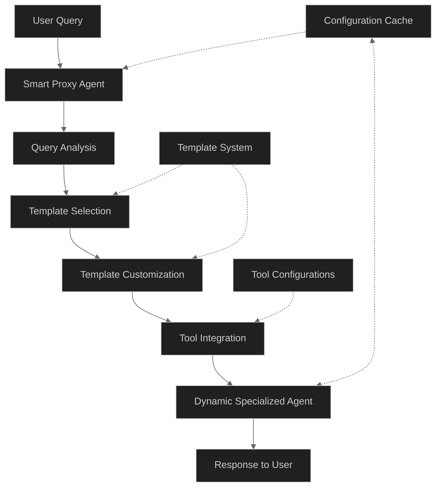

## Template-Based Design

The system uses predefined templates for common agent types (developer, researcher, data scientist, etc.) that can be rapidly customized for specific domains and tasks, rather than generating every detail from scratch.

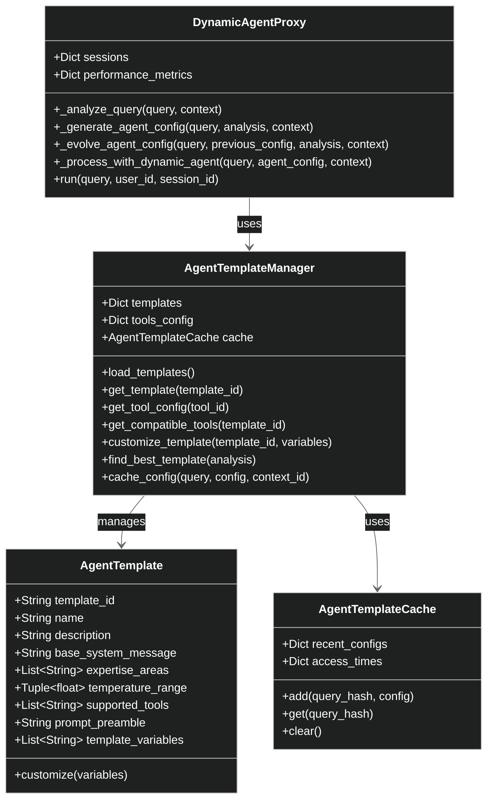

## Key Components

### 1. Dynamic Agent Proxy 

The core controller that orchestrates the entire process, from analyzing user queries to creating and deploying specialized agents.

### 2. Template System

Provides a structured way to define and customize agent profiles:

- **Agent Templates**: Base configurations for different types of agents
- **Tool Configurations**: Definitions of tools that can be used with templates
- **Template Variables**: Customization points within templates

### 3. Conversation Context

Tracks conversation history, metadata, and previously used agent configurations to support continuity and follow-up handling.

## Process Flow

The following diagram illustrates the complete workflow from user query to response:

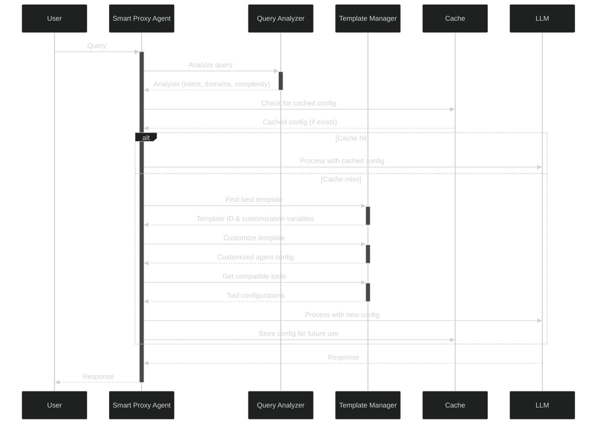

## Query Analysis

The Smart Proxy begins by analyzing the query to understand its intent, domains, complexity, and other metadata:

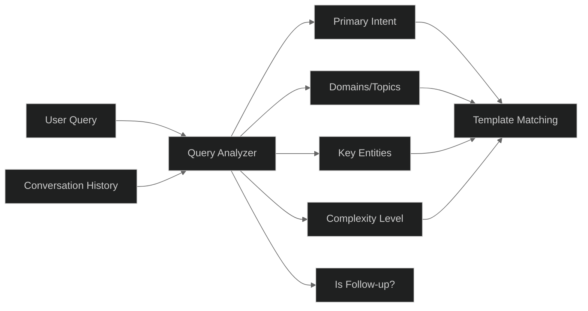

## Template Selection and Customization

Based on the query analysis, the system selects the most appropriate template and customizes it:

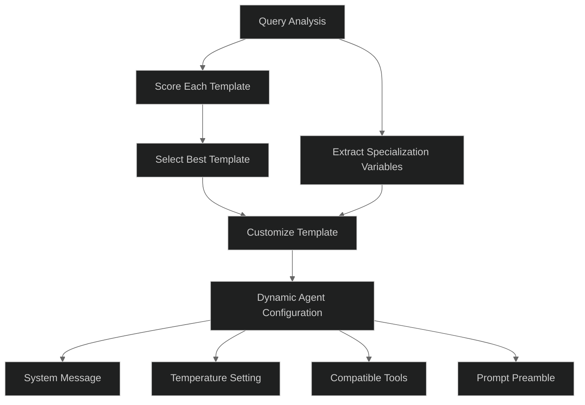

## Tool Integration

The system integrates appropriate tools based on the template and query needs:

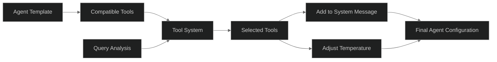

## Configuration Evolution

For follow-up queries, the system can evolve existing configurations rather than creating new ones:

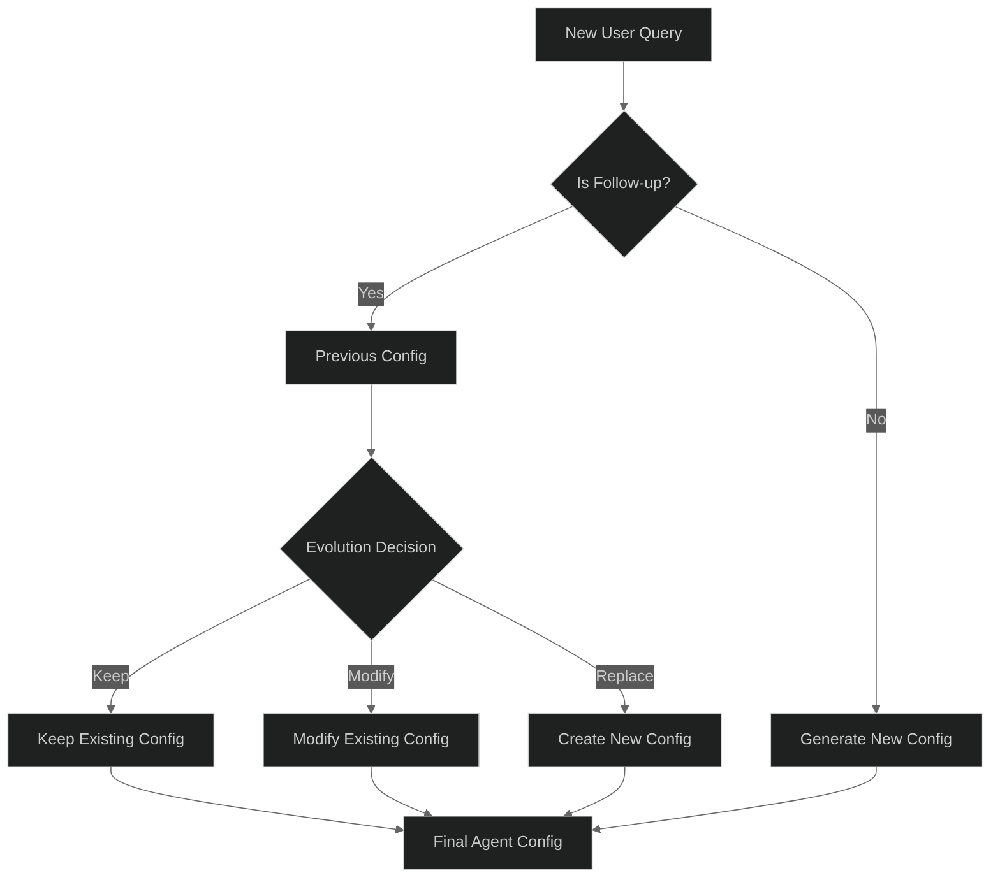

## Supported Templates

The system includes predefined templates for various agent types:

| Template ID | Name | Description | Temperature Range |
|-------------|------|-------------|-------------------|
| developer | Developer | Software development, coding, debugging | 0.1-0.4 |
| data_scientist | Data Scientist | Data analysis, statistics, ML | 0.1-0.5 |
| researcher | Researcher | Academic research, literature review | 0.1-0.3 |
| strategic_advisor | Strategic Advisor | Business strategy, decision analysis | 0.2-0.6 |
| creative | Creative | Creative writing, content creation | 0.5-0.9 |
| technical_writer | Technical Writer | Technical documentation | 0.1-0.4 |
| system_architect | System Architect | System design, architecture | 0.1-0.4 |

## Tool Configuration Structure

Tools are configured to work with specific templates and include system message additions:

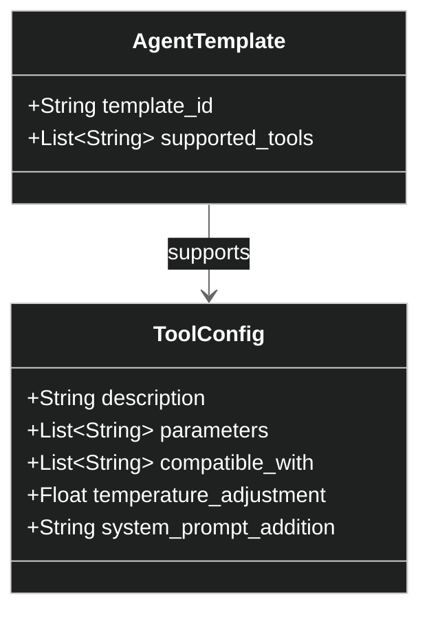

Example tool configuration:

```yaml
code_analysis:
  description: "Analyzes code to identify patterns, issues, and optimization opportunities"
  parameters:
    - language
    - code_snippet
    - analysis_type
  compatible_with:
    - developer
    - data_scientist
    - system_architect
  temperature_adjustment: -0.1
  system_prompt_addition: |
    You have access to a code analysis tool that can help identify issues, patterns, and optimization opportunities.
    When analyzing code, focus on readability, maintainability, and performance aspects.
```

## Caching Mechanism

The system implements caching to efficiently reuse configurations for similar queries:

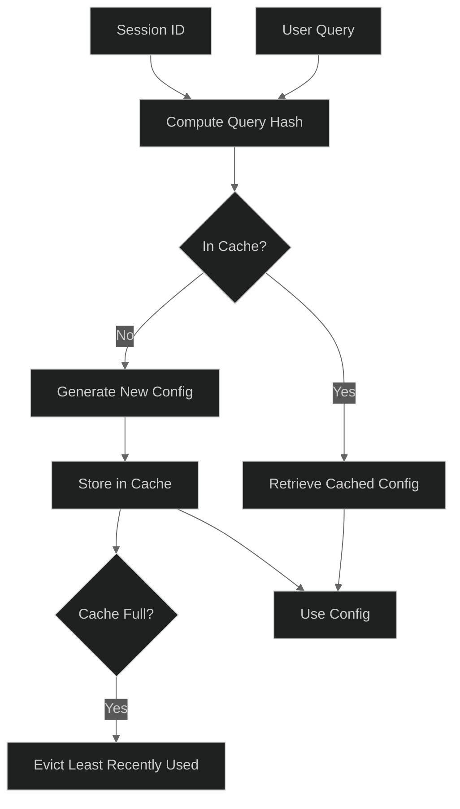

## Benefits of the Template Approach

The template-based approach offers several advantages:

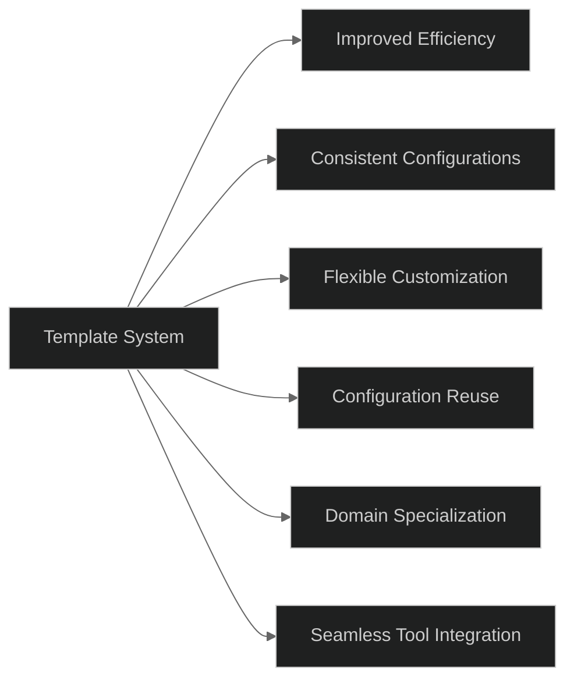

1. **Improved Efficiency**: Quickly creates specialized agents without regenerating every detail
2. **Consistency**: Ensures a consistent approach while allowing customization
3. **Caching**: Reuses configurations for similar queries, reducing latency
4. **Tool Integration**: Seamlessly integrates tools based on agent type and query needs
5. **Specialization**: Customizes for specific domains while maintaining expertise profile

## Extending the System

New templates and tools can be added by:

1. **Adding Templates**: Create new entries in `agent_templates.yaml`
2. **Adding Tools**: Define new tools in `tools_config.yaml`
3. **Custom Variables**: Define template variables for customization points

## Implementation Structure

The system is implemented with the following key files:

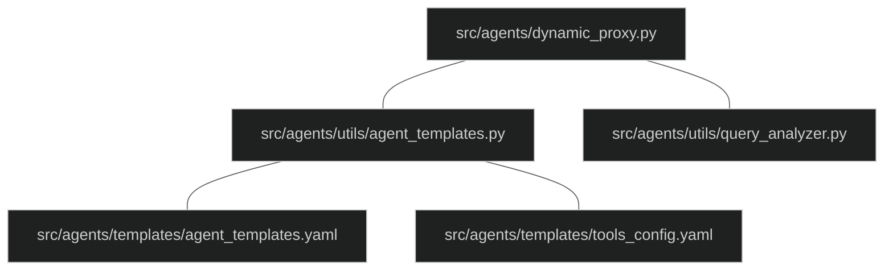

## Full System Diagram

The complete system with all components:

```mermaid
%%{init: {'theme': 'dark', 'themeVariables': { 'primaryColor': '#333333', 'primaryTextColor': '#fff', 'primaryBorderColor': '#444', 'lineColor': '#666', 'secondaryColor': '#555', 'tertiaryColor': '#444'}}}%%
flowchart TD
    User[User] --> Query[Query]
    Query --> SmartProxy[Dynamic Agent Proxy]
    
    SmartProxy --> Context[Conversation Context]
    Context --> History[Chat History]
    Context --> Metadata[Context Metadata]
    Context --> PrevConfig[Previous Configurations]
    
    SmartProxy --> Analysis[Query Analysis]
    Analysis --> Intent[Intent Detection]
    Analysis --> Domains[Domain Extraction]
    Analysis --> Complexity[Complexity Assessment]
    Analysis --> FollowupDetection[Follow-up Detection]
    
    SmartProxy --> TemplateSystem[Template System]
    TemplateSystem --> Templates[Agent Templates]
    TemplateSystem --> ToolConfigs[Tool Configurations]
    TemplateSystem --> Cache[Configuration Cache]
    
    SmartProxy --> ConfigGeneration[Configuration Generation]
    ConfigGeneration --> TemplateSelection[Template Selection]
    ConfigGeneration --> Customization[Template Customization]
    ConfigGeneration --> ToolIntegration[Tool Integration]
    ConfigGeneration --> CacheCheck[Cache Check/Update]
    
    SmartProxy --> Processing[Query Processing]
    Processing --> SystemMessage[System Message Construction]
    Processing --> TemperatureSettings[Temperature Adjustment]
    Processing --> LLM[LLM Interaction]
    
    LLM --> Response[Response]
    Response --> User
    
    class User,Query,Response primary;
    class SmartProxy,TemplateSystem,Context,Analysis,ConfigGeneration,Processing tertiary;
    class History,Metadata,PrevConfig,Intent,Domains,Complexity,FollowupDetection,Templates,ToolConfigs,Cache,TemplateSelection,Customization,ToolIntegration,CacheCheck,SystemMessage,TemperatureSettings,LLM secondary;
```

## Conclusion

The Smart Proxy Agent with template-based configuration provides a sophisticated yet efficient approach to dynamic agent creation. It balances standardization with customization, enabling rapid deployment of specialized agents optimized for specific queries while maintaining consistency and leveraging caching for improved performance. 