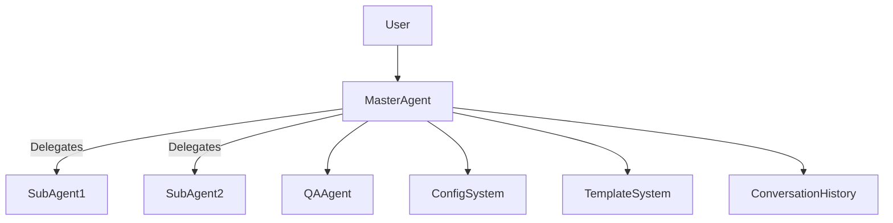
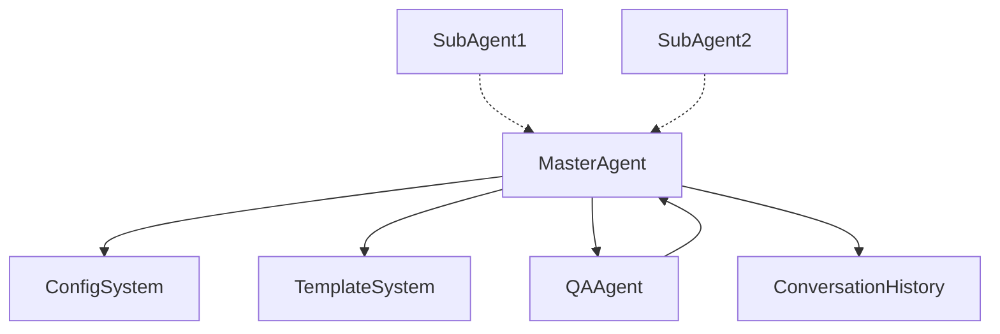
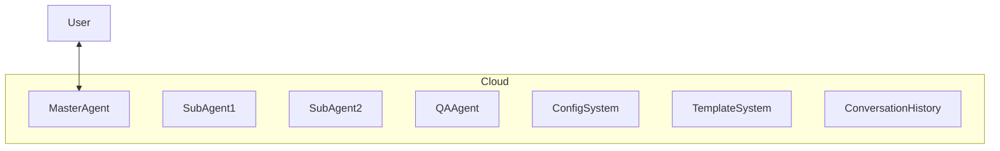

# System Design Document

## 1. Overview
This document describes the architecture and design of the multi-agent orchestration system, adapted from `.reference/docs/` for the current project context.

## 2. Architecture Overview

### 2.1 High-Level Architecture

- The Master Agent orchestrates all sub-agents and system components.
- QA Agent validates outputs before user delivery.
- Configuration and Template systems are centralized.

### 2.2 Component Diagram

## 3. Component Design

### 3.1 Master Agent
- Orchestrates sub-agents, manages workflow, and ensures requirements are met.
- Interfaces: Sub-agent API, QA API, Config API, Template API

### 3.2 Sub-Agents
- Types: Research, Code, Analysis, Documentation
- Each has a clear role and interface contract.

### 3.3 QA Agent
- Validates outputs for quality, completeness, and correctness.
- Returns feedback or approval to Master Agent.

### 3.4 Configuration System
- YAML-based, supports environment variable overrides.
- Centralized for all agents and components.

### 3.5 Template System
- Scenario-based prompt selection and assembly.
- Supports dynamic content and workflow context.

### 3.6 Conversation History
- Maintains context and state across user interactions.
- Threaded and persistent.

## 4. Data Models

### 4.1 Agent Metadata
| Field | Type | Description |
|-------|------|-------------|
| id | string | Unique agent identifier |
| role | string | Agent role (master, research, code, etc.) |
| status | string | Current status |

### 4.2 Configuration Schema
- YAML structure with sections for each component.
- Supports validation and overrides.

### 4.3 Prompt Template Structure
| Field | Type | Description |
|-------|------|-------------|
| id | string | Template identifier |
| scenario | string | Scenario type |
| content | string | Template content |

### 4.4 Conversation Record
| Field | Type | Description |
|-------|------|-------------|
| conversation_id | string | Unique conversation identifier |
| user_id | string | User identifier |
| history | list | List of message objects |

## 5. Interfaces

### 5.1 Agent API
- `POST /agent/execute` — Execute a task with input and context.
- `GET /agent/status` — Retrieve agent status.

### 5.2 Configuration API
- `GET /config` — Retrieve current configuration.
- `POST /config/update` — Update configuration.

### 5.3 Template API
- `GET /template/{id}` — Retrieve template by ID.
- `POST /template/render` — Render template with context.

## 6. Deployment Architecture

- All components are containerized and deployed in a cloud environment.
- Agents communicate via secure APIs.

## 7. Technology Stack
- Python 3.10+
- FastAPI (APIs)
- YAML (configuration)
- Mermaid (documentation diagrams)
- Docker (containerization)
- [Other project-specific tools]

## 8. References
- `.reference/docs/architecture.md`
- `.reference/docs/agent-orchestration-diagrams.md`
- `.reference/docs/sequence-diagram.md`
- `.reference/docs/configuration.md`
- `.reference/docs/prompt-engineering.md`
- `.reference/docs/qa-layer.md`
- `.reference/docs/workflow-process.md` 